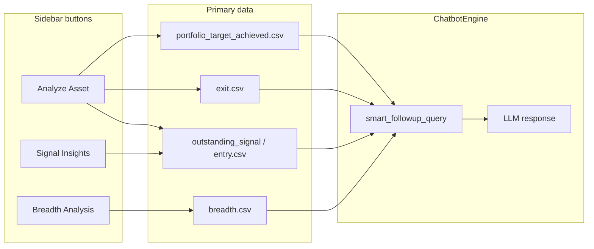

# AI Chatbot — Sidebar Action Buttons

Reference for the three one-click analysis buttons on the **AI Chatbot** page (`src/pages/chatbot_page.py`). They live under **Deep Dive Analysis** and related sidebar sections, use the shared **date range** pickers (default: last 15 days), and run through `ChatbotEngine.smart_followup_query()` via `run_smart_followup_with_progress()`.

**Location in app:** Sidebar → **AI Chatbot** → buttons below **Select Date Range**.

**Implementation:** [`src/pages/chatbot_page.py`](../src/pages/chatbot_page.py) (lines ~1360–1571).

---

## Shared behavior (all three buttons)

| Behavior | Detail |
|----------|--------|
| **New chat session** | Each click saves the current session, creates a new `SessionManager` session, and clears in-memory chat history so the analysis starts fresh. |
| **Date range** | Uses sidebar **From Date** / **To Date** (default: today minus 15 days → today). |
| **Execution** | On rerun, a *pending* prompt in `st.session_state` triggers `run_smart_followup_with_progress()` → `chatbot.smart_followup_query()`. |
| **AI pipeline** | Column selection (GPT) → `SmartDataFetcher` loads only needed CSV columns → LLM synthesizes an answer. |
| **Transparency** | Response includes **Smart Query Details** expander with signal tables used; **Complete Signal Data** (or breadth data) when available. |
| **Signal type labels** | From `chatbot/signal_type_selector.py` → `SIGNAL_TYPE_DESCRIPTIONS`. |

---

## 1. Analyze Asset

**UI:** `📊 Analyze Asset` (primary button)  
**Sidebar key:** `chatbot_analyze_asset_button`  
**Requires:** Asset selected in **Select Asset** dropdown (disabled until a ticker is chosen).

### What it does

Runs a **single-ticker deep dive**: lists all signals for the chosen symbol in the date range, checks cross-timeframe contradictions (e.g. short exited vs long still open), assesses alignment across intervals, and suggests **Buy / Hold / Sell** using only exported signal data—no invented signals.

### Data used

| Signal type | Source (priority) | Report reference |
|-------------|-------------------|------------------|
| **entry** (open) | Latest `trade_store/US/*_outstanding_signal.csv` when available; else `chatbot/data/entry.csv` | [Outstanding Signals](REPORTS.md#51-outstanding-signals-_outstanding_signalcsv), [entry.csv](REPORTS.md#43-consolidated-entryexit-extra-columns) |
| **exit** | `chatbot/data/exit.csv` | [exit.csv](REPORTS.md#43-consolidated-entryexit-extra-columns) |
| **portfolio_target_achieved** | `chatbot/data/portfolio_target_achieved.csv` | [Portfolio / Target](REPORTS.md#54-portfolio-risk-management--target-signal-_target_signalcsv) |
| **breadth** | Only if AI signal-type selector includes it (unusual for this prompt) | [SBI breadth](REPORTS.md#55-signal-breadth-indicator--sbi-_breadthcsv) |
| **claude_report** | Only if selector includes it | [Claude report](REPORTS.md#56-claude-shortlisted-signal) |

**Signal type selection:** **AI-driven** via `chatbot.signal_type_selector.select_signal_types(analysis_prompt)`—typically `entry`, `exit`, and `portfolio_target_achieved` for a deep dive (not fixed).

**Ticker filter:** `assets=[selected_asset]` — only the chosen symbol.

**MTM rule (prompt-enforced):** For open positions, the model must cite **Current Mark to Market and Holding Period**, **Today Trading Date/Price**, and **Trading Days between Signal and Today Date** exactly from the outstanding export—never recompute. See [Cross-report relationships — MTM authority](REPORTS.md#63-mtm-authority-rule).

**Asset dropdown population:** `chatbot.get_available_tickers()` — symbols from `entry.csv`, `exit.csv`, and latest `*_outstanding_signal.csv` (`chatbot/data_processor.py`).

### Significance

- **Portfolio decision support** for one name: reconciles conflicting signals across functions (FRACTAL TRACK, TRENDPULSE, etc.) and intervals (Daily vs Weekly vs Monthly).
- **Operational truth** for open trades: ties chatbot answers to the same MTM columns shown on the **Outstanding Signals** Streamlit page.
- **Risk of contradictions** is explicit in the prompt (short target hit vs monthly long still open)—suited before sizing or hedging a position.

### Example prompt themes (auto-generated)

- List every function, timeframe, Long/Short for the asset in range.
- Flag overlaps between exit dates and still-open entries.
- Stance: Buy / Hold / Sell from verified signals only.

---

## 2. Signal Insights

**UI:** `💡 Signal Insights` (secondary button)  
**Sidebar key:** `chatbot_signal_insights_button`  
**Requires:** Nothing beyond date range (works even if no asset is selected).

### What it does

Scans **all assets and all functions** for **open entry signals** in the date range and ranks those that meet **quality filters** (Sharpe, win rate, forward testing). Output is organized by strength (Sharpe first, then win rate, then forward-test highlight).

### Data used

| Signal type | Source | Notes |
|-------------|--------|--------|
| **entry** only | `SmartDataFetcher`: outstanding report (open rows) → fallback `chatbot/data/entry.csv` | Closed trades excluded by design |

**Fixed signal types:** `["entry"]` — not AI-selected.

**Ticker filter:** `assets=None`, `auto_extract_tickers=True` — universe = all tickers in entry data.

**Columns typically loaded** (via AI column selection): `Function`, `Symbol, Signal, Signal Date/Price[$]`, `Backtested Strategy Sharpe Ratio`, `Win Rate [%], History Tested, Number of Trades`, `Latest Past 6 Months Performance[%]/...`, `Forward Testing Win Rate[%]/...`, interval/confirmation fields as needed.

### Quality criteria (prompt)

The model is instructed to prioritize signals where:

| Criterion | Threshold |
|-----------|-----------|
| Strategy Sharpe Ratio | > **1.5** |
| Win Rate (full history) | > **80%** |
| Latest performance win rate (past ~4 years label in data) | > **85%** |
| Forward testing win rate | > **65%** |

Signals meeting **all or most** criteria are listed with symbol, function, interval, direction, signal date, and metrics.

### Significance

- **Cross-sectional screening** — find the strongest *new/open* setups in the book without picking a ticker first.
- Complements **Analyze Asset** (depth on one name) with **breadth across the universe**.
- Grounded in the same **entry** consolidation as the chatbot; does not use raw `new_signal.csv` directly (unless those rows are also in `entry.csv` / outstanding).
- Useful for daily/weekly “what should we look at?” workflows before opening the **New Signals** or **Outstanding Signals** pages.

### Limitations

- Only **open** entries (no exit date); exited winners are out of scope.
- Quality thresholds are **prompt guidance**, not hard SQL filters—the LLM interprets CSV values.
- “Latest performance” maps to the compound **Latest Past 6 Months Performance** column in exports (wording in prompt may say “past 4 years” when the export label differs—verify against actual column text).

---

## 3. Breadth Analysis

**UI:** `📊 Breadth Analysis` (secondary button)  
**Sidebar key:** `chatbot_breadth_analysis_button`  
**Requires:** Date range only (market-wide; no ticker).

### What it does

Analyzes **Signal Breadth Indicator (SBI)** **trade-arrival** metrics: how many new long/short signals fired each day vs the last six months, which days were unusually quiet or busy, and how TRENDPULSE, DELTADRIFT, BAND MATRIX, and the **Combined** row compare.

### Data used

| Signal type | Source | Schema |
|-------------|--------|--------|
| **breadth** only | `chatbot/data/breadth.csv` (from `*_breadth.csv` via converter) | 8 SBI columns — see [SBI glossary](REPORTS.md#column-glossary-8-columns) |

**Fixed signal types:** `["breadth"]`.

**Ticker filter:** `assets=None`, `auto_extract_tickers=False` — breadth is not per-ticker.

**Mandatory columns (engine guardrail):** Injected from `chatbot/breadth_context.py` → `BREADTH_MANDATORY_COLUMNS` / `BREADTH_SBI_COLUMNS`:

- `Date`, `Function`
- `Total New Long Signal`, `Total New Short Signal`
- `Last 6 Month Top 10 Percentile No of Long/Short Signal`
- `Today Long Signal Percentile From Top (Last 6 Month)`
- `Today Short Signal Percentile From Top (Last 6 Month)`

LLM context may include `sbi_schema_note` from `build_breadth_schema_note()` (percentile semantics, Combined row priority).

**Deprecated for this button:** Legacy `Bullish Asset vs Total Asset (%)` / `Bullish Signal vs Total Signal (%)` — prompt tells the model not to rely on them. See [breadth_analysis_button_fix.md](breadth_analysis_button_fix.md).

### Analysis focus (prompt)

1. **Extreme SBI days (Combined row):** Bottom/top 10% of days in the selected range by long (and short) percentile columns.
2. **Per-function patterns:** TRENDPULSE vs DELTADRIFT vs BAND MATRIX vs Combined; divergences (one strategy busy, Combined quiet).
3. **Low-activity context:** Bottom decile long percentiles → possible reduced bullish participation / consolidation.
4. **Summary:** Day counts, decile counts, average new long/short counts (Combined), trends.

**Preferred row for market-wide view:** `Function = "Combined (TrendPulse + DeltaDrift + BandMatrix)"`.

### Significance

- **Regime / participation** tool—not “is AAPL a buy?” but “is the **system** generating many/few signals today vs history?”
- High **Today Long Signal Percentile From Top** (e.g. ≥90) ≈ among the busiest long-signal days in six months; low values ≈ quiet days.
- Informs whether to trust a flood of new **entry** signals (Signal Insights) or treat them as noise in a quiet breadth environment.
- Directly tied to the **Signal Breadth Indicator (SBI)** Streamlit page and `*_breadth.csv` exports from MindWealth.

### Known issues (resolved)

NaN breadth fields from legacy column names were fixed in ingestion + prompts; details in [breadth_analysis_button_fix.md](breadth_analysis_button_fix.md).

---

## Comparison summary

| | Analyze Asset | Signal Insights | Breadth Analysis |
|--|---------------|-----------------|------------------|
| **Scope** | One ticker | All tickers | Market (S&P 500 universe) |
| **Signal types** | AI-selected (usually entry + exit + target) | `entry` only | `breadth` only |
| **Primary data** | Outstanding + entry/exit/target CSVs | entry / outstanding (open) | `breadth.csv` (SBI) |
| **Question answered** | Buy/Hold/Sell for this symbol? | Best open setups everywhere? | Is signal activity extreme or quiet? |
| **User input** | Asset + dates | Dates only | Dates only |
| **New session** | Yes | Yes | Yes |

---

## Related UI (not one-click buttons)

| Control | Purpose |
|---------|---------|
| **Select Date Range** | Shared by all three buttons and manual chat input. |
| **Available Signal Types** (expander) | Describes `entry`, `exit`, `portfolio_target_achieved`, `breadth`, `claude_report` for free-form questions. |
| **Manual chat input** | User types a question; signal types chosen by AI (`SignalTypeSelector`), same data layer as buttons. |

---

## See also

- [REPORTS.md](REPORTS.md) — Report types, columns, and data flow
- [chatbot/README.md](../chatbot/README.md) — Smart fetch, dedup, column selection
- [breadth_analysis_button_fix.md](breadth_analysis_button_fix.md) — SBI schema fix for Breadth Analysis
- [src/pages/chatbot_page.py](../src/pages/chatbot_page.py) — Button handlers and prompts
