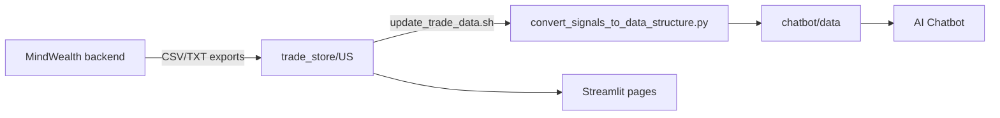
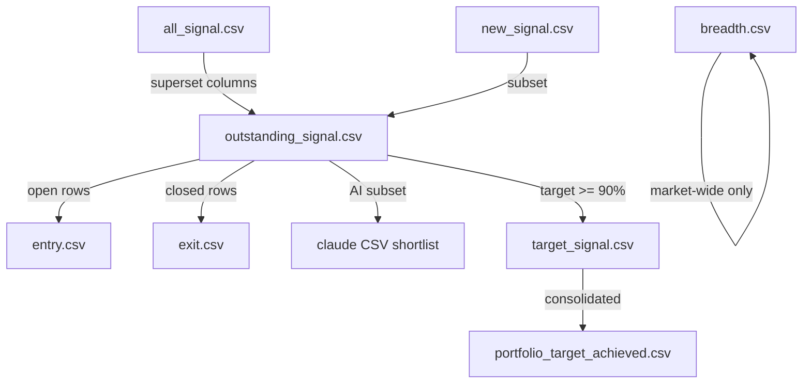

# MindWealth Reports Reference

Authoritative catalog of every report type consumed by MindWealth_UI: purpose, file locations, UI/chatbot surfaces, trading functions, full column schemas, and relationships between reports.

**Sample data references** in this document are taken from dated files in `trade_store/US/` (e.g. `2026-05-15_*.csv`) and consolidated files in `chatbot/data/` as of the latest sync in this repository.

---

## 1. Overview

### Two-layer data model

| Layer | Location | Produced by | Consumed by |
|-------|----------|-------------|-------------|
| **Raw reports** | `trade_store/US/` (and `trade_store/INDIA/` for F-Stack) | MindWealth backend (`/home/ubuntu/MindWealth` by default) | Streamlit report pages, Conviction Engine overlays, chart deep-dives |
| **Consolidated reports** | `chatbot/data/` | `chatbot/convert_signals_to_data_structure.py` (run via `update_trade_data.sh`) | AI Chatbot, **All Historical Report Signals** page |

Raw files use the naming convention **`YYYY-MM-DD_<base>.csv`**. When multiple dated versions exist, the UI picks the **latest date** (`src/utils/file_discovery.py` → `get_latest_csv_file`). Undated files (e.g. `virtual_trading_long.csv`) are also supported.

### Sync pipeline



1. `update_trade_data.sh` copies MindWealth `trade_store/US` → repo and refreshes `trade_store/stock_data/` OHLC.
2. `python3 chatbot/convert_signals_to_data_structure.py` builds `entry.csv`, `exit.csv`, `portfolio_target_achieved.csv`, `breadth.csv`, copies `claude_report.txt`, and updates current prices.

### Chatbot logical signal types

Defined in `chatbot/unified_extractor.py` → `ALLOWED_SIGNAL_TYPES`:

| Type | Consolidated source | Meaning |
|------|---------------------|---------|
| `entry` | `chatbot/data/entry.csv` | Open positions (no exit yet) |
| `exit` | `chatbot/data/exit.csv` | Closed trades |
| `portfolio_target_achieved` | `chatbot/data/portfolio_target_achieved.csv` | Target-hit / portfolio risk rows |
| `breadth` | `chatbot/data/breadth.csv` | Signal Breadth Indicator (SBI) |
| `claude_report` | `chatbot/data/claude_report.txt` | AI narrative synthesis (no tabular columns) |

---

## 2. Trading Functions (strategies)

Each **signal row** represents one trade idea: **Function × Symbol × Interval × direction (Long/Short)**.

### Quant signal functions (per-ticker reports)

These appear in the `Function` column of outstanding, new, all, target, Claude CSV, and consolidated entry/exit files:

| Function | Chart / per-function export file |
|----------|-----------------------------------|
| FRACTAL TRACK | `Fib-Ret.csv` |
| TRENDPULSE | `Trendline.csv` |
| BAND MATRIX | `bollinger_band.csv` |
| DELTADRIFT | `Distance.csv` |
| BASELINEDIVERGENCE | `General-Divergence.csv` |
| ALTITUDE ALPHA | `new_high.csv` |
| OSCILLATOR DELTA | `Stochastic-Divergence.csv` |
| SIGMASHELL | `sigma.csv` |
| PULSEGAUGE | `sentiment.csv` |

*Note: Code may reference `BASELINEDIVERGE` in chart mappings; exports use `BASELINEDIVERGENCE`.*

**Typical presence (2026-05-15 export):** outstanding / all_signal include BASELINEDIVERGENCE, DELTADRIFT, FRACTAL TRACK, OSCILLATOR DELTA, PULSEGAUGE, SIGMASHELL, TRENDPULSE (ALTITUDE ALPHA and BAND MATRIX may appear on other dates).

### SBI breadth functions (market-wide, not per ticker)

| Function | Role |
|----------|------|
| TRENDPULSE | Per-strategy daily long/short signal counts |
| DELTADRIFT | Per-strategy daily long/short signal counts |
| BAND MATRIX | Per-strategy daily long/short signal counts |
| Combined (TrendPulse + DeltaDrift + BandMatrix) | Aggregated market-wide row (preferred for chatbot breadth analysis) |

See `chatbot/breadth_context.py` for SBI column semantics.

### Combined performance report

The `Function` column is often **`Forward Testing`** (report section label); the actual strategy name is in the **`Strategy`** column (e.g. ALTITUDE ALPHA, TRENDPULSE).

---

## 3. Report inventory

| Report name | Raw file pattern | Consolidated file | Streamlit page | Chatbot type |
|-------------|------------------|-------------------|----------------|--------------|
| Outstanding Signals | `*_outstanding_signal.csv` | `entry.csv` + `exit.csv` | Outstanding Signals | `entry` / `exit` |
| New Signals | `*_new_signal.csv` | — | New Signals | — |
| All Signal Report | `*_all_signal.csv` | — | All Signal Report | — |
| Portfolio Risk Management | `*_target_signal.csv` | `portfolio_target_achieved.csv` | Portfolio Risk Management | `portfolio_target_achieved` |
| Signal Breadth Indicator (SBI) | `*_breadth.csv` | `breadth.csv` | Signal Breadth Indicator (SBI) | `breadth` |
| Claude Shortlisted Signal | `*_claude_signals_report.{txt,csv}` | `claude_report.txt` | Claude Shortlisted Signal | `claude_report` |
| Combined Performance Report | `*_combined_performance_report.csv` | — | Combined Performance Report | — |
| Horizontal & New High Report | `*_horizontal_new_high_report.csv` | — | Horizontal & New High Report | — |
| Virtual Trading | `virtual_trading_{long,short}.csv` | — | Virtual Trading | CE overlay only |
| F-Stack Analyzer | `F-Stack-Analyzer.csv` (`trade_store/INDIA/`) | — | F-Stack | — |
| Outstanding Exit Signal | `*_outstanding_exit_signal.csv` | — | (charts; not main nav) | — |
| Breadth entry companion | `*_breadth_entry.csv` | — | Breadth page (optional) | — |
| Trade Details | `success_rate/`, `forward_testing/`, `latest_performance/` | — | Trade Details | — |
| Conviction Engine Daily Report | *(in-app only)* | — | Conviction Engine → Daily Report tab | — |
| Per-function exports | `*_Trendline.csv`, `*_sigma.csv`, etc. | — | Chart deep-dives | — |

**Config paths:** `src/config_paths.py`, `constant.py`, `chatbot/config.py` (env-overridable via `.env`).

---

## 4. Shared schemas

### 4.1 Detailed signal schema (29 columns)

Used by: **outstanding_signal**, **new_signal**, **claude_signals_report.csv**, **outstanding_exit_signal**, and consolidated **entry** / **exit** (plus extra consolidated columns noted below).

**Row grain:** One open or closed trade signal for a single Function, symbol, interval, and direction.

**Parser:** `src/parsers/base_parsers.py` → `parse_detailed_signal_csv`; wrappers in `src/parsers/advanced_parsers.py`.

| Column | Type | Description | Example |
|--------|------|-------------|---------|
| `Function` | string | Trading strategy name | `FRACTAL TRACK` |
| `Symbol, Signal, Signal Date/Price[$]` | compound | **Symbol**, direction (`Long`/`Short`), **signal date**, **signal price**. Format: `TICKER, Long, YYYY-MM-DD (Price: X.XX)` | `PPH, Long, 2026-05-15 (Price: 100.84)` |
| `Exit Signal Date/Price[$]` | compound / status | Exit date and price, or `No Exit Yet` for open positions | `No Exit Yet` |
| `Current Mark to Market and Holding Period` | compound | Unrealized/realized **MTM %** and **holding period** (authoritative for open signals; do not recompute in chatbot) | `10.95%, 119 days` |
| `Win Rate [%], History Tested, Number of Trades` | compound | Historic win rate, lookback label, trade count | `93.75%, Past 20 years, 16` |
| `Interval, Confirmation Status` | compound | Candle interval and confirmation state | `Weekly, is CONFIRMED on 2026-05-15` |
| `Cancellation Level/Date` | string | Cancellation rule or `Already confirmed` | `Already confirmed` |
| `Today Trading Date/Price[$], Today price vs Signal` | compound | Latest session date/price and % vs signal price. Consolidated files may use `Today Price vs Signal` (capital P) | `2026-05-15 (Price: 100.84), 0.0% below` |
| `Trading Days between Signal and Today Date` | string | Calendar/trading days held | `119 days` |
| `Signal Open Price` | float | Open price at signal generation; used for **deduplication** (not display price) | `100.07` |
| `Sigmashell, Success Rate of Past Analysis [%]` | string | SIGMASHELL-specific; often `No Information` for other functions | `No Information` |
| `Divergence observed with, Signal Type` | string | Divergence pair / type (BASELINEDIVERGENCE, OSCILLATOR DELTA) | `No Information` |
| `Maxima Broken Date/Price[$]` | string | Breakout maxima (ALTITUDE ALPHA, etc.) | `No Information` |
| `Track Level/Price($), Price on Latest Trading day vs Track Level, Signal Type` | compound | Fib/track level, distance from level, signal subtype | `38.2% (Price: 99.2444), 1.61% above, Upmove Bounce Back` |
| `Reference Upmove or Downmove start Date/Price($), end Date/Price($)` | compound | Reference swing start/end | `2025-04-13 (Price: 77.67), 2026-02-22 (Price: 112.58)` |
| `% Change in Price on Latest Trading day vs Price on Trendpulse Breakout day/Earliest Unconfirmed Signal day/Confirmed Signal day` | string | TRENDPULSE price change breakdown | `0.13% above/0.0% below/0.0% below` |
| `Backtested Returns(Win Trades) [%] (Max/Min/Avg)` | compound | Win-trade return distribution | `17.44%/6.28%/14.88%` |
| `Backtested Max Loss [%], Backtested Worst Single MTM during Hold Period [%]` | compound | Max loss and worst MTM | `9.84%, 28.32%` |
| `Backtested Holding Period(Win Trades) (days) (Max/Min/Avg)` | compound | Holding period stats for wins | `6.1 years/3.3 months/1.7 year` |
| `Target Exit Date(Win Trades) (Max/Min/Avg)` | compound | Projected exit dates | `2035-01-28/2026-10-05/2028-10-17` |
| `Backtested Strategy CAGR [%]` | percent | Strategy CAGR | `8.15%` |
| `CAGR of Buy and Hold [%]` | percent | Buy-and-hold CAGR | `3.85%` |
| `CAGR difference (Strategy - Buy and Hold) [%]` | percent | Alpha vs buy-and-hold | `4.3%` |
| `Backtested Strategy Sharpe Ratio` | float | Strategy Sharpe | `0.85` |
| `Sharpe Ratio of Buy and Hold` | float | B&H Sharpe | `0.15` |
| `Targets (...)` | slash-separated | Target prices: historic pivot / avg gain / function target / horizontal / F-Stack 1 & 2 / EMA 200 | `103.9459/115.845/121.79/No Horizontal Resistance/...` |
| `Stop Loss (...)` | slash-separated | Stop levels: extrema / horizontal / F-Stack / F-Track / EMA 200 | `99.84/72.54/85.1101/No stop loss/...` |
| `Latest Past 6 Months Performance[%]/...` | compound | Recent backtest aggregate across all assets | `89.09%/55/1.4 year (Across ALL Assets)` |
| `Forward Testing Win Rate[%]/...` | compound | Forward-test aggregate across all assets | `61.63%/172/7.4 months (Across ALL Assets)` |

**Function-specific columns:** Populated when relevant; otherwise `No Information`. SIGMASHELL → Sigmashell column; TRENDPULSE → track/breakout fields; divergence functions → divergence columns.

### 4.2 All-signal extra columns (10 additional)

**File:** `*_all_signal.csv` — **39 columns** total (detailed schema + below).

**Purpose:** Superset dump of signals (open and closed) with extra Trendpulse/divergence analytics.

| Column | Description | Example |
|--------|-------------|---------|
| `Signal Type` | Strategy signal subtype | `Upmove Bounce Back` |
| `Track Level/Price($)` | Track level only (split from combined column in outstanding) | `38.2% (Price: 99.2444)` |
| `Price on Latest Trading day vs Track Level` | Distance from track | `1.61% above` |
| `Level, Trendpulse start Date/Price($)` | Trendpulse level start | `No Information` |
| `Trendpulse Breakout Date/Price($)` | Breakout point | `No Information` |
| `Earliest Unconfirmed Signal Date/Price($)` | First unconfirmed signal | `No Information` |
| `Time from Latest Trading day to Trendpulse Breakout day/...` | Time since breakout/unconfirmed/confirmed | `No Information` |
| `TrendPulse Start/End (Date and Price($))` | Trend leg boundaries | `No Information` |
| `Divergence Start/End (Date and Price [$])` | Divergence leg boundaries | `No Information` |
| `Divergence Duration (days) (Max/Min/Avg)` | Divergence duration stats | `No Information` |
| `Spread` | Spread metric (divergence strategies) | `No Information` |
| `Divergence Start (Date, Price)` | Divergence start point | `No Information` |

**Functions (2026-05-15):** BASELINEDIVERGENCE, DELTADRIFT, FRACTAL TRACK, OSCILLATOR DELTA, PULSEGAUGE, SIGMASHELL, TRENDPULSE.

**Parser:** `parse_outstanding_signal` → `parse_detailed_signal_csv` (same family).

### 4.3 Consolidated entry/exit extra columns

**Files:** `chatbot/data/entry.csv`, `chatbot/data/exit.csv` (31 columns).

| Column | Description | Example |
|--------|-------------|---------|
| `SignalType` | Chatbot category: `entry` or `exit` | `entry` |
| `Support (...)` | Renamed/duplicate support levels (alongside `Stop Loss (...)`) | `689.82/576.784/...` |
| `Today Trading Date/Price[$], Today Price vs Signal` | Normalized today-price column name | `2026-05-15 (Price: 1501.8101), 10.95% above` |

**Dedup key (entry):** `Function` + Symbol + `entry` + Interval + `Signal Open Price` (+ signal date for filtering).

**Dedup key (exit):** above + signal date + exit date.

**Production:** Rows split from latest `*_outstanding_signal.csv` — open → `entry.csv`, closed → `exit.csv`. Only **confirmed** entries are ingested (`is CONFIRMED` / `was CONFIRMED`).

**Chatbot MTM columns (always merged when fetching):** `Symbol, Signal, Signal Date/Price[$]`, `Signal Open Price`, today price column, `Current Mark to Market and Holding Period`, `Trading Days between Signal and Today Date` (`chatbot/smart_data_fetcher.py`).

---

## 5. Per-report reference

### 5.1 Outstanding Signals (`*_outstanding_signal.csv`)

| | |
|--|--|
| **Purpose** | Primary operational report: all **active** and **recently closed** signals with live MTM |
| **Source** | MindWealth backend |
| **UI page** | Outstanding Signals |
| **Chatbot** | Prefers live outstanding file via `chatbot/outstanding_paths.py`; consolidated entry/exit for history |
| **Schema** | [§4.1 Detailed signal schema](#41-detailed-signal-schema-29-columns) (29 cols) |
| **Functions** | All quant functions present in daily export (7 on 2026-05-15) |

**What signals it contains:** Every confirmed/unconfirmed strategy signal still tracked by the system—**Long and Short** across **Daily / Weekly / Monthly / Quarterly** intervals—not filtered to a single function.

---

### 5.2 New Signals (`*_new_signal.csv`)

| | |
|--|--|
| **Purpose** | Signals **newly added** since the prior run (subset for monitoring) |
| **Schema** | Same 29-column detailed schema as outstanding |
| **UI page** | New Signals |
| **Parser** | `parse_new_signal` |
| **Functions (2026-05-15)** | DELTADRIFT, TRENDPULSE |

Supports **Add to Monitored** workflow on the New Signals page.

**Conviction Engine:** After each trade_store sync, `scripts/run_conviction_engine_daily.py` archives overlays at `conviction_store/daily/YYYY-MM-DD/{date}_new_signal_conviction.csv`. The **Conviction Engine** app tab lets you pick a **report date** and view that day’s overlay table.

---

### 5.3 All Signal Report (`*_all_signal.csv`)

| | |
|--|--|
| **Purpose** | Broadest signal dump: full history context + extra analytics columns |
| **Schema** | [§4.1](#41-detailed-signal-schema-29-columns) + [§4.2](#42-all-signal-extra-columns-10-additional) (39 cols) |
| **UI page** | All Signal Report |
| **Relationship** | Superset of outstanding columns; use outstanding for authoritative MTM on open positions |

---

### 5.4 Portfolio Risk Management / Target signal (`*_target_signal.csv`)

| | |
|--|--|
| **Purpose** | Signals where price has reached **≥90% of a target** gain—portfolio exit planning |
| **Consolidated** | `chatbot/data/portfolio_target_achieved.csv` |
| **Chatbot type** | `portfolio_target_achieved` |
| **UI page** | Portfolio Risk Management |
| **Parser** | `parse_target_signals` |
| **Row grain** | One target-achievement event per symbol/function/interval |

**Functions (2026-05-15):** TRENDPULSE (others may appear on other dates).

#### Column glossary (30 columns)

Includes shared backtest columns (see §4.1) plus portfolio-specific:

| Column | Description | Example |
|--------|-------------|---------|
| `Function` | Strategy | `TRENDPULSE` |
| `Symbol, Signal, Signal Date/Price[$]` | Entry compound field | `MEL.NZ, Long, 2026-02-05 (Price: 5.71)` |
| `Interval` | Interval (standalone, not combined with confirmation) | `Daily` |
| `Exit Signal Date/Price[$]` | Exit if closed | `2026-05-13 (Price: 5.82)` |
| `Target for which Price has achieved over 90 percent of gain %` | Which target tier was nearly hit | `No Price Target` |
| `Backtested Target Exit Date` | Backtest-projected exit date | `No Date Target` |
| `Next Two Target Price % from Latest Trading Price` | Next two target % moves | `3.46%/16.67%` |
| `% Gain, Holding Period (days)` | Current gain and hold time | `2.45%, 3.3 months` |
| `Today Trading Date/Price[$], Today price vs Signal` | Latest price vs entry | `2026-05-15 (Price: 5.85), 2.45% above` |
| `Remaining Potential Exit Prices [$]` | Labeled remaining targets | `6.825 (Horizontal)/7.4565 (F-Stack 1)/...` |
| `Remaining Potential Exit Dates` | Remaining date targets | `2027-01-31 (Max)` |
| `Stop Loss (...)` | Stop ladder (same structure as detailed schema) | `5.52/4.3875/...` |
| `Win Rate [%], History Tested, Number of Trades` | Historic stats | `94.59%, Past 4 years, 37` |
| `Signal Open Price` | Dedup / backend price | `5.63` |
| *(remaining columns)* | Same as §4.1 function-specific and backtest fields | |

**Dedup key:** `Function` + Symbol + `portfolio_target_achieved` + Interval + `Signal Open Price`.

---

### 5.5 Signal Breadth Indicator — SBI (`*_breadth.csv`)

| | |
|--|--|
| **Purpose** | Market-wide **count** of new long/short signals vs 6-month history (S&P 500 universe) |
| **Consolidated** | `chatbot/data/breadth.csv` |
| **Chatbot type** | `breadth` |
| **UI page** | Signal Breadth Indicator (SBI) |
| **Parser** | `parse_breadth` (legacy Bullish % columns deprecated—see `docs/breadth_analysis_button_fix.md`) |
| **Row grain** | One row per **Function × Date** (not per ticker) |

**Functions (2026-05-15):** TRENDPULSE, DELTADRIFT, BAND MATRIX, Combined (TrendPulse + DeltaDrift + BandMatrix).

#### Column glossary (8 columns)

| Column | Description | Example |
|--------|-------------|---------|
| `Date` | Trading date | `2026-05-15` |
| `Function` | Strategy or Combined row | `TRENDPULSE` |
| `Total New Long Signal` | Count of new long signals today | `5` |
| `Last 6 Month Top 10 Percentile No of Long Signal` | 90th-percentile daily long count (6 mo) | `13` |
| `Today Long Signal Percentile From Top (Last 6 Month)` | Where today ranks vs 6 mo (100 = busiest) | `37.02` |
| `Total New Short Signal` | Count of new short signals today | `0` |
| `Last 6 Month Top 10 Percentile No of Short Signal` | 90th-percentile daily short count | `1` |
| `Today Short Signal Percentile From Top (Last 6 Month)` | Short-busyness percentile | `100.0` |

**Dedup key:** `Function` + `Date`.

**Legacy columns (older dated files only):** `Bullish Asset vs Total Asset (%)`, `Bullish Signal vs Total Signal (%)` — do not use for new analysis.

#### Breadth entry companion (`*_breadth_entry.csv`)

Optional per-signal rows that drove breadth counts.

| Column | Example |
|--------|---------|
| `Function` | `BreadthIndicator` |
| `Interval` | `Daily` |
| `Symbol, Signal, Signal Date/Price[$]` | `^GSPC, Long, 2026-03-23 (Price: 6574.96)` |

---

### 5.6 Claude Shortlisted Signal

Two formats per run:

#### A. Text report (`*_claude_signals_report.txt` → `chatbot/data/claude_report.txt`)

| | |
|--|--|
| **Purpose** | AI-generated **narrative synthesis** of parallel signal analysis across groups |
| **Chatbot type** | `claude_report` (full text appended to LLM context; no column extraction) |
| **UI page** | Claude Shortlisted Signal (`src/pages/text_file_page.py`) |

**Structure:**
1. Title / executive summary (e.g. `# COMPREHENSIVE SYNTHESIS OF PARALLEL PROCESSING RESULTS`)
2. Tier/filter conclusions (e.g. zero Tier A approvals)
3. **Pipe-delimited shortlist** of signals: `Symbol,Interval,Function,Date,Direction` separated by `\|` (see `FILTERED SIGNALS SUMMARY` section)
4. Thematic sections: negative alpha, mass exits, drawdowns, late-stage signals
5. Markdown tables and bullet analysis

**Example tuple:** `PPH,Weekly,FRACTAL TRACK,2026-05-15,Long`

#### B. CSV shortlist (`*_claude_signals_report.csv`)

| | |
|--|--|
| **Purpose** | Tabular shortlist for Streamlit cards and inspection |
| **Schema** | Same [29-column detailed schema](#41-detailed-signal-schema-29-columns) as outstanding |
| **Functions (2026-05-15)** | DELTADRIFT, FRACTAL TRACK, TRENDPULSE |

**What signals it contains:** AI-curated **subset** of outstanding signals deemed noteworthy—not all outstanding rows.

---

### 5.7 Combined Performance Report (`*_combined_performance_report.csv`)

| | |
|--|--|
| **Purpose** | Aggregated **backtest / forward-test performance** by strategy, interval, and direction |
| **UI page** | Combined Performance Report |
| **Parser** | `parse_combined_performance_report` → `parse_performance_csv` |
| **Row grain** | One row per Function section × Strategy × Interval × Signal Type |

| Column | Description | Example |
|--------|-------------|---------|
| `Function` | Report section (often `Forward Testing`) | `Forward Testing` |
| `Strategy` | Actual strategy name | `ALTITUDE ALPHA` |
| `Interval` | Timeframe | `Weekly` |
| `Signal Type` | Long or Short | `Long` |
| `Total Analysed Trades` | Trade count | `93` |
| `Win Percentage` | Win rate | `64.52%` |
| `Holding Period (days) (Max/Min/Avg)` | Hold time distribution | `3.0 years/4 days/1.3 year` |
| `Profit [%] (Max/Min/Avg.)` | Profit distribution | `85.6%/-84.14%/20.24%` |
| `Avg Backtested Win Rate [%]` | Mean backtest win rate | `83.39%` |
| `Avg Backtested Holding Period (days)` | Mean backtest hold | `2.2 years` |
| `Percentage of Open Trades` | Share still open | `36.56%` |

---

### 5.8 Horizontal & New High Report (`*_horizontal_new_high_report.csv`)

| | |
|--|--|
| **Purpose** | Price levels: new highs and horizontal support/resistance |
| **UI page** | Horizontal & New High Report (split tabs by `Report Type`) |
| **Row grain** | One symbol per row |

| Column | Description | Example |
|--------|-------------|---------|
| `Report Type` | `New High` or horizontal variant | `New High` |
| `Symbol` | Ticker | `AAPL` |
| `Today price` | Latest price | `$300.2300` |
| `New Highest` | New high flag and level | `√ $303.2000` |

Horizontal rows (when present) add: `Interval`, `Latest Horizontal`, `Difference (%)`, `Type` (see `src/pages/horizontal_page.py`).

*Legacy standalone `Horizontal.csv` / `new_high.csv` are superseded by this combined report.*

---

### 5.9 Virtual Trading (`virtual_trading_long.csv`, `virtual_trading_short.csv`)

| | |
|--|--|
| **Purpose** | Simulated long/short books tracking virtual P&L |
| **UI page** | Virtual Trading |
| **Conviction Engine** | Listed in `SIGNAL_SOURCES` (`src/conviction_engine/signals.py`) |

| Column | Description | Example |
|--------|-------------|---------|
| `Function` | Strategy | `TRENDPULSE` |
| `Symbol` | Ticker | `IMO.TO` |
| `Signal` | Long / Short | `Long` |
| `Interval` | Timeframe | `Daily` |
| `Entry Date` | Virtual entry date | `2026-05-15` |
| `Entry Price` | Entry price | `185.26` |
| `Exit Date` | Exit date if closed | *(empty when open)* |
| `Exit Price` | Exit price | *(empty when open)* |
| `Today price` | Mark price | `185.26` |
| `Realised/Unrealised Profit` | P&L % | `0.0000%` |
| `Holding Period` | Days held | `1.0` |
| `Status` | `Open` / closed | `Open` |
| `Backtested Win Rate [%]` | Reference win rate | `95.24` |

---

### 5.10 F-Stack Analyzer (`trade_store/INDIA/F-Stack-Analyzer.csv`)

| | |
|--|--|
| **Purpose** | India-market F-Stack band analysis |
| **UI page** | F-Stack |
| **Parser** | `parse_f_stack_analyzer` |

| Column | Description |
|--------|-------------|
| `Symbol` | Ticker |
| `Signal` | Long / Short |
| `Signal Date/Price($)` | Entry compound (rupees) |
| `Latest Trading Date/Price($)` | Latest session |
| `Interval` | Timeframe |
| `Current Extension Level($)` | Active extension |
| `Current Band Price Range($)` | Band bounds |
| `Width of Current Band(%)` | Band width % |
| `Band Composition (...)` | Extension composition detail |
| `Trading Days between signal date and Latest Trading date` | Hold duration |
| `Price on Latest Trading day vs signal date` | % change |
| `Next Band Price Level($)` | Next level |
| `Next Band Price Range($)` | Next band range |
| `Next Fib Ret [%] (...)` | Fibonacci extension detail |
| `Next Fib Ret [%] Price Level vs Price on Latest Trading day` | Distance to fib |
| `Next Band Price Level vs Price on Latest Trading day` | Distance to next band |

---

### 5.11 Outstanding Exit Signal (`*_outstanding_exit_signal.csv`)

| | |
|--|--|
| **Purpose** | Focused export of signals with **exit events** (exit planning / review) |
| **Schema** | [29-column detailed schema](#41-detailed-signal-schema-29-columns) |
| **UI** | Chart helper `create_outstanding_exit_signal_chart` — not in main `discover_csv_files()` nav |

---

### 5.12 Per-function strategy exports

Dated files in `trade_store/US/` for chart deep-dives (`src/components/charts.py`):

| Function | File pattern |
|----------|----------------|
| FRACTAL TRACK | `*_Fib-Ret.csv` |
| BAND MATRIX | `*_bollinger_band.csv` |
| DELTADRIFT | `*_Distance.csv` |
| BASELINEDIVERGE | `*_General-Divergence.csv` |
| ALTITUDE ALPHA | `*_new_high.csv` |
| OSCILLATOR DELTA | `*_Stochastic-Divergence.csv` |
| SIGMASHELL | `*_sigma.csv` |
| PULSEGAUGE | `*_sentiment.csv` |
| TRENDPULSE | `*_Trendline.csv` |

These are **not** separate Streamlit nav pages; they feed individual signal charts.

---

### 5.13 Trade Details (nested CSVs)

| | |
|--|--|
| **Purpose** | Per-asset drill-down: backtest history, forward testing, latest performance |
| **Base paths** | `trade_store/US/success_rate/`, `forward_testing/`, `latest_performance/` |
| **Structure** | `{function}/{asset}/{interval}.csv` |
| **UI page** | Trade Details |

Discovered dynamically by `discover_folder_structure()` in `src/pages/trade_details_page.py`. Column schemas vary by function/asset; each file is a time series or trade list for one strategy/asset/interval combination.

*Legacy flat `forward_testing.csv` and `latest_performance.csv` at repo root are removed on sync.*

---

### 5.14 Conviction Engine Daily Report (in-app only)

| | |
|--|--|
| **Purpose** | Text summary of fundamental conviction overlay on the quant universe |
| **Source** | Generated at runtime by `generate_daily_report()` in `src/conviction_engine/engine.py` |
| **UI** | Conviction Engine → **Daily Report** tab |
| **Not a file** | Does not exist in `trade_store/` |

**Typical content:**
```
Conviction Engine Daily Report

Universe size: N
Scored equities: M
Strong conviction names: X
Weak / cancel-buy names: Y

Alerts:
- TICKER: flag1, flag2
```

Fundamental data lives in `conviction_store/{TICKER}.json`; overlays in `conviction_store/overlays/*_conviction.csv`. See `docs/conviction_engine_fundamentals.md`.

---

## 6. Cross-report relationships

### 6.1 Quick answers

| Question | Answer |
|----------|--------|
| What signals does **outstanding_signal** contain? | All tracked strategy signals (open + closed) across all quant Functions, with **authoritative MTM** columns for open positions. |
| What does **entry.csv** contain? | **Subset:** only **open** rows from outstanding (`Exit Signal Date/Price[$]` = `No Exit Yet`), confirmed, accumulated over time in consolidated file. |
| What does **exit.csv** contain? | **Subset:** **closed** rows from outstanding, with exit dates. |
| What does **Claude report** contain? | **Shortlist + narrative:** TXT = synthesis and pipe-delimited picks; CSV = outstanding-like rows for shortlisted signals only. |
| What does **portfolio / target** report contain? | Signals where price reached **≥90%** of a profit target—focus on **exit planning** (remaining targets, stops, dates). |
| What does **breadth** contain? | **Market-wide** daily counts of new long/short signals—not per-ticker positions. |
| **entry** vs **outstanding** vs **all_signal** | `entry` ⊂ open rows of `outstanding`; `outstanding` ⊆ rows in `all_signal` (all_signal has more columns and broader history). |
| **new_signal** vs **outstanding** | `new_signal` = recently added rows only; same column schema. |

### 6.2 Set diagram



### 6.3 MTM authority rule

For **open / outstanding** positions, the chatbot and deep-dive templates (`src/pages/chatbot_page.py`) must cite these columns **exactly as exported**—never recompute:

- `Current Mark to Market and Holding Period`
- `Today Trading Date/Price[$], Today price vs Signal` (or consolidated `Today Price vs Signal`)
- `Trading Days between Signal and Today Date`

Live fetches prefer the latest `*_outstanding_signal.csv` via `chatbot/outstanding_paths.py` over stale consolidated MTM.

### 6.4 Deduplication keys (consolidated)

| File | Key |
|------|-----|
| `entry.csv` | Function + Symbol + Interval + Signal Open Price (+ `entry` type) |
| `exit.csv` | Function + Symbol + Interval + Signal Open Price + signal date + exit date |
| `portfolio_target_achieved.csv` | Function + Symbol + Interval + Signal Open Price |
| `breadth.csv` | Function + Date |

Configurable via `.env`: `DEDUP_COLUMNS`, `BREADTH_DEDUP_COLUMNS` (`chatbot/config.py`).

---

## 7. Parser and code references

| Report | Parser | Module |
|--------|--------|--------|
| outstanding_signal | `parse_outstanding_signal` | `src/parsers/advanced_parsers.py` |
| new_signal | `parse_new_signal` | `src/parsers/advanced_parsers.py` |
| all_signal | `parse_detailed_signal_csv` | `src/parsers/base_parsers.py` |
| target_signal | `parse_target_signals` | `src/parsers/advanced_parsers.py` |
| breadth | `parse_breadth` | `src/parsers/advanced_parsers.py` |
| combined_performance | `parse_combined_performance_report` | `src/parsers/performance_parsers.py` |
| F-Stack | `parse_f_stack_analyzer` | `src/parsers/advanced_parsers.py` |
| File discovery | `discover_csv_files`, `get_latest_csv_file` | `src/utils/file_discovery.py` |
| Consolidation | `main()` | `chatbot/convert_signals_to_data_structure.py` |
| Chatbot load | `DataProcessor`, `SmartDataFetcher` | `chatbot/data_processor.py`, `chatbot/smart_data_fetcher.py` |

---

## 8. Environment variables (reports)

| Variable | Default | Purpose |
|----------|---------|---------|
| `OUTSTANDING_SIGNAL_CSV` | — | Override path to outstanding file |
| `DEDUP_COLUMNS` | `Function,Symbol,Interval,Signal,Signal Open Price` | Consolidated dedup |
| `BREADTH_DEDUP_COLUMNS` | `Function,Date` | Breadth dedup |
| `ENTRY_CSV_NAME` | `entry.csv` | Consolidated entry filename |
| `EXIT_CSV_NAME` | `exit.csv` | Consolidated exit filename |
| `TARGET_CSV_NAME` | `portfolio_target_achieved.csv` | Consolidated target filename |
| `BREADTH_CSV_NAME` | `breadth.csv` | Consolidated breadth filename |

Paths: `TRADE_STORE_US_DIR`, `CHATBOT_DATA_DIR` in `src/config_paths.py`.

---

## 9. See also

| Document | Contents |
|----------|----------|
| [CHATBOT_UI_BUTTONS.md](CHATBOT_UI_BUTTONS.md) | **Analyze Asset**, **Signal Insights**, **Breadth Analysis** — what each button does, data sources, significance |
| [chatbot/README.md](../chatbot/README.md) | Chatbot pipeline, CSV keys, two-stage column selection |
| [src/README.md](../src/README.md) | UI module structure, how to add parsers/pages |
| [docs/breadth_analysis_button_fix.md](breadth_analysis_button_fix.md) | SBI schema migration (legacy Bullish % → trade-arrival) |
| [docs/conviction_engine_fundamentals.md](conviction_engine_fundamentals.md) | Conviction store, fundamentals CLI |
| `ConvictionEngine_v5_FINAL.pdf` | Conviction Engine product spec |

**Planned documentation (future phases):**
- `docs/ARCHITECTURE.md` — full application architecture
- Operations runbook — sync, deploy, env setup
