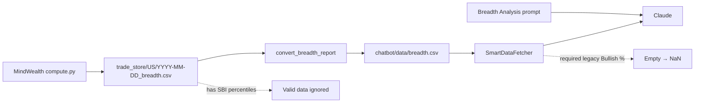

# Breadth Analysis Button — Issue & Resolution

This document describes the **Codebase Use → Breadth Analysis** chatbot button failure (NaN breadth values, empty analysis) and how it was fixed in **MindWealth_UI** (with a small backend fix in **MindWealth**).

---

## Symptom

When users clicked **Breadth Analysis** in the chatbot sidebar and asked for percentile analysis over a date range (e.g. `2026-05-02` to `2026-05-17`), the AI responded with:

- **"CRITICAL DATA ISSUE: NO VALID BREADTH VALUES"**
- All `Bullish Asset vs Total Asset (%)` and `Bullish Signal vs Total Signal (%)` values reported as **NaN**
- No bottom/top 10% day analysis possible

Example user-visible failure: records existed for TRENDPULSE, DELTADRIFT, BAND MATRIX, and Combined, but numeric breadth fields were missing.

---

## Root Cause

### 1. Schema mismatch (primary)

**MindWealth** changed the daily breadth report generator (`get_enhanced_breadth_signal` in `MindWealth/compute.py`) from a **legacy SBI** format to a **trade-arrival SBI** format.

| Era | Columns |
|-----|---------|
| **Legacy** | `Bullish Asset vs Total Asset (%)`, `Bullish Signal vs Total Signal (%)` |
| **Current** | `Total New Long/Short Signal`, `Last 6 Month Top 10 Percentile No of Long/Short Signal`, `Today Long/Short Signal Percentile From Top (Last 6 Month)` |

Dated files such as `trade_store/US/YYYY-MM-DD_breadth.csv` contain **only the new columns**.

The chatbot pipeline still assumed the legacy schema:

- [`chatbot/smart_data_fetcher.py`](../chatbot/smart_data_fetcher.py) — `BREADTH_REQUIRED_COLUMNS` forced legacy Bullish % columns
- [`chatbot/chatbot_engine.py`](../chatbot/chatbot_engine.py) — `BREADTH_MANDATORY_COLUMNS` guardrail injected the same legacy columns
- [`src/pages/chatbot_page.py`](../src/pages/chatbot_page.py) — Breadth Analysis prompt asked for "breadth ratios" on Bullish % fields

### 2. Empty cells → NaN in JSON

In [`chatbot/data/breadth.csv`](../chatbot/data/breadth.csv), rows ingested from new reports kept **empty** Bullish % cells while SBI trade-arrival columns were populated, e.g.:

```csv
2026-05-12,TRENDPULSE,,,5,13,1,1,37.57,9.94
```

`SmartDataFetcher` coerced Bullish % to numeric with `pd.to_numeric(..., errors="coerce")`. Empty strings became **NaN**, which serialized to JSON `NaN` in the Claude context. The model correctly refused to analyze non-existent ratios.

### 3. Ingestion issues (secondary)

[`chatbot/convert_signals_to_data_structure.py`](../chatbot/convert_signals_to_data_structure.py):

- **`convert_breadth_report()`** overwrote the `Date` column with `datetime.now()` instead of using the CSV row date or filename date.
- **`main()`** ingested only the **most recent** `*_breadth.csv` by modification time, not all dated breadth files.

### 4. Backend bug (MindWealth)

`calculate_trade_arrival_stats_for_breadth()` in `MindWealth/compute.py` returned **4** values on error paths while callers unpack **6** values, which could cause fragile failures during breadth generation.

---

## Data Flow (before fix)



---

## Resolution

### Design decision

**Use the new trade-arrival SBI schema only** — do not restore legacy Bullish % generation in `compute.py` and do not dual-schema the chatbot for this button.

### Files changed (MindWealth_UI)

| File | Change |
|------|--------|
| [`chatbot/breadth_context.py`](../chatbot/breadth_context.py) | **New.** SBI column list, column descriptions, Combined row name, `build_breadth_schema_note()` for LLM context |
| [`chatbot/smart_data_fetcher.py`](../chatbot/smart_data_fetcher.py) | `BREADTH_REQUIRED_COLUMNS` → SBI columns; numeric coercion on trade-arrival fields (not Bullish %) |
| [`chatbot/chatbot_engine.py`](../chatbot/chatbot_engine.py) | `BREADTH_MANDATORY_COLUMNS` from `breadth_context`; breadth JSON payloads include `sbi_schema_note` |
| [`chatbot/convert_signals_to_data_structure.py`](../chatbot/convert_signals_to_data_structure.py) | Date from CSV row or `YYYY-MM-DD_breadth.csv` filename; ingest **all** dated breadth files |
| [`src/pages/chatbot_page.py`](../src/pages/chatbot_page.py) | Breadth Analysis prompt rewritten for SBI metrics and Combined row focus |
| [`src/parsers/advanced_parsers.py`](../src/parsers/advanced_parsers.py) | Fixed typo: `Bullish Asset vs Total Asset (%).` → `Bullish Asset vs Total Asset (%)` |

### Files changed (MindWealth backend)

| File | Change |
|------|--------|
| `MindWealth/compute.py` | Error paths return 6-tuple `"N/A"`; docstring matches actual output columns |

---

## Current SBI schema (chatbot)

Mandatory / required columns for breadth fetches:

- `Date`, `Function`
- `Total New Long Signal`, `Total New Short Signal`
- `Last 6 Month Top 10 Percentile No of Long Signal`, `Last 6 Month Top 10 Percentile No of Short Signal`
- `Today Long Signal Percentile From Top (Last 6 Month)`, `Today Short Signal Percentile From Top (Last 6 Month)`

**Market-wide row:** `Function = "Combined (TrendPulse + DeltaDrift + BandMatrix)"`

**Percentile semantics** (from `breadth_context.py`):

- `Today Long Signal Percentile From Top = 10` → today’s long-signal count is in the **top 10%** of the last 6 months (busy day).
- **Low** values (e.g. ≤ 10) → quiet long-signal day vs 6-month history.
- Breadth Analysis prompt asks the model to rank days in the selected range by these percentiles (bottom/top decile), not legacy Bullish %.

---

## How to refresh breadth data after deploy

From the MindWealth_UI repo root:

```bash
./update_trade_data.sh
# or
.venv/bin/python chatbot/convert_signals_to_data_structure.py
```

This syncs `trade_store/US/*_breadth.csv` from MindWealth and appends/updates `chatbot/data/breadth.csv`.

---

## Verification

After the fix, for date range `2026-05-02`–`2026-05-17`:

```python
from chatbot.smart_data_fetcher import SmartDataFetcher
df = SmartDataFetcher()._fetch_breadth_data_consolidated(
    required_columns=None,
    from_date="2026-05-02",
    to_date="2026-05-17",
)
# Expect ~20 rows, Combined rows with non-NaN
# "Today Long Signal Percentile From Top (Last 6 Month) [numeric]"
```

Example Combined row (`2026-05-12`): long percentile **26.52**, short **23.2**, with signal counts populated.

Click **Breadth Analysis** in the chatbot — the BREADTH SIGNALS JSON block should include numeric SBI fields and `sbi_schema_note`, not all-NaN Bullish columns.

---

## Out of scope (not fixed in this change)

- **Streamlit breadth page** ([`src/pages/breadth_page.py`](../src/pages/breadth_page.py), [`src/components/cards.py`](../src/components/cards.py)) still targets legacy Bullish % UI and `breadth_us.csv` for the SBI chart — separate from the chatbot button.
- **Legacy rows** in `breadth.csv` (Jan 2026 and earlier) may still have Bullish % populated; the chatbot no longer requires them for Breadth Analysis.

---

## Related paths

- UI button: `src/pages/chatbot_page.py` — `chatbot_breadth_analysis_button`
- Consolidated data: `chatbot/data/breadth.csv`
- Source reports: `trade_store/US/YYYY-MM-DD_breadth.csv` (from MindWealth `trade_store/US/`)
- Backend generator: `MindWealth/compute.py` — `get_enhanced_breadth_signal()`
