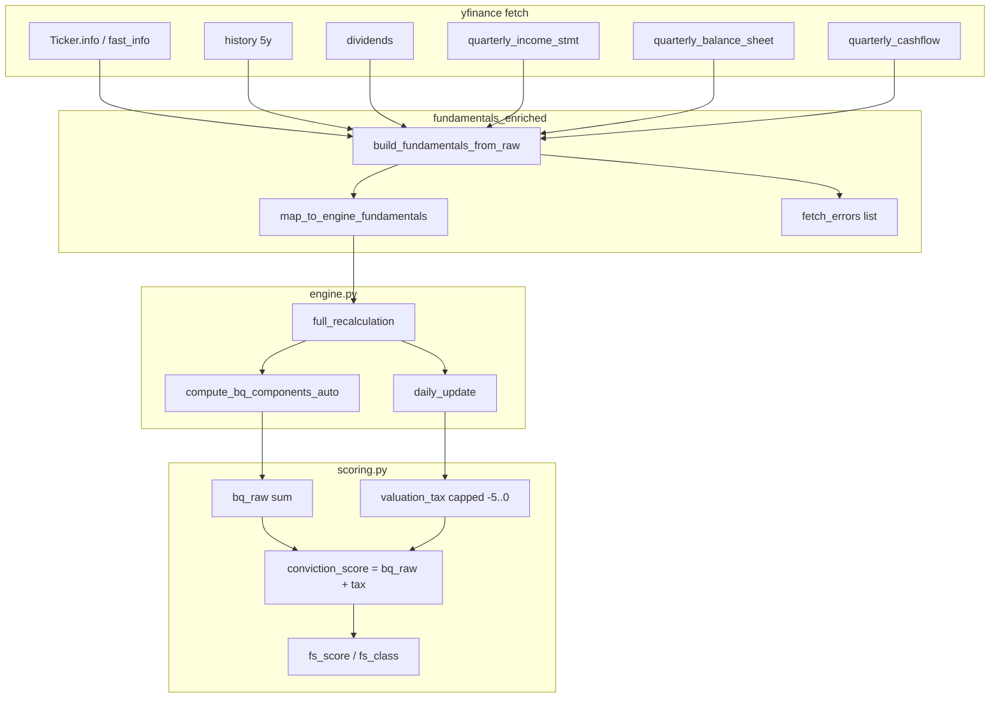

# Conviction Engine — Fundamental Agent (Status & Operations)

This document describes how the **fundamental conviction** layer works today, what we **assume**, and how to **run and verify** it. It aligns with the implementation plan at `.cursor/plans/conviction_engine_79da0f8e.plan.md` and the v5 PDF conceptually (batch overlay + JSON store); the PDF is not modified in-repo.

## Current status (verified in this workspace)

- **Entry point:** `scripts/update_conviction_fundamentals.py` — scheduled job to pull **yfinance** data, update `conviction_store/{TICKER}.json`, optionally refresh overlay CSVs under `conviction_store/overlays/`.
- **Data path:** `fetch_yfinance_fundamentals` → `fundamentals_enriched.fetch_and_compute_fundamentals` (quarterly statements, TTM sums, trailing P/E series, dividend stats, retries on thin `info`).
- **Scoring:** `full_recalculation` / `daily_update` in `src/conviction_engine/engine.py`; rules in `src/conviction_engine/scoring.py`.
- **Last full run:** `--mode full --write-overlays` for **166** tickers — batch **status completed, 0 thrown errors**; **no `fetch_errors`** returned on ticker results.
- **Equity scores (typical auto universe):** `conviction_score` often falls in a band like **roughly -8 to +8** depending on the tape and tax caps; **BQ raw** can span a wider range. Counts exactly at **-1 / 0 / +1** are a **minority**, not the bulk distribution.
- **Overlay contract:** Original `trade_store` CSVs unchanged; overlays appended alongside (e.g. `*_conviction.csv`).

## Architecture (batch)

1. Discover tickers from latest `trade_store/US` signal files (+ optional universe / flags).
2. Fetch enriched fundamentals per ticker (`info` + mapped fields + non-fatal `errors` list).
3. **Full:** refresh static BQ, copy fundamentals into record, run `daily_update` for valuation fields. **Daily:** refresh price-sensitive fields from latest fetch.
4. If `--write-overlays`, run `apply_to_signal_file` on latest signal sources.

### Daily automation (after signal reports)

**Script:** `scripts/run_conviction_engine_daily.py` (also invoked from `update_trade_data.sh` after trade_store sync).

Each run:

1. Resolves report date from `YYYY-MM-DD_all_signal.csv` (or `--report-date`).
2. Refreshes `conviction_store/{TICKER}.json` (default `--fundamentals-mode daily`).
3. Overlays conviction columns onto daily signal CSVs (`all_signal`, `new_signal`, `outstanding_signal`, `claude_signals_report`, `target_signal`, virtual trading).
4. Archives under **`conviction_store/daily/YYYY-MM-DD/`**:
   - `{report}_conviction.csv` — full report + conviction columns
   - `{report}_conviction_scores.csv` — compact score sheet (`conviction_score`, `verdict`, `fs_class`, …)
   - `manifest.json` — per-report summaries and paths
   - `daily_report.txt` — universe alert summary
5. Updates **`conviction_store/overlays/`** latest files for the Streamlit Conviction Engine page.

```bash
.venv/bin/python scripts/run_conviction_engine_daily.py --fundamentals-mode daily
.venv/bin/python scripts/run_conviction_engine_daily.py --report-date 2026-05-15 --skip-fundamentals
```

## Key modules

| Role | File                                                         |
| ---- | ------------------------------------------------------------ |
| CLI  | `scripts/update_conviction_fundamentals.py`                |
| Orchestration + fetch | `src/conviction_engine/fundamentals.py`             |
| Enriched yfinance      | `src/conviction_engine/fundamentals_enriched.py`   |
| Data coverage          | `src/conviction_engine/data_coverage.py`                 |
| Engine API             | `src/conviction_engine/engine.py`                       |
| Scoring / gates        | `src/conviction_engine/scoring.py`                       |
| Tests                  | `tests/test_conviction_engine.py`                       |

## Fundamental inputs: what is used, why it matters, how it is fetched

This section ties **stored JSON fields** to **yfinance sources** and the **formulas** in `fundamentals_enriched.py`, `engine.py` (`daily_update`), and `scoring.py`.

### How data is fetched (pipeline)

1. **`fetch_yfinance_enriched`** (`fundamentals_enriched.py`): builds a `yfinance.Ticker(symbol)`, with retries if `info` is empty. Pulls:
   - **`info`** — consolidated metadata (sector, margins, EPS, cashflow hints, `quoteType`, etc.).
   - **`fast_info`** — spot **`last_price`** / **`market_cap`** when available.
   - **`history(period="5y")`** — daily **Close** for dividend-yield statistics and trailing P/E history.
   - **`dividends`** — cash dividends aligned to price history.
   - **Quarterly statements**: **`quarterly_income_stmt`**, **`quarterly_balance_sheet`**, **`quarterly_cashflow`** — used for TTM sums and trends.

2. **`build_fundamentals_from_raw`**: maps the above into a flat **`fundamentals`** dict passed into the engine (see table below).

3. **`map_to_engine_fundamentals`**: drops nulls; may substitute **`gross_margin_computed`** when yfinance `grossMargins` is missing.

4. **`full_recalculation`**: merges `info` + `fundamentals`, sets **`business_type`**, computes **`bq_components`** / **`bq_raw`**, copies fields into the JSON record, then calls **`daily_update`**.

5. **`daily_update`** (and every overlay via **`modify_signal`**): refreshes **price-sensitive** ratios (**`pe_ttm`**, **`ev_fwd_rev`**, **`owner_earnings_yield`**, **`dividend_yield_current`**), recomputes **`valuation_tax`**, **`conviction_score`**, **`fs_score`**, **`fs_class`**, **`yield_trap_warning`**.

**Significance:** fundamentals answer “quality and valuation of the business **right now** (per yfinance)” so conviction can **overlay** quant signals. This is **not** a point-in-time archive unless you snapshot JSON historically.

---

### Primary inputs after fetch (engine `fundamentals` / record fields)

| Field(s) | Typical source(s) | Role / significance |
| -------- | ----------------- | ------------------- |
| **`quote_type`**, **`sector`**, **`industry`** | `info` | **Asset gate** (`EQUITY` vs ETF/index/crypto). **Business type** heuristics (saas / income / cyclical / compounder) for sector-appropriate valuation tiers and WACC used in ROIC spread. |
| **`price`**, **`market_cap`** | `fast_info` / `info` | **Market cap** drives **`enterprise_value`**, **`owner_earnings_yield`**, **`ev_fwd_rev`**, **`pe_ttm`**, live **dividend yield**. |
| **`eps_ttm`**, **`eps_fwd`** | `info.trailingEps`, quarterly net income / shares | **`pe_ttm`** = price / EPS; feeds **P/E percentile** vs built-up history. |
| **`fwd_revenue_stored`** | Sum of last **4 quarters** revenue (preferred), reconciled with `info.totalRevenue` if TTM looks wrong | **EV/revenue** = enterprise value / revenue — core **valuation tax** lens by business type. |
| **`fcf_ttm`** | Operating cash flow TTM + capex TTM (capex usually negative in yfinance, so **OCF + capex**), else `info.freeCashflow` | **FCF margin**, **distribution coverage**, **`owner_earnings_yield`** = FCF / market cap. |
| **`fcf_margin`** | `fcf_ttm / revenue_base` | **Rule of 40** style **margin_quality** for non-income types. |
| **`gross_margin`** | `info.grossMargins` or gross profit TTM / revenue TTM | **Revenue quality** and margin quality tie-ins. |
| **`net_debt_stored`** | Balance sheet debt minus cash (latest quarter row) | With **`market_cap`**: **EV** = market cap + net debt (net debt defaults 0 if null). |
| **`net_debt_ebitda`** | `net_debt / EBITDA` (TTM or `info.ebitda`) | **Balance sheet** score uses type-specific leverage bands. |
| **`roic_proxy`** | `returnOnEquity` or `returnOnAssets` (normalized % vs decimal), else NI/equity from statements | Compared to **type WACC** → **roic_wacc_spread** BQ points. |
| **`revenue_growth`**, **`revenue_accelerating`** | YoY change latest quarter vs 5 quarters back; last 3Q monotonicity | **Growth trajectory** BQ dimension. |
| **`gross_margin_trend`** | Change in gross margin % over ~5 quarters | **gross_margin_trend** BQ points. |
| **`distribution_coverage_ratio`** | `fcf_ttm / (dividendRate * shares)` | For **income** types, **margin_quality** from payout sustainability. |
| **`annual_div_per_share_stored`** | `dividendRate` / trailing annual | **`dividend_yield_current`** = div / price; **yield trap** z-score vs 5Y history. |
| **`dividend_yield_5y_mean`**, **`dividend_yield_5y_std`** | 5Y rolling sum of dividends / price | **Yield trap**: high current yield vs own history + exchange threshold. |
| **`pe_20y_array`** | **`history(period='max')`**: daily **P/E = that day’s close ÷ rolling 4Q EPS**; stored as **month-end** samples (up to ~240 points). | **Percentile** of today’s **`pe_ttm`** within that series → valuation tax. |
| **`pe_history_meta`** | Calendar span of valid P/E points: `years_available`, `start_date`, `end_date`, `insufficient_20y` if &lt; **20** years | Flags + universe distribution; see below. |
| **`insider_pct`** | `heldPercentInsiders` scaled to **0–100** if given as a fraction | **insider_ownership** BQ via thresholds (>15% good, &lt;1% bad). |

---

### Derived quantities in `daily_update` (math)

Let **P** = price, **M** = market cap, **D** = net debt (stored or 0), **R** = `fwd_revenue_stored`, **FCF** = `fcf_ttm`, **EPS** = `eps_ttm`.

| Quantity | Formula / rule | Use |
| -------- | -------------- | --- |
| **`enterprise_value`** | `enterprise_value = market_cap + net_debt` (net debt defaults to 0 if missing) | Less noisy “firm value” than equity-only cap. |
| **`pe_ttm`** | `pe_ttm = price / eps_ttm` when EPS > 0 | Current trailing P/E. |
| **`pe_percentile_20y`** | Fraction of `pe_20y_array` values ≤ current `pe_ttm`, times 100 | “How expensive vs recent own history” (field name is legacy). |
| **`ev_fwd_rev`** | `(market_cap + net_debt) / fwd_revenue_stored` when revenue > 0 | Richness vs sales; valuation tax tiers depend on `business_type`. |
| **`owner_earnings_yield`** | `fcf_ttm / market_cap` when both known and cap > 0 | Cash return on equity value; very low yield adds valuation tax. |
| **`dividend_yield_current`** | `annual_div_per_share_stored / price` | Current yield vs 5Y stats → z-score for yield trap gate. |
| **`conviction_score`** | `bq_raw + valuation_tax` (rounded) | Stored headline score before FS overlay cap in `modify_signal`. |

---

### Business type → valuation tier sets (`EV_REV_TIERS` in `scoring.py`)

**`business_type`** selects threshold list **`[t1,t2,t3,t4]`** (EV/revenue) and optional **`floor_trigger`**:

| Type | EV/rev thresholds (must cross in order) | `floor_trigger` (note) |
| ---- | ---------------------------------------- | ---------------------- |
| **saas** | 3, 5, 8, 12 | 4 |
| **compounder** | 1.5, 3, 6, 8 | 3 |
| **income** | 4, 6, 8, 10 | 6 |
| **cyclical** | 1, 2.5, 4, 5 | None |
| **unknown** | 2, 4, 6, 8 | None |

**EV/revenue tier tax:** let the tier list be `[t1, t2, t3, t4]`. Initialize `tier_tax = 0`. For each index **i** from 1 to 4, if `ev_fwd_rev >= t_i`, set `tier_tax = -i` (so the deepest breached threshold wins). Add `tier_tax` to total tax. If `ev_fwd_rev` is at or above the **last** threshold, set `tax = min(tax, -5)` (extra pinch at the top). **Income** only: if `ev_fwd_rev` is **below** the **first** threshold, add **+1** to tax.

**P/E percentile tax** (on current P/E vs stored history): if percentile ≥ 85% → **−3**; elif ≥ 70% → **−2**; elif ≥ 55% → **−1** (single branch — not stacked across bands).

**Owner earnings yield:** if `owner_earnings_yield < 1%` (0.01) → add **−2** to tax.

**Clamp:** `valuation_tax = round(max(-5, min(0, tax)), 2)` — never positive, never more negative than **−5** in total.

**Why:** combine **multiple** expensive signals without letting the raw sum explode past the v5-style cap.

---

### Auto BQ (`compute_bq_components_auto` + `bq_raw`)

**`bq_raw` = sum of 15 components** (each is a small integer-like score, then rounded).

| Component | Main inputs | Scoring idea (abbrev.) |
| --------- | ----------- | ------------------------ |
| **revenue_quality** | gross_margin, fcf_margin | Higher gross / FCF margin → up to +2 each branch, cap +2. |
| **growth_trajectory** | revenue_growth, revenue_accelerating | YoY and accel flags → −1 … +2. |
| **margin_quality** | business_type, dist_cov OR rule_of_40, fcf_margin, gross_margin | Income: coverage &gt;2 → +2, etc.; else Rule of 40 (%): ≥40 → +2, ≥25 → +1, etc. |
| **balance_sheet** | net_debt_ebitda vs **type bands** (`NET_DEBT_SAFE` / `CONCERN` / `DANGER`) | Safe → +1, stretched → 0 / −1 / −2. |
| **roic_wacc_spread** | roic_proxy minus **WACC** (saas 10%, compounder 7.5%, income 5.5%, cyclical 9%, unknown 8%) | Spread ≥5% → +2, ≥2% → +1, &gt;0 → 0, etc. |
| **gross_margin_trend** | gross_margin_trend | ≥+2% rel. → +1, ≤−2% → −1. |
| **debt_maturity_risk** | override | default 0. |
| **ceo_quality**, **mgmt_capital_allocation**, **competitive_moat**, **macro_tailwind** | overrides / scores | default **0** unless manual JSON. |
| **divergence_signal**, **deal_delay_risk** | override flags | 0 or ±2 / −1. |
| **insider_ownership** | insider % (0–100) | &gt;15% → +2, &lt;1% → −1. |
| **reinvestment_runway** | override multiple | ≥5 → +1, &lt;3 → −1. |

If **every** auto component is **0**, **`full_recalculation`** falls back to legacy **`compute_bq_components`** (simpler thresholds on the same fundamentals).

**`fs_quality_base`** = **`50 + bq_raw × 2.5`** (starting point for financial strength score).

---

### Financial strength score (`calculate_fs_score`) → `fs_class`

Starting score = **`fs_quality_base`** (or override). Then adjustments (examples):

- **Owner earnings yield** vs **OEY_STRONG** by type (e.g. compounder 4%): strong → **+5**; very weak (&lt;1%) → **−8**.
- **P/E percentile**: ≤30 → **+5**; ≥80 → **−6**.
- **EV/revenue**: ≥ top tier → **−8**; &lt; first tier → **+3**.

Clamp to **[0, 100]**, then **classify**: ≥75 strong, ≥55 moderate_high, ≥40 moderate, ≥25 moderate_low, else weak.

**`apply_fs_cap`** then may **lower** the conviction used for verdicts if **fs_class** is weak/moderate_low (long vs short caps differ).

---

### `fd_direction` (sizing nudge, not BQ)

From **`compute_fd_direction`**: votes from **revenue_growth** (&gt;2% / &lt;−2%), optional EPS growth (not populated from fetch by default), **gross_margin_trend** (&gt;1% / &lt;−1%) → **positive** / **negative** / **stable**. Used only inside **TACTICAL / REDUCED BUY** sizing bands.

---

## Meaning and significance of conviction scores

### What the numbers are

| Field | Meaning |
| ----- | ------- |
| **`bq_raw`** | Sum of **15 Business Quality (BQ)** dimension scores (roughly -15 … +30 in principle; typical auto-calibrated band is narrower). Higher = better franchise / balance sheet / growth / returns **before** adjusting for how expensive the stock is. Many dimensions default to **0** until you add **manual overrides** (CEO, moat, etc.). |
| **`valuation_tax`** | Non-positive adjustment for **rich** valuation vs business type (EV/revenue tiers, trailing P/E percentile, very low owner-earnings yield). Ranges from **0** down to a **floor of -5** (total tax is capped there so one expensive lens does not dominate). |
| **`conviction_score`** (in JSON store) | **`bq_raw` + `valuation_tax`** (rounded). This is the **uncapped** headline fundamental score used as input to the next steps. |

So a **high positive** score means: strong or decent BQ **and** valuation not punishing too hard. A **deep negative** score usually means weak BQ and/or heavy valuation tax (expensive vs fundamentals).

### How to read the magnitude (interpretive bands)

These bands describe **economic significance** in this implementation, not a guarantee of future performance:

| Approx. `conviction_score` | Interpretation |
| -------------------------: | -------------- |
| **&lt; 0** | Fundamentals **do not support** sizing into a typical long on fundamental grounds alone: weak BQ and/or punitive valuation tax. Often pairs with **CANCEL BUY** on new longs after FS and other gates. |
| **0 … 1.99** | **Marginal**: some BQ may be fine, but valuation drag and/or weak FS path keeps you **below** the first “actionable” BUY tier in the verdict map (needs **≥ 2** after any FS cap). |
| **2 … 4.99** | **Moderate alignment**: crosses the **REDUCED BUY** threshold **if** the score fed into `modify_signal` is **≥ 2** after **FS caps** (see below). Good businesses can sit here when still somewhat expensive. |
| **5 … 7.99** | **Strong alignment**: crosses **TACTICAL BUY** if the **post-cap** score **≥ 5**. Usually needs solid BQ and a valuation tax that is not maxed out (or strong overrides). |
| **≥ 8** | **Maximum fundamental tier** (**MAX CONVICTION** for buys). In practice, reaching **8+** with **only** automated yfinance inputs is **uncommon** because subjective BQ scores and extreme “cheapness” are often required; **manual BQ** and/or very favorable valuation help. |

**Negative scores** are **meaningful**, not errors: they say “fundamentals argue against paying up,” which is by design when tax and BQ both lean negative.

### Verdict mapping (after FS cap): BUY side

The engine applies **`apply_fs_cap`** so **weak** or **moderate-low** financial strength can **lower** the score before sizing. Overlay columns:

- **`conviction_raw`** ≈ pre-cap score from the record  
- **`conviction_score`** = **post-FS-cap** score used for **`verdict`** and **`sizing_pct`**

Thresholds (from `verdict_for_buy`, yield-trap excluded):

| Post-cap score | BUY verdict | Suggested sizing (conceptual) |
| -------------: | ----------- | ----------------------------- |
| **≥ 8** | MAX CONVICTION | 100% of framework bucket |
| **≥ 5** | TACTICAL BUY | 60–85% (depends on `fd_direction`) |
| **≥ 2** | REDUCED BUY | 25–50% (depends on `fd_direction`) |
| **&lt; 2** | CANCEL BUY | 0% |

**Yield-trap** (`yield_trap_warning`): hard **CANCEL BUY** / zero sizing regardless of score.

**`fd_direction`** (`positive` / `negative` / `stable`): nudges sizing **within** the REDUCED / TACTICAL bands; it does **not** change the tier boundaries.

### Financial strength (`fs_class`) — why scores get “stuck” in overlays

`fs_score` / `fs_class` come from a **separate** 0–100 scale (`calculate_fs_score` / `classify_fs`). If FS is **weak** or **moderate_low**, **`apply_fs_cap`** can cap the long/short **conviction_score** used for verdicts (e.g. weak + long-term signal capped at **+1**). That can make overlays look “all 0 or 1” even when **`conviction_raw`** is higher — always compare **`conviction_raw`**, **`bq_raw`**, **`valuation_tax`**, and the **rationale** column.

### SELL side (short signal)

For **SELL** signals, the same underlying score drives **pause vs exit** logic (`verdict_for_sell`): higher conviction supports **pausing** or **trading around** a short exit; lower conviction favors **full / hard** exit. Interpretation is symmetric to risk tolerance: “how much does fundamental quality argue for keeping vs exiting the position?”

### Non-equities

ETF / index / FX / crypto: **`conviction_score`** is **`null`** in JSON; overlays use **NOT_APPLICABLE**. There is **no** fundamental equity score to interpret.

## Assumptions

1. **Primary source** for automated fundamentals is **yfinance**; the JSON / overlay **shape** is stable so other providers can supply the same fields later.
2. **Non-equities** (ETF, index, FX, crypto) get **no** numeric equity conviction score in the same sense; gating uses asset type + `NOT_APPLICABLE` where appropriate.
3. **`pe_20y_array`** is a **legacy name**: the implementation builds a **recent trailing P/E history** from rolling four-quarter EPS vs spot prices, not a full multi-decade Macrotrends series.
4. **Subjective BQ items** (CEO, moat, etc.) score **0** unless **manual overrides** are set — consistent with an analyst workflow in the PDF.
5. **Valuation tax** is non-positive, **capped at -5** total; extreme EV/revenue floor applies at the **top EV/rev tier** only.
6. **`heldPercentInsiders` / `insider_pct`** is normalized to a **0–100 percent** scale for auto-BQ (e.g. `0.065` → `6.5`) so insider scoring matches `_score_insider`.

## Implementation notes (recent)

- **Auto BQ** (`compute_bq_components_auto`) with **fallback** to legacy `compute_bq_components` when every auto component is zero (sparse data).
- **Retries** when `Ticker.info` is empty or flaky.
- **Business type:** e.g. “Software – Infrastructure” not misclassified as income purely on the word “infrastructure”; dividend yield normalization for yfinance percent vs decimal.
- **`fd_direction`:** inferred from revenue growth and gross margin trend when not overridden; `_copy_known_fields` no longer resets it to a stale default.
- **`insider_pct`:** stored on **0–100** scale after fetch for consistent `_score_insider` thresholds.

## How to run

```bash
python3 -m venv .venv
.venv/bin/pip install -r requirements.txt

# Full refresh + overlays
.venv/bin/python scripts/update_conviction_fundamentals.py --mode full --write-overlays

# Price-sensitive only
.venv/bin/python scripts/update_conviction_fundamentals.py --mode daily --write-overlays
```

## How to verify

```bash
.venv/bin/python -m unittest tests.test_conviction_engine -v
```

Inspect JSON under `conviction_store/` for `conviction_score`, `bq_raw`, `valuation_tax`, `fetch_errors`. Successful runs should show **`fetch_errors`: []** or absent; batch JSON should report **`errors`: 0`.

### Verification checklist (last automated pass)

Use this as a repeatability checklist after a full `--mode full --write-overlays` run:

| Check | Expected |
| ----- | -------- |
| Unit tests `tests.test_conviction_engine` | All pass |
| EQUITY JSON records | Each has numeric `conviction_score` (non-equities use `null`) |
| Identity | Stored `conviction_score` == `bq_raw` + `valuation_tax` (two decimals) |
| `fetch_errors` on records | Empty or absent when yfinance responded normally |
| `data_coverage` / `missing_fields` | Present after full recalc; `coverage_ratio` reflects `CRITICAL_FIELDS` in `data_coverage.py` |
| Non-equities | `conviction_score` is `null` in JSON; overlays use `NOT_APPLICABLE` |
| Overlay CSV `conviction_score` “NaN” rows | Should be **only** ETF / INDEX / CURRENCY / CRYPTO rows (pandas empty for `null`); equity rows should be numeric |
| `conviction_score` vs overlay cap | Overlay column may be **FS-capped** vs store raw; see `conviction_raw` and rationale column |

Example spot-check: live `fetch_yfinance_fundamentals("AAPL")` should return **0** `fetch_errors` and populated keys such as `eps_ttm`, `fcf_ttm`, `fwd_revenue_stored`, `gross_margin`, `market_cap`.

## Backtesting conviction vs signal MTM

Use **`scripts/backtest_conviction_signals.py`** to compare two **dated exports** of the **same report type** (for example `*_outstanding_signal.csv`):

1. **Historical** file: signals and MTM as of report date T1.  
2. **Forward** file: same logical rows matched on `Function` + compound symbol line; outcome is the **forward** file’s **“Today … % vs Signal”** column (MTM vs original signal price as of T2).

The script attaches **`conviction_raw`** from the **current** `conviction_store` (today’s fundamentals), then reports:

- **Correlation** (Pearson and rank-based Spearman) between `conviction_raw` and forward % vs signal for **EQUITY / BUY** rows that matched T1→T2.  
- **Bucket summary**: mean / median / win-rate (`% vs signal` > 0) by conviction band (`<0`, `[0,2)`, `[2,5)`, `>=5`).

### Important limitations

- This is **not** a point-in-time fundamental backtest unless you rebuild `conviction_store` with historical fundamentals (not implemented here). Scores answer: “given **today’s** model, did higher conviction align with **later-reported** quant MTM?”  
- Rows must **exist in both** files with the **same** key; additions/removals between exports reduce the matched set.  
- If historical and forward paths are the **same file**, `same_file_warning` is true: correlations are still defined but **forward MTM equals historical** (not a time evolution).

### Example

```bash
.venv/bin/python scripts/backtest_conviction_signals.py \\
  --historical trade_store/US/2026-04-01_outstanding_signal.csv \\
  --forward trade_store/US/2026-05-14_outstanding_signal.csv \\
  --output-csv reports/conviction_backtest_detail.csv \\
  --output-json reports/conviction_backtest_summary.json
```

Resolve historical path by date:

```bash
.venv/bin/python scripts/backtest_conviction_signals.py \\
  --from-date 2026-04-01 \\
  --report-base outstanding_signal.csv
```

(Forward file defaults to the **latest** dated `*_<report-base>` under `trade_store/US`.)

Core logic: `src/conviction_engine/backtest.py`.

## Data linkage, redundancy, and missing data

This section documents how the engine behaves when yfinance data is partial or missing, how fields link together, and how to audit coverage on each JSON record.

### Linkage graph (fetch → score)



### Fallback chains (critical stored fields)

| Field | Primary | Secondary | Tertiary | If all absent |
| ----- | ------- | --------- | -------- | ------------- |
| `price` | `fast_info.last_price` | `info.currentPrice` / `regularMarketPrice` | `previousClose` | Omitted; daily update may skip `pe_ttm` |
| `market_cap` | `fast_info.market_cap` | `info.marketCap` | — | Omitted; EV / yield branches skipped |
| `eps_ttm` | Quarterly net income TTM / shares | `info.trailingEps` | — | Omitted; no `pe_ttm` |
| `fcf_ttm` | OCF TTM + capex TTM | `info.freeCashflow` | — | Omitted; FCF margin / owner earnings weak |
| `fwd_revenue_stored` | 4Q revenue sum | `info.totalRevenue` (ADR sanity) | — | Omitted; no `ev_fwd_rev` tax branch |
| `net_debt_stored` | Balance sheet debt − cash | — | — | Omitted; **defaults to 0** in `daily_update` EV |
| `pe_20y_array` | `history(max)` price vs rolling 4Q EPS | — | — | Omitted; **no P/E percentile penalty** |
| `dividend_yield_5y_mean/std` | 5Y div / price history | — | — | Omitted; yield-trap z-score skipped |
| Subjective BQ (CEO, moat, …) | Manual overrides only | — | — | Score **0** (neutral) |

Implementation: `_first_not_none` chains in `fundamentals_enriched.build_fundamentals_from_raw`; per-step `try/except` appends to `fetch_errors` without aborting the batch.

### BQ dimension ↔ inputs (auto path)

| BQ component | Fundamental inputs | Notes |
| ------------ | -------------------- | ----- |
| `revenue_quality` | `gross_margin`, `fcf_margin` | Neutral 0 if missing |
| `growth_trajectory` | `revenue_growth`, optional `revenue_accelerating` | |
| `margin_quality` | `revenue_growth`, `fcf_margin`, `distribution_coverage_ratio`, `gross_margin` | Type-aware in scorer |
| `balance_sheet` | `net_debt_ebitda` | Bands by `business_type` |
| `roic_wacc_spread` | `roic_proxy` or `roic` | vs type WACC |
| `gross_margin_trend` | `gross_margin_trend` | |
| `insider_ownership` | `insider_pct` | |
| `ceo_quality`, `mgmt_capital_allocation`, `competitive_moat`, `macro_tailwind`, `debt_maturity_risk`, `divergence_signal`, `deal_delay_risk`, `reinvestment_runway` | Overrides only | **Always 0** without manual JSON overrides |
| All auto zero | — | `full_recalculation` falls back to legacy `compute_bq_components` |

**Neutral-zero policy:** Missing inputs add **0** to `bq_raw`; scores are **not** re-normalized by `%` of dimensions with data. Sparse names can look “average” when many dims are empty. This pass **reports** coverage only; it does not rescale `conviction_score`.

### Valuation tax when inputs are missing

`calculate_valuation_tax` skips branches when inputs are absent:

- No `ev_fwd_rev` → no EV/revenue tier penalty (can be **less negative** than full data).
- No `pe_percentile_20y` → no historical P/E percentile penalty.
- No `owner_earnings_yield` → no earnings-yield branch.

`net_debt_stored` null is treated as **0** when computing enterprise value, which can **understate** EV.

### What is recorded on each JSON record

| Field | Purpose |
| ----- | ------- |
| `fetch_errors` | Non-fatal yfinance step failures from last fetch |
| `data_coverage` | Structured report: `coverage_ratio`, `low_data_confidence`, `statements`, `valuation_inputs`, `bq_auto_dimensions`, `fields_missing` |
| `missing_fields` | Flat sorted list for UI/search (includes `valuation:*` and `fetch:*` prefixes) |
| Null valuation fields | e.g. `pe_percentile_20y` null when `pe_20y_array` absent |

`low_data_confidence` is true when: non-empty `fetch_errors`, empty/thin `info`, `coverage_ratio` &lt; **0.45**, or missing `ev_fwd_rev`. Logic lives in `src/conviction_engine/data_coverage.py`.

### How to audit a ticker

1. Open `conviction_store/{TICKER}.json`.
2. Check `data_coverage.coverage_ratio` and `low_data_confidence`.
3. Read `missing_fields` and `data_coverage.fetch_errors`.
4. Inspect nulls on `pe_percentile_20y`, `dividend_yield_zscore`, `ev_fwd_rev`.
5. Expand `data_coverage.bq_auto_dimensions` for per-dimension `inputs_missing`.

Re-run full fundamentals to refresh coverage after code changes:

```bash
.venv/bin/python scripts/update_conviction_fundamentals.py --mode full
```

### Limitations

- Not point-in-time historical fundamentals unless you snapshot JSON externally.
- Wrong but non-null values are **not** detected as corrupt.
- No automatic score rescaling by coverage in this release.

### P/E history length flag (&lt; 20 years)

The valuation tax’s **P/E percentile** branch compares today’s `pe_ttm` to a trailing P/E series built from yfinance **`max`** price history and quarterly EPS. Each equity record stores:

| Field | Meaning |
| ----- | ------- |
| `pe_history_meta.years_available` | Calendar years from first to last valid daily P/E point |
| `pe_history_meta.insufficient_20y` | `true` when `years_available` &lt; **20** (target for “full” historical percentile) |
| `pe_history_meta.price_years_available` | Years of raw price data fetched |
| `pe_history_meta.eps_quarters` / `eps_years_available` | Quarterly EPS depth (often the binding limit for IPOs) |
| `data_coverage.pe_history` | Copy of the above on each coverage refresh |
| `missing_fields` | Includes `pe_history:insufficient_20y (Xy)` when under 20 years |

**Universe distribution** (how many names lack 20Y history, histogram by years):

```bash
.venv/bin/python scripts/report_pe_history_coverage.py
# or after a full refresh:
.venv/bin/python scripts/update_conviction_fundamentals.py --mode full --pe-history-report
```

JSON summary fields: `total_equity_records`, `insufficient_20y_count`, `insufficient_20y_pct`, `years_distribution` (buckets `0`, `0-2`, `2-5`, …, `20+`).

**UI:** Conviction Engine → **Charts** tab → “P/E history coverage (universe)” bar chart and per-ticker table.

**Interpretation:** Names with `insufficient_20y: true` still get a percentile vs **whatever history exists**; the flag means the comparison is **not** a full 20-year regime. Recent IPOs, thin EPS filings, or missing statements often land in `0-5` year buckets. Re-run **`--mode full`** after deploy so `pe_history_meta` is populated (legacy records with only `pe_20y_array` show `legacy_no_meta` until refreshed).

---

## Gaps vs PDF (explicit)

- No live `trade_arrival_analysis` dispatcher in-repo; integration is **batch CSV overlay**.
- No replacement for **manual** 15-dimension analyst scores except overrides.
- No external **long-history PE** vendor unless added later.

---

*Update this file when scoring or fetch behavior changes materially.*
