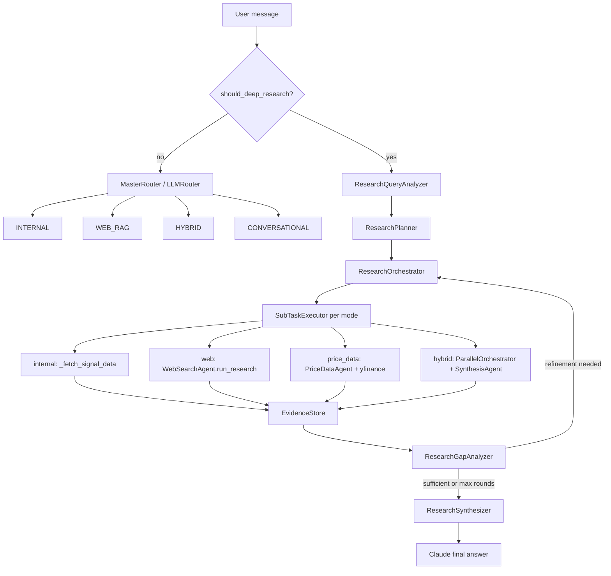

# Deep Research Agent Mode

Reference for the **Deep Research** chatbot pipeline: multi-step query decomposition, per-subtask retrieval (internal / web / hybrid), gap-driven refinement, and evidence-bound synthesis.

**Code:** [`chatbot/agents/`](../../chatbot/agents/) (`research_query_analyzer.py`, `research_planner.py`, `research_orchestrator.py`, `research_subtask_executor.py`, `price_data_agent.py`, `research_gap_analyzer.py`, `research_synthesizer.py`, `deep_research_gate.py`, `research_types.py`), [`chatbot/tools/market_price_tool.py`](../../chatbot/tools/market_price_tool.py)

**Entry point:** [`chatbot/chatbot_engine.py`](../../chatbot/chatbot_engine.py) — `smart_followup_query()` gates to `_answer_deep_research()` before the standard LLM router.

**UI:** Sidebar toggle **Deep Research mode** in [`src/pages/chatbot_page.py`](../../src/pages/chatbot_page.py).

**Prompts:** [`prompts/engine.py`](../../prompts/engine.py) — `RESEARCH_PLANNER_SYSTEM`, `RESEARCH_GAP_ANALYSIS_PROMPT`, `RESEARCH_SYNTHESIS_SYSTEM`.

---

## Summary

| Aspect | Standard WEB_RAG | Deep Research |
|--------|------------------|---------------|
| **Routing** | LLM router → one Tavily pass | Gate → query analysis → plan → N subtasks → gap rounds → synthesis |
| **Queries** | Max 3 search strings total | Up to 4 per subtask, up to 8 subtasks |
| **Tavily depth** | `basic` | `advanced` (research profile) |
| **Results** | 3 global snippets | Up to ~25 deduped URLs across subtasks |
| **Price data** | None | `price_data` subtasks: yfinance (+ trade_store fallback) for T+0/T+1m/3m/6m |
| **Iteration** | None | Gap analyzer can add refinement subtasks (max 2 rounds) |
| **Answer policy** | Single Claude pass on web block | Evidence pack per subtask; computed price tables; no generic filler |
| **Historical queries** | Recency `days=` heuristic may apply | `temporal_scope: historical` skips recency filter |

Deep Research is **not** the same as **Analyze Asset / Deep Dive** (`query_kind=deep_dive`), which is internal signal analysis with a higher row cap only.

---

## Problem this mode addresses

Flagged sessions (e.g. [`chatbot/flagged_pairs/flagged_research_mode.txt`](../../chatbot/flagged_pairs/flagged_research_mode.txt), [`flag_20260520_6b59ca98.json`](../../chatbot/flagged_pairs/flag_20260520_6b59ca98.json)) showed:

1. **WEB_RAG** ran 3 generic Tavily queries and returned announcement snippets, not T+1m / T+3m / T+6m outcomes.
2. The model **apologized and listed gaps** but had **no runtime loop** to run follow-up searches.
3. Later turns fell back to **generic block-sale theory** instead of marking facts as **Not found**.

Deep Research adds an explicit **plan → execute → gap-check → refine → synthesize** loop so the assistant can keep searching until the evidence pack is as complete as the budget allows, then answer with tables and honest gaps.

---

## How it fits in the chatbot routes

The engine supports five route concepts:

| Route | When |
|-------|------|
| `CONVERSATIONAL` | History-only, no new data |
| `INTERNAL` | MindWealth CSV / smart query |
| `WEB_RAG` | Web-only, single Tavily pass |
| `HYBRID` | Parallel web + internal, one synthesis |
| **`DEEP_RESEARCH`** | Toggle or auto-detect → full research pipeline |



Deep Research runs **before** `MasterRouter.route()` in `smart_followup_query()`. Normal chat is unchanged when the gate returns false.

---

## Activation

### 1. Sidebar toggle (session)

**Deep Research mode** in the chatbot sidebar sets `st.session_state["deep_research_enabled"]`, passed to `smart_followup_query(deep_research_enabled=...)`.

When on, **every** message in that session uses the Deep Research pipeline (subject to `ENABLE_DEEP_RESEARCH`).

### 2. Auto-detect (heuristics)

Implemented in [`chatbot/agents/deep_research_gate.py`](../../chatbot/agents/deep_research_gate.py).

Triggers when a score threshold is met from signals such as:

- Keywords: `block sale`, `precedent`, `what happened after`, `1 month` + `3 month` + `6 month`, `divestment`, `investigate`, etc.
- Multiple NZ / precedent entities in one message (Trustpower, Z Energy, Genesis, …)
- Frustration follow-ups (`why haven't you`, `useless`, `do the research`, …)
- Prior assistant message admitted missing web data / told the user to research elsewhere

Also: `query_kind == "deep_research"` (for future buttons or API use).

### 3. Config kill-switch

`ENABLE_DEEP_RESEARCH=false` disables the pipeline entirely.

---

## Pipeline stages

### Stage 0 — Query analysis (`ResearchQueryAnalyzer`)

Runs **before** subtask planning. Produces structured intent logged as `query_analysis` in `dprsh_*.json`:

- `comparison_type`: e.g. `historical_precedents` vs `general`
- `reference_event`: current deal tickers (context only when `measure_forward_returns_for_reference` is false)
- `suggested_precedents`: Z Energy, Trustpower, Genesis, etc.

Rule-based fallback when the LLM is unavailable detects “similar / years gone by / precedent” + block-sale language and sets `measure_forward_returns_for_reference=false` for in-progress reference sales (e.g. IFT/CEN May 2026).

### Stage 1 — Research plan (`ResearchPlanner`)

- **Model:** `DEEP_RESEARCH_PLANNER_MODEL` (default `gpt-4o-mini`)
- **Input:** User message + history + **query analysis JSON**
- **Output:** `ResearchPlan` with up to `DEEP_RESEARCH_MAX_SUBTASKS` (default 8) `ResearchSubTask` objects

Planner rules (prompt-enforced):

- **Two-phase precedent pattern:** per historical case → (1) `web` subtask to find **event date** and parties; (2) `price_data` subtask `depends_on` that web id for T+0/T+1m/T+3m/T+6m via yfinance.
- Do **not** plan forward T+Xm searches on an **in-progress** reference deal unless the user explicitly asks to track it.
- Minimum `DEEP_RESEARCH_MIN_PRECEDENTS` (default 3) web+price_data pairs for NZ block-sale historical questions.
- Use **internal** only for MindWealth signals; **hybrid** for news + signal stance.
- Set `temporal_scope: historical` so Tavily does not apply a short `days=` window.

### Stage 2 — Subtask execution (`ResearchSubTaskExecutor`)

Subtasks run in **topological order** (`depends_on`: web discovery before `price_data`).

| Mode | Behavior |
|------|----------|
| `internal` | `ChatbotEngine._fetch_signal_data()` with optional `internal_scope` |
| `web` | `WebSearchAgent.run_research()` — find event dates / announcements (not post-hoc prices) |
| `price_data` | `PriceDataAgent` → `market_price_tool.compute_post_event_returns()` (yfinance, trade_store fallback) |
| `hybrid` | `ParallelOrchestrator` (web + internal) → subtask synthesis prompt |

`price_data` reads `event_date` from the subtask or infers it from dependent web evidence (regex on prior snippets). Full return dict is stored in `SubTaskEvidence.price_data` and logged under `execution_detail.price_data`.

Results append to `EvidenceStore` as `SubTaskEvidence` (summary, formatted context, sources, price tables).

### Stage 3 — Gap analysis (`ResearchGapAnalyzer`)

After the initial plan batch, a small LLM call compares evidence to the original question and each subtask’s `success_criteria`.

- If gaps remain → emit **refinement subtasks** (prefer `price_data` when dates are known; web when dates missing). Invalid placeholder questions (`"Research subtask"`) are rejected.
- Repeat up to `DEEP_RESEARCH_MAX_ROUNDS` (default 2) refinement rounds.
- Hard cap: `DEEP_RESEARCH_TOTAL_TIMEOUT_SECONDS` (default 120s) for the whole run.

### Stage 4 — Synthesis (`ResearchSynthesizer` + Claude)

Builds a prompt from the full evidence pack (`DEEP_RESEARCH_MAX_WEB_CHARS`, default 12000) with rules:

- Cite `[Subtask stX / Source N]` where applicable.
- Use **=== COMPUTED PRICE DATA ===** blocks for numeric tables; never invent T+Xm returns.
- For reference deals not measured: state sale in progress / see precedents below.
- Do not substitute generic finance theory when evidence is thin.
- Do not tell the user to “research elsewhere.”

Final call uses `_answer_synthesized()` (same history path as HYBRID synthesis).

---

## Subtask schema

```json
{
  "id": "st1",
  "question": "Find Infratil Z Energy block sale announcement date (2019)",
  "retrieval_mode": "web",
  "precedent_name": "Z Energy / Infratil 2019",
  "seller_ticker": "IFT.NZ",
  "sold_ticker": "ZEL.NZ",
  "web_queries": ["Infratil Z Energy block trade June 2019 announcement date"],
  "temporal_scope": "historical"
},
{
  "id": "st2",
  "question": "Compute IFT.NZ and ZEL.NZ T+1m/3m/6m closes from st1 event date",
  "retrieval_mode": "price_data",
  "depends_on": ["st1"],
  "seller_ticker": "IFT.NZ",
  "sold_ticker": "ZEL.NZ",
  "price_offsets_months": [1, 3, 6]
}
```

Python types: [`chatbot/agents/research_types.py`](../../chatbot/agents/research_types.py).

---

## Web search: research profile vs WEB_RAG

[`WebSearchAgent.run_research()`](../../chatbot/agents/web_search_agent.py) is used only inside Deep Research.

| Setting | WEB_RAG (`run`) | Deep Research (`run_research`) |
|---------|-----------------|-------------------------------|
| `search_depth` | `basic` | `advanced` |
| Queries | ≤3 total | ≤4 per subtask |
| Results | 3 global | 8 per query, deduped up to ~25 |
| Recency | `_detect_recency_window()` | Disabled when `temporal_scope == "historical"` |

Standard routing still uses `run()` for `WEB_RAG` and HYBRID web branches.

---

## Structured audit logs (`dprsh_<uuid>.json`)

Each Deep Research run writes one JSON file under [`chatbot/deep_research_logs/`](../../chatbot/deep_research_logs/) (override with `DEEP_RESEARCH_LOGS_DIR`).

| Setting | Default |
|---------|---------|
| `ENABLE_DEEP_RESEARCH_LOGGING` | `true` |
| `DEEP_RESEARCH_LOG_MAX_CONTENT_CHARS` | `2000` (per Tavily snippet in log) |

**Filename:** `dprsh_<full_uuid>.json` (e.g. `dprsh_a1b2c3d4e5f6789012345678abcdef01.json`)

**Implementation:** [`chatbot/deep_research_log.py`](../../chatbot/deep_research_log.py) — `DeepResearchLogRecorder`

### Log contents (schema v1)

| Section | What is recorded |
|---------|------------------|
| `gate` | Trigger (`session_toggle`, `auto_detect`, `query_kind`), auto-detect score, matched keyword patterns |
| `input` | User message, assets, date range, functions, `query_kind` |
| `query_analysis` | `comparison_type`, `reference_event`, `measure_forward_returns_for_reference`, `suggested_precedents` |
| `plan` | Summary, reasoning, **subtask_count**, full subtask list (`price_data` fields, `depends_on`), raw planner JSON |
| `execution.rounds[]` | Per batch (`initial` / `refinement`): each subtask with elapsed ms, success, **planned vs executed web queries**, **per-query Tavily results** (title, url, score, content), internal row counts, hybrid branch errors |
| `execution.gap_analyses[]` | Sufficient flag, gaps summary, refinement subtasks planned, raw gap JSON |
| `synthesis` | Evidence pack size, final prompt size |
| `outcome` | Subtasks executed, refinement rounds, total ms, web sources, response metadata |
| `engine_log_lines` | Appended after the run from captured `chatbot` logger output |

Response metadata includes `deep_research_log_id` and `deep_research_log_path` for UI and debugging.

Log files are gitignored (`chatbot/deep_research_logs/*.json`).

---

## Configuration (environment)

Defined in [`chatbot/config.py`](../../chatbot/config.py):

| Variable | Default | Purpose |
|----------|---------|---------|
| `ENABLE_DEEP_RESEARCH` | `true` | Master switch |
| `DEEP_RESEARCH_MAX_SUBTASKS` | `8` | Initial plan cap |
| `DEEP_RESEARCH_MAX_ROUNDS` | `2` | Gap refinement rounds after initial plan |
| `DEEP_RESEARCH_WEB_TIMEOUT_SECONDS` | `45` | Per hybrid/web branch in subtask executor |
| `DEEP_RESEARCH_INTERNAL_TIMEOUT_SECONDS` | `60` | Per internal/hybrid internal branch |
| `DEEP_RESEARCH_WEB_MAX_RESULTS` | `8` | Tavily results per query in research profile |
| `DEEP_RESEARCH_WEB_MAX_QUERIES_PER_SUBTASK` | `4` | Search strings per web/hybrid subtask |
| `DEEP_RESEARCH_MAX_WEB_CHARS` | `12000` | Evidence pack web budget for final synthesis |
| `DEEP_RESEARCH_TOTAL_TIMEOUT_SECONDS` | `120` | Hard stop for Streamlit UX |
| `DEEP_RESEARCH_PLANNER_MODEL` | `gpt-4o-mini` | Planner + gap analyzer |
| `ENABLE_DEEP_RESEARCH_LOGGING` | `true` | Write `dprsh_*.json` audit files |
| `DEEP_RESEARCH_LOGS_DIR` | `chatbot/deep_research_logs` | Log directory |
| `DEEP_RESEARCH_LOG_MAX_CONTENT_CHARS` | `2000` | Max chars per web snippet in log |
| `ENABLE_DEEP_RESEARCH_PRICE_DATA` | `true` | Run `price_data` subtasks via yfinance |
| `DEEP_RESEARCH_PRICE_DATA_SOURCE` | `yfinance` | Primary OHLC source (trade_store fallback in tool) |
| `DEEP_RESEARCH_MIN_PRECEDENTS` | `3` | Minimum precedent web+price pairs in planner prompt |

**Required secrets:** `OPENAI_API_KEY` (planner, gap analysis), `TAVILY_API_KEY` (web subtasks). Claude API for the final answer (unchanged).

---

## UI and metadata

### Sidebar

- **Enable Web Search (Tavily)** — must be on for web subtasks.
- **Deep Research mode** — forces the pipeline for the session.
- **LLM router** — unused for messages that enter Deep Research (gate runs first).

### Response badges

- Intent: **Deep Research** (`INTENT_DEEP_RESEARCH`)
- Route: **DEEP_RESEARCH**
- Expander **Deep Research details**: subtasks executed, refinement rounds, plan summary, gaps summary

### Flow trace (live progress)

Stages surfaced to users (via `_FRIENDLY_FLOW_STEPS` in `chatbot_page.py`):

| Engine stage | User-facing label |
|--------------|-------------------|
| Deep Research | Deep research mode |
| Research Plan | Planning research |
| Subtask | Running research step |
| Gap Analysis | Checking coverage |
| Refinement | Follow-up research |
| Synthesis | Connecting the dots |

Technical `flow_trace` is still stored in session JSON for support.

### Metadata fields

| Field | Meaning |
|-------|---------|
| `deep_research_subtasks` | Count of subtasks executed (initial + refinements) |
| `deep_research_rounds` | Gap refinement rounds completed |
| `deep_research_plan_summary` | Planner one-line summary |
| `deep_research_gaps` | Gap analyzer summary when evidence incomplete |
| `web_sources` | Deduped URLs from all subtasks |

---

## Example: NZ block-sale precedents (flagged scenario)

User asks what happened to the **seller** and **block stock** at 1 / 3 / 6 months after NZ block sales (IFT selling CEN.NZ, precedents: Trustpower, Z Energy, Genesis, …).

**Typical plan (illustrative):**

1. `web` — Z Energy + IFT block sale dates and announcement prices  
2. `web` — Z Energy T+1m/3m/6m after sale (`historical`)  
3. `web` — IFT price after same events  
4. `web` — Trustpower 2022 divestment aftermath  
5. `web` — Genesis / Meridian / Mercury placements (parallel subtasks)  
6. `hybrid` — CEN.NZ signals + block-sale news (if session context needs internal stance)  
7. **Gap round** — only missing precedents from step 5  
8. **Synthesis** — comparison table with explicit **Not found** cells  

Contrast with old WEB_RAG: three generic queries → nine snippets → apology without further searches.

---

## Module map

| Module | Role |
|--------|------|
| `deep_research_gate.py` | Toggle + auto-detect |
| `research_planner.py` | Decompose query → `ResearchPlan` |
| `research_subtask_executor.py` | Run one subtask (internal / web / hybrid) |
| `research_orchestrator.py` | Plan execution, timeouts, refinement loops |
| `research_gap_analyzer.py` | Emit refinement subtasks |
| `research_synthesizer.py` | Build final Claude prompt |
| `research_types.py` | Dataclasses: plan, subtask, evidence store |
| `web_search_agent.py` | `run_research()` profile |
| `orchestrator.py` | Reused for hybrid subtasks |
| `synthesis_agent.py` | Reused for hybrid subtask prompts |

Prompt changelog auto-registers `RESEARCH_PLANNER_SYSTEM`, `RESEARCH_GAP_ANALYSIS_PROMPT`, `RESEARCH_SYNTHESIS_SYSTEM` on engine startup.

---

## Testing

Gate tests (no full engine import): [`chatbot/tests/test_deep_research_gate.py`](../../chatbot/tests/test_deep_research_gate.py)

```bash
python3 chatbot/tests/test_deep_research_gate.py
```

Validates that flagged-style block-sale / precedent messages auto-trigger and simple signal lookups do not.

---

## Limitations and future work (phase 2)

Not in scope for the current implementation:

- **Computed T+Xm returns** from a market-data API (Bloomberg, exchange OHLC feeds) — web snippets may still lack numeric post-sale performance.
- **NZX announcement scraping** as a dedicated tool — relies on Tavily discovery.
- **Native Claude tool-use loop** — orchestration is custom Python, not Anthropic built-in web tools.

Possible extensions: `price_data` subtask type, domain allowlists (`nzx.com`, `nzherald.co.nz`), dedicated “Deep Research” sidebar button with `query_kind=deep_research`.

---

## See also

- [CHATBOT_UI_BUTTONS.md](CHATBOT_UI_BUTTONS.md) — Analyze Asset (internal deep dive), Signal Insights, Breadth Analysis
- [REPORTS.md](REPORTS.md) — Outstanding signals, entry/exit CSV columns, MTM authority
- [analyze_asset_prompt_update.md](../updates_and_fixes/analyze_asset_prompt_update.md) — Deep Dive prompt (internal-only; different from Deep Research)
