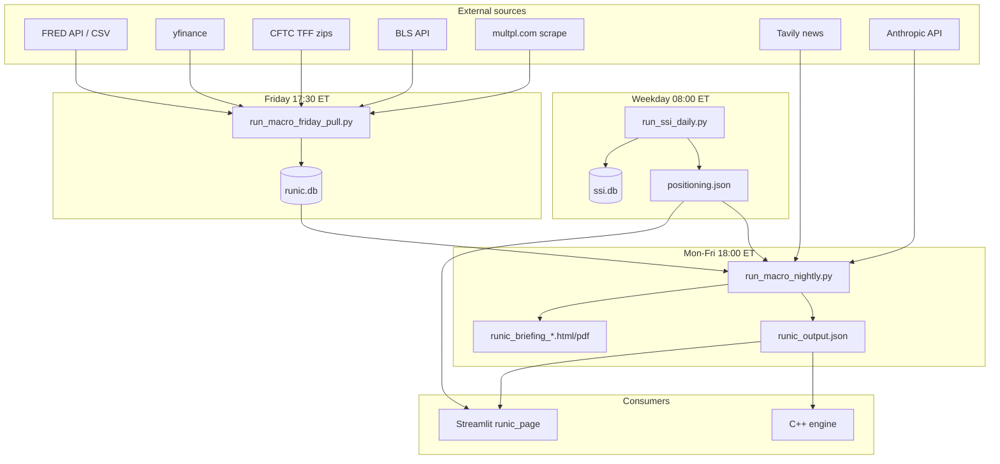

# Macro Intelligence (Runic Agent) — Architecture & Implementation

**Version:** CONFIG v2.2 / DATA_SOURCES v2.0  
**Last updated:** 2026-06-04  
**Audience:** Engineers operating AWS host `51.20.53.218`, C++ consumers, and Streamlit operators.

Authoritative product specs live in `macro_intelligence_docs/` (sourcing PDF, BTIG briefing sample, combo cheatsheet). This document describes **what is implemented in this repository** — file paths, data flow, config keys, edge cases, and known gaps.

---

## Table of contents

1. [System purpose](#1-system-purpose)
2. [High-level architecture](#2-high-level-architecture)
3. [Repository layout](#3-repository-layout)
4. [Configuration reference](#4-configuration-reference)
5. [Data sourcing (26 variables)](#5-data-sourcing-26-variables)
6. [CFTC TFF pipeline](#6-cftc-tff-pipeline)
7. [Database schema & migration](#7-database-schema--migration)
8. [Data pull layer](#8-data-pull-layer)
9. [Engine layer](#9-engine-layer)
10. [Scheduled jobs & cron](#10-scheduled-jobs--cron)
11. [Outputs & downstream consumers](#11-outputs--downstream-consumers)
12. [SSI integration](#12-ssi-integration)
13. [Backfill & validation scripts](#13-backfill--validation-scripts)
14. [Environment variables](#14-environment-variables)
15. [Testing](#15-testing)
16. [Known gaps & config vs cron discrepancies](#16-known-gaps--config-vs-cron-discrepancies)
17. [Operational runbook (quick)](#17-operational-runbook-quick)

---

## 1. System purpose

The **Runic Macro Intelligence Agent** ingests 12 macro variables, computes percentiles and signal tiers, detects **named combos A–G** plus **generic rare-variable combos**, classifies **macro regime**, resolves a **dominant signal** via fixed priority, and publishes:

- **SQLite** history (`runic.db`) for hit rates, analog dates, and research
- **`runic_output.json`** for the C++ trading engine
- **BTIG-style briefing** (HTML/PDF) for humans
- **Streamlit** dashboard (`Runic Macro Intelligence` page)

The **Sentiment SuperIndex (SSI)** runs earlier each weekday and writes `positioning.json`, which Runic reads at night for size multipliers, Layer 2 confirmation, Combo F gating, and VIX bypass rules.

---

## 2. High-level architecture



### Daily sequence (production)

| Order | Time (ET) | Job | Writes |
|-------|-----------|-----|--------|
| 1 | 08:00 Mon–Fri | `scripts/run_ssi_daily.py` | `positioning.json`, `ssi.db` |
| 2 | 17:30 Friday | `scripts/run_macro_friday_pull.py` | `daily_readings`, `combo_fires`, `forward_returns`, `cftc_positioning`, Combo C cancel state |
| 3 | 18:00 Mon–Fri | `scripts/run_macro_nightly.py` | `runic_output.json`, briefing files, `macro_regime_log` |

CFTC positions are reported Tuesday; the consolidated zip is typically refreshed by **Friday ~3:30pm ET**. The Friday job persists `cftc_positioning` only when `datetime.now().weekday() == 4` inside `pull_all_series()`.

---

## 3. Repository layout

### Config & manifests (`macro_intelligence/`)

| File | Role |
|------|------|
| `CONFIG.yaml` | Thresholds, combos, PRIORITY, CPI/CFTC, regime, AWS schedule metadata |
| `DATA_SOURCES.yaml` | Full 26-variable sourcing table (macro + SSI layers) |
| `CFTC_TFF_COLUMNS.yaml` | Production TFF column names, zip URLs, market filter |
| `SSI_CONFIG.yaml` | SSI weights, Layer 2 multipliers, entry thresholds |
| `data/runic.db` | Runtime SQLite (gitignored) |
| `data_cache/cftc/*.zip` | Local CFTC downloads (gitignored) |
| `output/runic_output.json` | C++ contract (gitignored) |
| `output/positioning.json` | SSI contract (gitignored) |
| `logs/*.log` | Cron logs |

### Python package (`src/macro_intelligence/`)

| Module | Responsibility |
|--------|----------------|
| `config.py` | `load_config()`, `db_path()`, `json_output_path()` |
| `models.py` | `SignalTier`, `ComboFire`, `RegimeState`, enums |
| `data/pull_all.py` | Orchestrates 12 pulls → `daily_readings` |
| `data/fred_pull.py` | NFCI, HY, WALCL, T10Y2Y |
| `data/yahoo_pull.py` | VIX, VXTS, WTI, CNH, GSR, SPX+50WMA |
| `data/cftc_pull.py` | TFF parse, FM/RM nets, snapshot persist |
| `data/cpi_pull.py` | CPI surprise CSV |
| `data/bls_pull.py` | BLS CPI/PPI, retry, FRED fallback |
| `data/cape_scrape.py` | Shiller CAPE |
| `data/retry_cache.py` | `data_pull_log` last-good cache |
| `engine/percentiles.py` | Dual percentiles, tier evaluation |
| `engine/combo_detector.py` | Named A–G + generic combos |
| `engine/combo_c_cancel.py` | Combo C cancellation tracker |
| `engine/dominant.py` | PRIORITY + brave/fearful labels |
| `engine/regime_rules.py` | Python fed/curve/val/liquidity |
| `engine/persistence.py` | Streak rules (7WK_GRIND, etc.) |
| `engine/forward_returns.py` | SPX forward returns vs combo fires |
| `engine/hit_rates.py` | SQL hit-rate queries |
| `engine/prefilter.py` | Generic combo gate (min fires / hit rate) |
| `engine/vix_bypass.py` | Combo B / Combo F+SSI bypass |
| `claude/regime_classifier.py` | Geo overlay (Claude+Tavily or heuristics) |
| `claude/geo_news.py` | Tavily headline fetch |
| `claude/nightly_briefing.py` | Narrative generation |
| `jobs/friday_pull.py` | Friday EOD pipeline |
| `jobs/nightly_run.py` | Nightly JSON + briefing |
| `jobs/monthly_threshold_review.py` | Threshold suggestions |
| `output/json_writer.py` | Atomic `runic_output.json` |
| `output/briefing_renderer.py` | HTML/PDF briefing |
| `db/schema.sql`, `migrate.py`, `connection.py` | SQLite |

### SSI package (`src/sentiment_superindex/`)

Parallel structure: `data/`, `engine/ssi_score.py`, `layer2.py`, `positioning.py`, `jobs/daily_run.py`, `output/json_writer.py`, `db/schema.sql`. Shares `cftc_pull.py` via `data/cftc_ssi.py`.

### Entry scripts (`scripts/`)

| Script | Purpose |
|--------|---------|
| `run_ssi_daily.py` | SSI morning job |
| `run_macro_friday_pull.py` | Friday macro + combos |
| `run_macro_nightly.py` | Nightly JSON + briefing |
| `install_aws_cron.sh` | Install production crontab |
| `backfill_macro_history.py` | Historical DB backfill |
| `backfill_geo_overlay.py` | Geo overlay on key dates |
| `download_cftc_tff_zip.py` | Self-service CFTC zip cache |
| `validate_cftc_tff_columns.py` | Manifest vs live/local zip |
| `export_data_validation.py` | 12-var validation CSV |
| `ingest_cpi_release.py` | Manual CPI surprise |
| `recalibrate_thresholds.py` | Threshold review helper |
| `run_ssi_threshold_sweep.py` | SSI threshold analysis |

### UI

- `src/pages/runic_page.py` — `create_runic_page()` in Streamlit nav **"Runic Macro Intelligence"**
- `app.py` — registers the page

### Path resolution (`src/config_paths.py`)

All paths honor env overrides and create directories on import:

- `MACRO_INTEL_DIR`, `MACRO_INTEL_DATA_DIR`, `MACRO_INTEL_OUTPUT_DIR`
- `MACRO_INTEL_CONFIG` → `macro_intelligence/CONFIG.yaml`
- `MACRO_INTEL_DB`, `MACRO_INTEL_JSON_PATH`
- `SSI_CONFIG`, `SSI_DB`, `SSI_POSITIONING_JSON`

---

## 4. Configuration reference

### 4.1 `CONFIG.yaml` — Claude

```yaml
claude:
  model: claude-sonnet-4-20250514   # override: MACRO_CLAUDE_MODEL
  regime_max_tokens: 150
  narrative_max_tokens: 500
```

### 4.2 Schedules (documented vs installed)

| Key | CONFIG value | **Actual AWS cron** (`install_aws_cron.sh`) |
|-----|--------------|---------------------------------------------|
| SSI daily | (in SSI_CONFIG) `0 8 * * 1-5` | `0 8 * * 1-5` ET ✓ |
| Friday pull | `0 18 * * 5` (comment: UTC) | `30 17 * * 5` ET |
| Nightly | `0 21 * * 1-5` | `0 18 * * 1-5` ET |
| Monthly review | `0 10 1 * *` | **Not installed** in cron script |

`aws` block documents intended ET times: `friday_pull_et: 17:30`, `nightly_et: 18:00`, `ssi_daily_et: 08:00`, host `51.20.53.218`, `tz: America/New_York`.

Cron installer sets `export TZ=America/New_York` before installing crontab.

### 4.3 Prefilter (generic combos / rule library)

```yaml
prefilter:
  min_historical_fires: 3
  min_hit_rate: 0.60
  candidate_named_min_fires: 3
  candidate_named_min_hit_rate: 0.75
```

Generic combo fires are stored with `gate_flag: BELOW_GATE` until prefilter/hit-rate gates pass (used in analysis, not fully enforced on every nightly path).

### 4.4 Forward returns

```yaml
forward_returns:
  spx_ticker: ^GSPC
  horizons_trading_days: [5, 21, 63, 126]   # maps to spx_1w, spx_1m, spx_3m, spx_6m (+ spx_2w)
```

Uses NYSE calendar via `pandas_market_calendars` in `forward_returns.py`.

### 4.5 Twelve Runic variables (CONFIG `variables:`)

Each entry defines: `id`, `name`, `source`, `paradigm`, `pctile_window`, `pctile_start` (optional), `combos`, `rare` / `extreme` thresholds.

| ID | Source | Paradigm | Pctile window | Start | Combos | Rare highlights |
|----|--------|----------|---------------|-------|--------|-----------------|
| NFCI | FRED NFCI | DUAL | full | 1973 | A,E | pctile 80/20, sd ±0.3 |
| HY | FRED BAMLH0A0HYM2 | DUAL | full | 1996 | A,B,F,G | abs 400 bps, pctile 80 |
| WALCL | FRED WALCL | ROC | rolling_3y | — | A,C | mom 0.8% rare |
| CNH | YAHOO USDCNH=X | ROC | rolling_3y | 2010 | A,C,G | 4wk 1.5% |
| WTI | YAHOO CL=F | ROC | rolling_3y | — | C | 4wk 6% rare, 10% extreme |
| VIX | YAHOO ^VIX | DUAL | full | 1990 | B,D,G | level 25, pctile 80 |
| VXTS | YAHOO ^VIX3M/^VIX | RATIO | full | 2007 | D,G | low 0.95 / high 1.10 |
| CFTC | CFTC TFF | PCTILE | rolling_3y | 2006 | B,D,E,F | pctile 15/85 |
| CURVE | FRED T10Y2Y | DUAL | full | 1976 | A,E | spread -30 bps, steepen 15 bps 4wk |
| CPI | CPI | ABS | rolling_3y | — | C | surprise 0.2 pp |
| GSR | YAHOO GC/SI | ROC | rolling_3y | — | A | 4wk 5% |
| CAPE | CAPE scrape | ABS | full | 1881 | E | high 28, low 16 |

**Internal series not stored as variables:** `SPX_W` (50-week MA frame) loaded in `load_all_series()` for Combo F only.

### 4.6 Named combos (`named_combos`)

| Combo | Logic (implemented in `combo_detector.detect_named_combos`) |
|-------|---------------------------------------------------------------|
| **A** | ≥2 of [NFCI, HY, WALCL, CNH] at RARE or EXTREME tier |
| **B** | ALL: VIX≥25, HY≥400 bps, CFTC combo pctile≤15; 1–2 legs → WATCH |
| **C** | WTI 4wk≥10%, CPI surprise≥0.2 pp, WALCL mom abs&lt;0.8% (flat); duration weeks tracked |
| **D** | VXTS≥1.10, VIX&lt;18; CFTC pctile≥85 → ACTIVE else WATCH |
| **E** | 2 of 3: CAPE≥28, NFCI&lt;-0.3, CFTC pctile≥80; status CONFIRMED when ≥2 hits |
| **F** | SPX reclaims 50WMA (was below prior week) OR weekly gain≥3%, AND CFTC pctile≤50 |
| **G** | VXTS&lt;1.0 and VIX&lt;20 (CONFIG also lists `hy_widen_4wk_bps: 30` — **not evaluated** in detector today) |

**CFTC percentiles for combos:** `combo_pctile_from_reading()` uses `unconditional_pctile` or `pctile_rank_3yr` — **FM net only** (fast money), not RM.

### 4.7 Dominant signal PRIORITY

```yaml
dominant:
  PRIORITY: { C: 100, B: 90, F: 80, E: 70, D: 60, G: 50, A: 40 }
  combo_f_validation_date: "2020-06-08"
```

`resolve_dominant()` picks highest PRIORITY among combos with status `ACTIVE`, `PARTIAL`, or `CONFIRMED`.

**Brave/fearful labels** (`_brave_fearful`):

- `C` + active `F` → `TACTICAL_FEARFUL_STRATEGIC_BRAVE`
- `F` dominant → `TACTICAL_BRAVE`
- `E` → `STRATEGIC_CAUTIOUS`
- `B` → `TACTICAL_FEARFUL`
- else → `NEUTRAL`

### 4.8 Combo C cancel

```yaml
combo_c_cancel:
  wti_4wk_max_pct: 5.0
  consecutive_fridays: 4
```

Only runs on **Fridays** when Combo C is active. Each Friday: if WTI 4wk &lt;5% AND CPI “not hot” (`actual <= consensus` from `pending_releases`), increment `wti_potential_week` in `combo_c_cancel` table; at 4 weeks set `active=0` (cancelled).

**PPI:** `ppi_cooling` flag is computed separately; `affects_combo_cancel: false`.

### 4.9 CPI / PPI (`cpi`, `ppi_cooling`)

```yaml
cpi:
  bls_series_id: CUSR0000SA0
  fred_fallback: CPIAUCSL
  fred_fallback_after_calendar_days: 2
  retry_times_et: [08:30, 09:00, 10:00, 13:00, 16:00, 20:00]
  hot_surprise_min_pp: 0.2
  not_hot_rule: "actual <= consensus"

ppi_cooling:
  bls_series_id: WPSFD49207
  enabled: true
  cooling_mom_max_pct: 0.0
```

### 4.10 CFTC block

```yaml
cftc:
  local_cache_dir: macro_intelligence/data_cache/cftc
  market_primary: "S&P 500 Consolidated"
  market_filter: "S&P 500"
  market_exclude: "E-MINI|MICRO|DIVIDEND|ADJUSTED INT RATE"
  fm_classification: "Lev Money|Leveraged Funds"
  rm_classification: "Asset Mgr|Asset Manager"
  pending_status: PENDING_CFTC_CONFIRM
  pctile_window_weeks: 156
```

**Status in DB:** `CONFIRMED` when `persist_cftc_snapshot` runs on a Friday (`weekday()==4`); otherwise `PENDING_CFTC_CONFIRM`.

### 4.11 Regime

```yaml
regime:
  min_regime_days_for_pctile: 50
  geo_model: claude-sonnet-4-20250514
  tavily_max_results: 5
```

Python builds `fed_cycle`, `curve_regime`, `val_regime`, `liquidity`. Claude+Tavily adds `geo_overlay` when API keys present; else `_heuristic_regime()` / `_heuristic_geo()` fixed dates for tests.

### 4.12 VIX bypass

```yaml
vix_bypass:
  combos: [B]
  ssi_confirmed_combo_f: true
```

`compute_vix_bypass()`: true if Combo B active, OR Combo F active AND `ssi_layer2_status == CONFIRMED`.

### 4.13 Persistence rules (`persistence_rules`)

Six streak scanners in `persistence.py`: `7WK_GRIND`, `3WK_SURGE`, `VIX_SUPPRESSED`, `HY_GRIND_TIGHT`, `FCI_EASING_STREAK`, `OIL_VOLATILE` — conditions from CONFIG (SPX weekly returns, VIX&lt;15 for 10 days, etc.).

### 4.14 Briefing

```yaml
briefing:
  output_dir: macro_intelligence/output
  formats: [html, pdf]
```

---

## 5. Data sourcing (26 variables)

`DATA_SOURCES.yaml` is the authoritative crosswalk for **macro (1–12)** and **SSI (13–24)**.

**Governing principles:** free sources, yfinance for prices, scrape only when no API, no paid subscriptions, government-shutdown retry/cache.

**Overlap rules (do not double-count):**

- Macro **HY** = FRED OAS; SSI **HYG/LQD** = ETF ratio (Layer 2)
- **VIX** = Runic only (not in SSI combined score)
- **VXTS** = single Yahoo pull shared by macro combos and SSI Layer 2
- **CFTC** = one TFF download; FM for combos, RM for dashboard/SSI Layer 3 only

---

## 6. CFTC TFF pipeline

### 6.1 Official files (do not use legacy `deacot*.zip`)

| Period | Zip URL | Inner file |
|--------|---------|------------|
| 2006–2016 | `https://www.cftc.gov/files/dea/history/fin_fut_txt_2006_2016.zip` | `F_TFF_2006_2016.txt` |
| 2017+ | `https://www.cftc.gov/files/dea/history/fut_fin_txt_{year}.zip` | `FinFutYY.txt` |

Manifest: `macro_intelligence/CFTC_TFF_COLUMNS.yaml` (aligned with [cotvariablestfm](https://www.cftc.gov/MarketReports/CommitmentsofTraders/HistoricalViewable/cotvariablestfm)).

### 6.2 Required columns (production format)

One row per market per report date (not per trader classification row):

- `Market_and_Exchange_Names`
- `Report_Date_as_YYYY-MM-DD`
- `Lev_Money_Positions_Long_All` / `_Short_All` → **FM net**
- `Asset_Mgr_Positions_Long_All` / `_Short_All` → **RM net**

### 6.3 Market filter (`cftc_pull._market_mask`)

1. Prefer rows containing **`S&P 500 Consolidated`**
2. Else: `market_filter` match AND NOT `market_exclude` regex  
   **Never sum** E-mini, micro, dividend, or adjusted-rate contracts (prevents bogus nets like -760k).

### 6.4 Parsing

- `parse_cftc_dataframe()` → FM net series (groupby date `.last()`)
- `parse_cftc_rm_dataframe()` → RM net series
- Rolling percentile for snapshot: 156 weeks default (`_rolling_pctile`)

### 6.5 Caching layers

1. **Process memory:** `_TFF_RAW_CACHE` after first `_download_frames()`
2. **Disk:** `macro_intelligence/data_cache/cftc/` — populated by `scripts/download_cftc_tff_zip.py`; read before HTTP
3. **DB:** `cftc_positioning` on Fridays via `persist_cftc_snapshot()`
4. **Pull log:** `data_pull_log` source_ids `cftc_fm`, `cftc_rm`

### 6.6 Self-service download (no external sample zip)

```bash
# Current year + latest consolidated sample row
.venv/bin/python scripts/download_cftc_tff_zip.py --year 2026 --extract-sample

# Full history for backfill
.venv/bin/python scripts/download_cftc_tff_zip.py --all-years --start 2006

# Offline column check
.venv/bin/python scripts/validate_cftc_tff_columns.py \
  --zip macro_intelligence/data_cache/cftc/fut_fin_txt_2026.zip
```

Sample output: `tests/fixtures/cftc/tff_latest.csv` (regenerated by `--extract-sample`).

---

## 7. Database schema & migration

**Path:** `macro_intelligence/data/runic.db` (`MACRO_INTEL_DB`)

### Tables

| Table | Purpose |
|-------|---------|
| `variables` | Seeded from CONFIG (var_id, paradigm, combo_slots, pctile window) |
| `thresholds` | Per-var tier thresholds |
| `daily_readings` | Daily snapshot: raw, `pctile_rank_3yr`, `unconditional_pctile`, `regime_pctile`, tier, direction, `meta_json` |
| `pending_releases` | CPI/PPI releases (actual, consensus, surprise_pp) |
| `combo_c_cancel` | Singleton `id=1`: cancel progress |
| `cftc_positioning` | FM/RM nets and pctiles per date |
| `data_pull_log` | Pull OK/ERROR/CACHE_HIT audit |
| `signal_fires` | Per-variable tier fires |
| `combo_fires` | Named + generic; `runic_combo` NULL for generic |
| `forward_returns` | SPX horizons per `combo_id` |
| `rule_library` | Hit-rate rules |
| `persistence_fires` | Streak signals |
| `macro_regime_log` | `regime_json` + model tag |
| `threshold_review_log` | Monthly suggestions (`PENDING`) |

### Migration (`db/migrate.py`)

- Re-applies `schema.sql`
- Adds `unconditional_pctile`, `regime_pctile` to existing DBs if missing
- Seeds `combo_c_cancel` row `id=1`

### Init (`db/connection.py`)

`init_db()` → schema + seed variables from CONFIG + `migrate_db()`.

---

## 8. Data pull layer

### 8.1 Orchestrator (`pull_all.py`)

**`load_all_series(force=False)`** — builds in-memory `_CACHE`:

| Key | Pull function | Notes |
|-----|---------------|-------|
| NFCI, HY, WALCL, CURVE | `fred_pull` | WALCL → `walcl_mom_pct()`; CURVE → spread + steepen 4wk |
| VIX, VXTS, WTI, CNH, GSR | `yahoo_pull` | WTI/CNH/GSR use 20-day rolling % change |
| CAPE | `cape_scrape` | CSV cache `data/cape_history.csv` |
| CFTC | `fetch_cftc_fast_money_net(2006)` | FM series only in readings |
| CPI | BLS + CSV | `try_bls_cpi_pull()`, FRED fallback, `load_cpi_surprise_series()` |
| SPX_W | `spx_with_50wma` | Combo F only |

**`pull_all_series(as_of)`** — for each CONFIG variable: compute unconditional + regime percentiles, `evaluate_variable_tier()`, upsert `daily_readings`. On Friday, `persist_cftc_snapshot(as_of)`.

### 8.2 FRED (`fred_pull.py`)

- Primary: `fredapi` if `FRED_API_KEY`
- Fallback: public `fredgraph.csv` URL
- No NULL overwrite on failure when used via `pull_with_cache`

### 8.3 Yahoo (`yahoo_pull.py`)

- `yfinance` downloads
- `vix_term_structure`: ratio ^VIX3M / ^VIX
- `spx_with_50wma`: columns `above_50wma`, `weekly_ret_pct`

### 8.4 BLS / CPI (`bls_pull.py`, `cpi_pull.py`)

- BLS API v2 for `CUSR0000SA0`
- After 2 calendar days without BLS: FRED `CPIAUCSL` MoM proxy
- Manual ingest: `scripts/ingest_cpi_release.py`, optional `CPI_CONSENSUS_CSV`
- Surprises also in `macro_intelligence/data/cpi_surprises.csv`

### 8.5 Retry cache (`retry_cache.py`)

`pull_with_cache(source_id, fetch_fn)`:

1. Try fetch → log `OK`
2. On error → log `ERROR`, return `get_last_good()` and log `CACHE_HIT`
3. Never writes NULL to downstream consumers when cache exists

### 8.6 Percentiles (`percentiles.py`)

| Function | Use |
|----------|-----|
| `compute_unconditional_pctile` | Stored as `pctile_rank_3yr` / `unconditional_pctile`; used for combos |
| `compute_regime_pctile` | Fed-cycle-conditioned; falls back if &lt;50 regime days in `macro_regime_log` |
| `combo_pctile_from_reading` | Combo B/D/E/F CFTC legs |
| `evaluate_variable_tier` | Variable-specific RARE/EXTREME (VIX level, HY bps, VXTS ratio, etc.) |

---

## 9. Engine layer

### 9.1 Combo detection (`combo_detector.py`)

**Friday / backfill:** `detect_all_combos(as_of, persist=True)`

1. `detect_named_combos()` → A–G
2. `detect_generic_combos()` → all 1/2/3 combinations of vars at RARE+
3. Dedupe generics that match named var sets
4. `_persist_fires()` → `combo_fires`

**Nightly:** `detect_named_combos()` only (no generic persist in `nightly_run.py`).

**Generic fires:** `runic_combo=NULL`, `gate_flag=BELOW_GATE`.

**Duration buckets:** SHORT &lt;6w, MEDIUM 6–16w, LONG &gt;16w.

### 9.2 Forward returns (`forward_returns.py`)

`backfill_forward_returns()` / `fill_matured_returns()` join `combo_fires` to SPX forward returns at CONFIG horizons.

### 9.3 Hit rates (`hit_rates.py`)

`raw_hit_rate(combo, bullish=...)` — SQL over `combo_fires` + `forward_returns`; used in dominant reason string and nightly payload.

### 9.4 Dominant (`dominant.py`)

See [4.7](#47-dominant-signal-priority). `find_analog_dates()` returns recent dates with non-null `spx_3m` for dominant combo.

### 9.5 Regime (`regime_rules.py` + `regime_classifier.py`)

**Python labels:**

- `fed_cycle`: WALCL MoM proxy (QE/QT/HIKING/CUTTING/PAUSING) — FFR not wired in nightly context (`ffr: unknown`)
- `curve_regime`: T10Y2Y spread + steepen meta
- `val_regime`: CAPE buckets → mapped to EXTREME/ELEVATED/CHEAP/FAIR in Claude path
- `liquidity`: NFCI thresholds ±0.5

**Geo overlay:** Tavily headlines → Claude JSON; enums: NEUTRAL, TRADE_WAR, SANCTIONS, REGIONAL_WAR, PANDEMIC, FINANCIAL_CRISIS.

### 9.6 Persistence (`persistence.py`)

Runs after pull; writes `persistence_fires` for streak rules in CONFIG.

### 9.7 VIX bypass (`vix_bypass.py`)

Exposed in JSON as `vix_bypass: true` → C++ should ignore SSI size reduction.

### 9.8 Prefilter & monthly review

`prefilter.py` — gates unnamed combos for research.  
`monthly_threshold_review.py` + `recalibrate_thresholds.py` + `combo_threshold_sweep.py` — analysis tooling.

---

## 10. Scheduled jobs & cron

### 10.1 Friday pull (`friday_pull.run_friday_pull`)

```
init_db()
→ pull_all_series(as_of)
→ run_persistence_scan(as_of)
→ detect_all_combos(as_of, persist=True)
→ fill_matured_returns + backfill_forward_returns()
→ run_combo_c_cancel_check(wti, combo_c_active)
```

Returns JSON summary: readings count, combo fires, cancel state.

### 10.2 Nightly (`nightly_run.run_nightly`)

```
init_db()
→ pull_all_series(as_of)
→ get_readings_as_of
→ run_persistence_scan
→ detect_named_combos (not detect_all)
→ build_python_regime + classify_regime (Claude geo optional)
→ resolve_dominant + find_analog_dates + hit_rate
→ compute_vix_bypass
→ build_payload (ppi_cooling, combo_c_cancel, cftc_status, SSI fields)
→ generate_nightly_briefing (Claude optional)
→ write_runic_json (atomic)
→ write_briefing (html/pdf)
```

### 10.3 Install cron

```bash
bash scripts/install_aws_cron.sh
crontab -l   # verify
```

Logs: `macro_intelligence/logs/{ssi_daily,friday_pull,nightly}.log`.

---

## 11. Outputs & downstream consumers

### 11.1 `runic_output.json` (atomic write)

`json_writer.write_runic_json()` uses temp file + `os.replace`.

**Required keys** (enforced by `tests/test_runic_output_schema.py`):

`date`, `regime`, `dominant_signal`, `dominant_reason`, `brave_fearful`, `active_combos`, `ppi_cooling`, `combo_c_cancel`, `cftc_status`

**Additional fields** from `build_payload()`:

| Field | Source |
|-------|--------|
| `watch_combos` | WATCH-status named combos |
| `persistence_signals` | Streak scanner |
| `ssi_multiplier` | `positioning.json` signals.long.size_mult |
| `ssi_layer2_status` | CONFIRMED / PARTIAL / UNCONFIRMED |
| `ssi_positioning_date` | SSI file date |
| `vix_bypass` | Combo B or F+CONFIRMED |
| `analog_dates` | DB history |
| `spx_3m_forward_avg`, `spx_3m_hit_rate` | Dominant combo stats |
| `combo_f_active`, `combo_f_weeks_elapsed` | Combo F tracking |
| `narrative` | Claude briefing text |
| `variables_dashboard` | 12 rows; CFTC includes `cftc_rm_pctile` from DB |
| `pending_cpi_release` | Placeholder false |
| `system_recommendation` | Optional |

### 11.2 Briefing (`briefing_renderer.py`)

`runic_briefing_{date}.html` (+ PDF if reportlab available) under `macro_intelligence/output/`.

### 11.3 C++ contract

Read `MACRO_INTEL_JSON_PATH` at market open. Honor `vix_bypass` over `ssi_multiplier` when true.

### 11.4 Streamlit (`runic_page.py`)

Displays dominant, SSI, regime, combos, variable dashboard, narrative, VIX bypass banner, briefing download link.

---

## 12. SSI integration

### 12.1 Schedule

`SSI_CONFIG.yaml`: `daily_cron: "0 8 * * 1-5"` — matches AWS cron.

### 12.2 Scoring (`SSI_CONFIG.yaml`)

**Weights (combined z-score):** hyg_lqd 0.30, dbmf_beta 0.25, cnn_fg 0.25, vix_ratio 0.20

**Layer 2 multipliers:** CONFIRMED 1.20, PARTIAL 1.00, UNCONFIRMED 0.80 (`min_confirmed: 2` votes)

**Entry thresholds:** long_entry -0.6, short_entry 0.85

### 12.3 `positioning.json`

Written by `src/sentiment_superindex/output/json_writer.py`. Nightly Runic reads via `SSI_POSITIONING_JSON`.

**Fields used by Runic:**

- `layer2_status` → Combo F confirmation, `ssi_layer2_status` in output
- `signals.long.size_mult` → `ssi_multiplier`
- Layer 3 CFTC block via shared `cftc_pull` / `cftc_ssi.py`

### 12.4 Data flow constraint

SSI must complete before **18:00 ET** nightly job so `positioning.json` is fresh.

---

## 13. Backfill & validation scripts

### 13.1 `backfill_macro_history.py`

```bash
nohup .venv/bin/python scripts/backfill_macro_history.py \
  --start 1990-01-01 --weekly-only \
  > macro_intelligence/logs/backfill_full.log 2>&1 &
```

Per date (Fridays if `--weekly-only`):

1. `load_all_series(force=True)` once at start
2. `pull_all_series(ds)`
3. `detect_all_combos(ds, persist=True)`
4. `build_python_regime(ds)` → `macro_regime_log`
5. End: `backfill_forward_returns()`

**Effective data windows (not full 35y for all vars):**

| Variable | Practical start |
|----------|-----------------|
| CAPE | 1881 |
| NFCI | 1973 |
| VIX/SPX | 1990 |
| CFTC TFF | **2006** |
| VXTS | 2007 |
| CNH | 2010 |
| HY FRED | ~1996 (short HY OAS history ~2023 in some FRED series — verify live) |
| CPI | Sparse without manual releases |

**Runtime estimate:** ~1,900 Fridays × 30–45s → **16–24 hours** (faster after CFTC zip cached).

**Not in backfill loop:** geo batch (use `backfill_geo_overlay.py`), SSI history, Combo C cancel historical replay, `signal_fires`/`rule_library` full recompute.

### 13.2 `backfill_geo_overlay.py`

Default anchor dates: 2008-09-15, 2020-03-23, 2020-06-08, 2022-02-24, 2022-10-13, 2024-09-18, 2025-04-01.

### 13.3 Validation

| Script | Output |
|--------|--------|
| `export_data_validation.py` | CSV checklist for 12 vars |
| `validate_cftc_tff_columns.py` | Column manifest vs CFTC zip |
| `download_cftc_tff_zip.py` | Local zip cache |

---

## 14. Environment variables

From `.env.example` and `src/config_paths.py`:

| Variable | Default | Required for |
|----------|---------|--------------|
| `FRED_API_KEY` | — | Faster FRED (CSV fallback works) |
| `BLS_API_KEY` | — | Live CPI/PPI |
| `ANTHROPIC_API_KEY` | — | Geo + narrative |
| `TAVILY_API_KEY` | — | Geo headlines |
| `MACRO_CLAUDE_MODEL` | claude-sonnet-4-20250514 | Model override |
| `MACRO_INTEL_DB` | macro_intelligence/data/runic.db | SQLite path |
| `MACRO_INTEL_JSON_PATH` | macro_intelligence/output/runic_output.json | C++ JSON |
| `MACRO_INTEL_DIR` | macro_intelligence | Base dir |
| `SSI_POSITIONING_JSON` | macro_intelligence/output/positioning.json | SSI input |
| `SSI_DB` | macro_intelligence/data/ssi/ssi.db | SSI SQLite |
| `CPI_CONSENSUS_CSV` | optional | Manual consensus |

---

## 15. Testing

| Test module | Verifies |
|-------------|----------|
| `test_runic_output_schema` | Nightly payload required keys |
| `test_macro_percentiles` | Percentile + VIX tier |
| `test_combo_b_oct_2022` | Combo B gate Oct 2022 |
| `test_combo_f_jun_2020` | Combo F validation date 2020-06-08 |
| `test_combo_c_cancel` | Friday WTI increment / reset |
| `test_dominant_priority` | C > F, B > G |
| `test_friday_pull_integration` | 12 vars to DB (mocked) |
| `test_hit_rates` / `test_backfill_hit_rates` | SQL hit rates |
| `test_briefing_renderer` | HTML file write |
| `test_cftc_parser` / `test_cftc_column_manifest` | FM/RM nets, manifest |
| `test_bls_cpi_pull` | CPI not-hot for cancel |
| `test_cpi_pull` | CSV ingest |
| `test_regime_classifier_fixtures` | Heuristic regime dates |
| `test_scraper_pipelines` | CAPE, CNN, AAII, NAAIM, breadth proxies, 200DMA, CFTC guard |
| `test_ssi_*` | Layer2, positioning JSON, VIX bypass |

**Fixtures:** `tests/fixtures/cftc/tff_sample.csv` (consolidated-row format), `tff_latest.csv` (from download script).

```bash
.venv/bin/python -m unittest discover -s tests -p 'test_*macro*' -p 'test_*combo*' -p 'test_*cftc*' -p 'test_*runic*' -p 'test_*ssi*' -q
```

---

## 16. Known gaps & config vs cron discrepancies

| Item | Detail |
|------|--------|
| CONFIG nightly `21:00` vs cron `18:00` | **Cron wins** on AWS; update CONFIG comment or cron for alignment |
| Combo G `hy_widen_4wk_bps` | **Implemented** in `detect_named_combos` |
| Generic combos on nightly | `generic_combo_watch` in nightly JSON; full persist on Friday/backfill |
| `fed_cycle` in live nightly | WALCL proxy only; `ffr` passed as `unknown` to Claude context |
| Dual percentiles in UI | Both stored; combo logic uses unconditional |
| AAII XLS direct | Often 403 — **ingest** via `scripts/ingest_aaii_sentiment.py` (production FAIL if &lt;20 rows) |
| NH/NL | **S&P 500** 52-week high/low count ratio (`sp500_breadth.py`) |
| McClellan | **Classic** EMA(19)−EMA(39) on cumulative SP500 net advances |
| % above 200 DMA | **Full S&P 500** constituents (`sp500_universe.py` + `pct_200dma_pull.py`) |
| CPI consensus | **Investing.com** + CSV; avoid `FRED_PROXY` as sole consensus in prod |
| Monthly threshold cron | Documented, not in `install_aws_cron.sh` |
| `pending_cpi_release` | **Wired** to `pending_releases` in `json_writer` |
| WTI/CNH/GSR 4wk | **28 calendar days** via `calendar_pct_change` |
| Backfill forward returns | Use optimized `backfill_forward_returns_only.py` (cached NYSE sessions) |
| v3 sign-off | `run_full_v3_verification.py`, `audit_production_no_mocks.py`, `v3_go_no_go.md`, traceability CSV, `macro_intelligence_rohit_signoff.md` |
| Rohit sample zip | **Not required** — use `download_cftc_tff_zip.py` |

---

## 17. Operational runbook (quick)

```bash
cd /path/to/MindWealth_UI && source .venv/bin/activate

# One-time CFTC cache (recommended before backfill)
python scripts/download_cftc_tff_zip.py --all-years --start 2006

# Daily/weekly jobs (manual)
python scripts/run_ssi_daily.py
python scripts/run_macro_friday_pull.py          # Friday
python scripts/run_macro_nightly.py

# Verify outputs
jq '{date, dominant: .dominant_signal, ssi: .ssi_multiplier, bypass: .vix_bypass, cftc: .cftc_status}' \
  macro_intelligence/output/runic_output.json

# Deploy cron (AWS)
bash scripts/install_aws_cron.sh
```

**Related docs:**

- `macro_intelligence/SYSTEM_DOCUMENTATION.md` — short ops index
- `docs/plans/macro_intelligence_implementation_status.md` — gap tracker
- `docs/plans/macro_intelligence_open_questions.md` — open technical questions
- `macro_intelligence/SSI_SYSTEM.md` — SSI-specific notes

---

*This document reflects the repository as of 2026-06-04. When changing CONFIG thresholds, combo logic, or cron, update this file in the same PR.*
