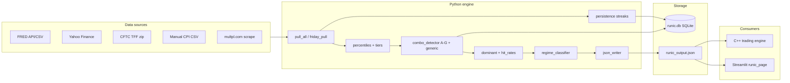
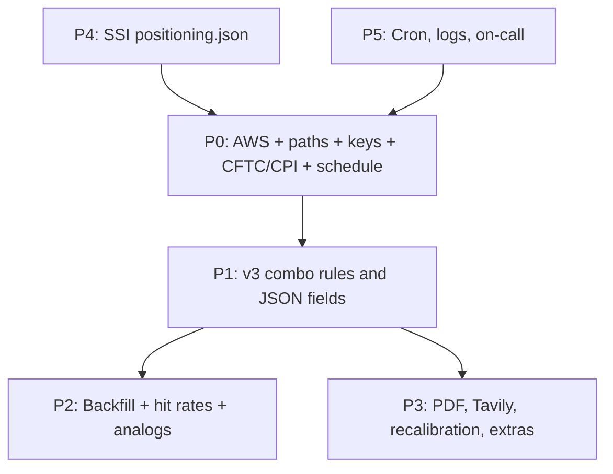

# Macro Intelligence Agent (Runic v2.2) — Implementation Status Report

**Purpose:** Single reference for what has been built in MindWealth_UI, what remains, and how close the project is to production go-live.

**Audience:** Divyanshu, Rohit, Ahil (C++), ops.

**Related docs:**

| Document | Purpose |
|----------|---------|
| **`docs/macro_intelligence_architecture.md`** | **Full architecture, data flow, CONFIG reference, CFTC, schema, jobs, SSI, backfill, tests** |
| `docs/plans/macro_intelligence_open_questions.md` | Technical gap analysis |
| `docs/plans/macro_intelligence_questions_for_manager.md` | Manager Q&A (Section 12 = missing items) |
| `macro_intelligence/SYSTEM_DOCUMENTATION.md` | Runbook and restart procedure |
| `macro_intelligence/README_MAINTENANCE.md` | Maintenance notes |
| `macro_intelligence/CONFIG.yaml` | Thresholds and variable definitions |
| `macro_intelligence_docs/` | Authoritative specs (PDF/DOCX) |

**Last updated:** 2026-06-04 (v3 verification track + backfill complete)

---

## Executive summary

The **Runic Macro Intelligence Agent** and **SSI** run end-to-end in this repo: live pulls, SQLite history, named combos A–G, nightly JSON, Claude briefing, and Streamlit UI.

| Area | Status |
|------|--------|
| **Core pipeline** | Done — pulls, DB, combos, JSON, UI |
| **Named combos A–G** | Done — v3 cancel, A vote, G HY widen, E 3/3, F lifecycle, 28d calendar ROC |
| **298 generic combos** | Partial — `detect_all` + prefilter; nightly exposes `generic_combo_watch` |
| **Historical backfill** | **Done** — 1,050 Fridays + 15,072 forward returns |
| **C++ integration** | JSON contract ready; **Ahil path sign-off pending** |
| **SSI integration** | Done — 14 SSI inputs, daily `positioning.json`, wired to Runic |
| **AWS deployment** | Script `install_aws_cron.sh`; **ops install pending** |
| **v3 verification** | `scripts/run_full_v3_verification.py` + traceability matrix |

**Bottom line:** **v3 verification GO** (2026-06-04) — `macro_intelligence/output/v3_go_no_go.md`. Remaining before trading: **AAII weekly ingest** (WARN if &lt;20 rows), **CPI consensus** before release week, **Ahil JSON path** + **AWS cron install** on 51.20.53.218 (`docs/plans/macro_intelligence_rohit_signoff.md`).

---

## Spec corpus (authoritative order)

1. `macro_intelligence_docs/28_May_2026_Divyanshu_Runic_Integration_Note_v3.docx` — **latest integration rules**
2. `Divyanshu Instructions to Build Macro Intelligence agent.pdf`
3. `Divyanshu_Addendum_MacroAgent.docx`
4. `Runic_Agent_Combo_Cheatsheet_v2.pdf`
5. `Runic_Sample_Nightly_Intelligence Briefing.pdf`
6. `SSI_OpenQuestions_DivyanshuTestList (1).docx` — separate SSI workstream

**Missing from repo:** `Macro_Intelligence_Agent_Spec.xlsx` (May 26 attachment #5)

---

## Architecture (what was built)



---

## What is done

### 1. Project structure and configuration

| Item | Location | Notes |
|------|----------|-------|
| Python package | `src/macro_intelligence/` | 32 modules across data, engine, claude, jobs, output, db |
| Config file | `macro_intelligence/CONFIG.yaml` | All 12 variables, named combos A–G, persistence rules, prefilter, vix_bypass |
| Path overrides | `src/config_paths.py` | `MACRO_INTEL_DIR`, `MACRO_INTEL_DB`, `MACRO_INTEL_JSON_PATH` |
| Runtime config | `src/macro_intelligence/config.py` | Loads YAML; env-based DB/JSON paths |
| Dependencies | `requirements.txt` | `fredapi`, `pandas-market-calendars`, `beautifulsoup4`, `lxml`, `PyYAML` |

### 2. Database (SQLite)

| Item | Status |
|------|--------|
| Schema definition | `src/macro_intelligence/db/schema.sql` |
| Connection + init | `src/macro_intelligence/db/connection.py` |
| Tables created | `variables`, `thresholds`, `daily_readings`, `signal_fires`, `combo_fires`, `forward_returns`, `rule_library`, `persistence_fires`, `macro_regime_log`, `threshold_review_log` |
| Indexes | On `daily_readings`, `combo_fires`, `forward_returns` |

**Populated at runtime:** `daily_readings`, `combo_fires`, `persistence_fires`, `macro_regime_log` (when jobs run).

**Never populated:** `signal_fires`, `rule_library`, `thresholds` (thresholds live in YAML only).

### 3. Data pullers (12 variables)

| # | Variable | Module | Status |
|---|----------|--------|--------|
| 1 | NFCI | `data/fred_pull.py` | Done — API if `FRED_API_KEY`, else public CSV (~3y) |
| 2 | HY OAS | `data/fred_pull.py` | Done |
| 3 | WALCL MoM | `data/fred_pull.py` | Done |
| 4 | USD/CNH 4wk | `data/yahoo_pull.py` | Done |
| 5 | WTI 4wk | `data/yahoo_pull.py` | Done — uses `CL=F` |
| 6 | VIX | `data/yahoo_pull.py` | Done |
| 7 | VIX3M/VIX (VXTS) | `data/yahoo_pull.py` | Done — ratio from 2007 |
| 8 | CFTC net spec | `data/cftc_pull.py` | Done — **parser unvalidated** in prod |
| 9 | 10Y-2Y curve | `data/fred_pull.py` | Done |
| 10 | CPI surprise | `data/cpi_pull.py` | Partial — **manual CSV only** |
| 11 | GSR 4wk | `data/yahoo_pull.py` | Done — uses **`GC=F`/SI=F** (v3 wants `GOLD`) |
| 12 | CAPE | `data/cape_scrape.py` | Done — multpl scrape + `cape_history.csv` cache |

**Orchestration:** `data/pull_all.py` — loads all series, computes tiers, writes `daily_readings`.

**SPX helper:** `spx_with_50wma()` for Combo F and persistence rules.

### 4. Percentile and signal tier engine

| Feature | File | Status |
|---------|------|--------|
| Variable-specific windows | `engine/percentiles.py` | Done — `full`, `rolling_3y`, `pctile_start` from CONFIG |
| RARE / EXTREME evaluation | `engine/percentiles.py` | Done — DUAL, ROC, RATIO, ABS paradigms |
| Single percentile column | `daily_readings.pctile_rank_3yr` | Done — name is misleading for full-history vars |

**Not done (v3):** Dual columns `unconditional_pctile` + `regime_pctile`; regime sample &lt; 50 days fallback.

### 5. Named combo detection (A–G)

| Combo | Rule (spec intent) | Implementation | Status |
|-------|-------------------|----------------|--------|
| **A** | 2 of 4 vars RARE+ with BRAVE/FEARFUL vote | 2 of 4 RARE+ only | **Partial** — no direction vote, no CONTESTED, no GSR amp |
| **B** | ALL: VIX≥25, HY≥400bps, CFTC≤15th | All 3 + WATCH if 1–2 | **Done** (simplified) — no `PENDING_CFTC_CONFIRM` |
| **C** | WTI≥10%, hot CPI, flat WALCL | Fire logic exists | **Partial** — no cancel, no `pending_releases` |
| **D** | VXTS≥1.10, CFTC≥85th, VIX&lt;18 | ACTIVE/WATCH | **Done** (simplified) |
| **E** | 2 of 3: CAPE, easy NFCI, CFTC | 2 of 3 fires | **Partial** — uses `PARTIAL` not v3 `CONFIRMED` / `CONFIRMED_3_OF_3` |
| **F** | 50WMA reclaim +3% week, CFTC≤50th, 26 weeks | Detection exists | **Partial** — week counter weak, no invalidation rule |
| **G** | VXTS&lt;1.0, HY widen, VIX&lt;20 | Level-based only | **Partial** — no 4wk HY delta in bps |

**File:** `engine/combo_detector.py`

**Gate test helpers:** `evaluate_combo_b_at_date()`, `evaluate_combo_f_at_date()`

### 6. Generic (298) combos

| Feature | Status |
|---------|--------|
| Generate singles/pairs/triples of RARE+ vars | Done — `detect_generic_combos()` |
| Tag `BELOW_GATE` on all generic fires | Done — but not filtered before JSON/briefing |
| Pre-filter (≥3 fires, ≥60% hit rate) | **Partial** — `engine/prefilter.py` exists; **not wired into nightly job** |
| Named combo promotion (≥75% hit rate) | Stub only |

### 7. Persistence / streak signals

| Signal | Status |
|--------|--------|
| 7WK_GRIND | Done |
| 3WK_SURGE | Done |
| VIX_SUPPRESSED | Done |
| HY_GRIND_TIGHT | **Not implemented** in `_eval_rule` |
| FCI_EASING_STREAK | Done |
| OIL_VOLATILE | Done |

**File:** `engine/persistence.py` — writes to `persistence_fires`.

### 8. Analytics layer

| Feature | File | Status |
|---------|------|--------|
| Forward returns (1w/1m/3m/6m SPX) | `engine/forward_returns.py` | Done — fills on Friday job |
| Raw hit rates | `engine/hit_rates.py` | Done — sparse without backfill |
| Regime-adjusted hit rates | `engine/hit_rates.py` | **Partial** — SQL exists; data sparse |
| Dominant signal resolver | `engine/dominant.py` | Done — simple rules |
| Analog date finder | `engine/dominant.py` | Done — often returns `[]` without backfill |
| VIX bypass | `engine/vix_bypass.py` | Done for Combo B; F+SSI path **not wired** |

### 9. Claude integration

| Feature | File | Status |
|---------|------|--------|
| Regime classifier (5 dimensions) | `claude/regime_classifier.py` | Done — Claude API + **heuristic fallback** for 5 fixture dates |
| Nightly narrative | `claude/nightly_briefing.py` | Done — Claude API + template fallback |
| Anthropic client wrapper | `claude/_client.py` | Done |
| Geo backfill batch (~400 dates) | — | **Not implemented** |
| Tavily news context | — | **Not implemented** |

### 10. Scheduled jobs and scripts

| Job | Entry point | Schedule in CONFIG | Status |
|-----|-------------|-------------------|--------|
| Friday pull | `scripts/run_macro_friday_pull.py` → `jobs/friday_pull.py` | `0 18 * * 5` | Done locally |
| Nightly JSON | `scripts/run_macro_nightly.py` → `jobs/nightly_run.py` | `0 21 * * 1-5` | Done locally |
| Historical backfill | `scripts/backfill_macro_history.py` | Manual | Script done; **not run full history** |
| Monthly threshold review | `jobs/monthly_threshold_review.py` | `0 10 1 * *` | **Stub only** |

**Friday job steps:** pull all → persistence → detect all combos (named + generic) → forward returns.

**Nightly job steps:** pull → persistence → **named combos only** → regime → dominant → hit rate → JSON + narrative.

### 11. JSON output (`runic_output.json`)

**Writer:** `output/json_writer.py` — atomic write (temp file + rename).

**Fields implemented:**

| Field | Status |
|-------|--------|
| `date` | Done |
| `regime` (5 keys) | Done |
| `dominant_signal`, `dominant_reason`, `brave_fearful` | Done |
| `active_combos`, `watch_combos` | Done |
| `persistence_signals` | Done |
| `ssi_multiplier` | Done — reads `SSI_POSITIONING_JSON` or **1.0** |
| `vix_bypass` | Done |
| `analog_dates`, `spx_3m_forward_avg`, `spx_3m_hit_rate` | Done — often null |
| `combo_f_active`, `combo_f_weeks_elapsed` | Done — weeks often null |
| `narrative` | Done |
| `variables_dashboard` (12 rows, one percentile) | Done |

**Sample output:** `macro_intelligence/output/runic_output.json` (generated 2026-05-26).

### 12. Streamlit UI

| Item | Status |
|------|--------|
| Page module | `src/pages/runic_page.py` |
| App wiring | `app.py` → nav **"Runic Macro Intelligence"** |
| Displays | Date, dominant, SSI mult, regime, combos, dashboard, narrative, raw JSON |
| VIX bypass banner | Done |
| BTIG PDF layout | **Not implemented** — simplified tables only |

### 13. Tests

| Test file | Covers |
|-----------|--------|
| `tests/test_combo_b_oct_2022.py` | Combo B conditions, vix_bypass, regime fixture, optional live FRED/Yahoo |
| `tests/test_combo_f_jun_2020.py` | Combo F on **Jun 29, 2020** (conflicts with v3 **Jun 8**) |
| `tests/test_regime_classifier_fixtures.py` | 5 regime fixture dates (heuristic mode) |
| `tests/test_macro_percentiles.py` | Percentile rank and tier evaluation |
| `tests/test_hit_rates.py` | Hit rate SQL with seeded DB |

**Not tested:** CFTC real file parse, Combo C cancel, JSON schema validation, Friday 12-var integration, `BELOW_GATE` filter, dual percentiles.

### 14. Documentation

| File | Status |
|------|--------|
| `macro_intelligence/SYSTEM_DOCUMENTATION.md` | Done |
| `macro_intelligence/README_MAINTENANCE.md` | Done |
| `docs/plans/macro_intelligence_open_questions.md` | Done |
| `docs/plans/macro_intelligence_questions_for_manager.md` | Done |

---

## What is left

Organized by priority for go-live. **Quick summary tables are below; full explanations in [Plain-language guide to blockers (P0–P5)](#plain-language-guide-to-blockers-p0p5).**

### P0 — Blockers (need Rohit / Ahil decisions + build)

| # | Item | Why it blocks |
|---|------|---------------|
| 1 | **AWS deployment** on 51.20.53.218 | Production C++ never sees JSON |
| 2 | **Production JSON path** sign-off with Ahil | Wrong file = wrong trading behavior |
| 3 | **FRED_API_KEY** in prod `.env` | Without it, ~3y history only; backtest invalid |
| 4 | **CFTC parser validation** | Wrong column → wrong Combo B/D/E/F |
| 5 | **CPI/PPI surprise process** | Combo C fire/cancel broken without it |
| 6 | **Schedule conflict** — v3 ~5pm ET after C++ vs CONFIG 9pm | Wrong run time vs trading day |

### P1 — v3 spec gaps (code work)

| # | Item | Spec reference | Current gap |
|---|------|----------------|-------------|
| 1 | **Combo C cancel** | 4 Fridays WTI &lt; +5% + CPI not hot | Not coded; no `combo_c_cancel` table |
| 2 | **Combo A BRAVE/FEARFUL vote** | NFCI, HY 4wk bps, WALCL MoM, CNH 4wk | Fires without direction; no CONTESTED |
| 3 | **Dual percentiles** | `unconditional_pctile` + `regime_pctile` | Single `pctile_rank_3yr` only |
| 4 | **`PENDING_CFTC_CONFIRM`** | Friday JSON status for CFTC-dependent combos | Not in JSON |
| 5 | **Combo E status strings** | `CONFIRMED`, `CONFIRMED_3_OF_3` | Uses `PARTIAL` / `ACTIVE` |
| 6 | **GSR ticker** | Yahoo `GOLD` ÷ `SI=F` | Code uses `GC=F` |
| 7 | **WTI 4wk formula** | 28 **calendar** days | ~20 **trading** days in code |
| 8 | **Combo F lifecycle** | 26-week window, invalidate below 50WMA | Week counter null; no invalidation |
| 9 | **Combo F test date** | v3: **2020-06-08** | Tests use **2020-06-29** |
| 10 | **CFTC Asset Manager percentile** | Separate from Leveraged Money | Not implemented |
| 11 | **Tables `pending_releases`, `combo_c_cancel`** | v3 schema | Missing from schema |
| 12 | **v3 columns on `combo_fires`** | `cftc_status`, `gsr_modifier`, `combo_legs_confirmed`, etc. | Not in schema / not written |

### P2 — Data completeness and research

| # | Item | Notes |
|---|------|-------|
| 1 | **Full historical backfill** (35+ years) | **Done** 2006–2026 weekly + forward returns; use `backfill_forward_returns_only.py` on new hosts |
| 2 | **`signal_fires` population** | Table empty — per-variable RARE/EXTREME history |
| 3 | **`rule_library` population** | Table empty — named rule hit rates |
| 4 | **Geo regime backfill** | ~400 Claude batch calls for history |
| 5 | **Analog dates + hit rates in live JSON** | Depend on backfill |
| 6 | **FRED MULTPL_CAPE fallback** | Not coded if multpl fails |
| 7 | **FRED DCOILWTICO cross-check** | Rollover noise on `CL=F` |
| 8 | **PPI data** | Not implemented |
| 9 | **Investing.com consensus scraper** | Not implemented |

### P3 — Features deferred (v1 vs later)

| # | Item | Notes |
|---|------|-------|
| 1 | **`recalibrate_thresholds.py`** | Annual threshold review CLI — not in repo |
| 2 | **Tavily news integration** | Narrative context only |
| 3 | **PDF/HTML nightly report** | BTIG-style export matching sample PDF |
| 4 | **Futures rollover flagger** | WTI/SI manual review weeks |
| 5 | **298-combo pre-filter in nightly** | `prefilter.py` not wired |
| 6 | **Combo F + D + B interaction flags** | For C++ narrative/policy |
| 7 | **Monthly threshold email + approval links** | Stub only |
| 8 | **FastAPI HTTP endpoints** | Optional in original plan |
| 9 | **Postgres/RDS migration** | Future; SQLite for v1 |
| 10 | **Alerts / on-call** | No email/Slack on job failure |

### P4 — SSI (separate system)

| # | Item | Notes |
|---|------|-------|
| 1 | **SSI agent** | Not in this repo |
| 2 | **`positioning.json`** | No sample file; Runic defaults multiplier to 1.0 |
| 3 | **Combo F vix_bypass when SSI confirms** | Logic in `vix_bypass.py` but `ssi_confirmed_f` never passed from nightly job |
| 4 | **15 SSI validation tests** | Separate workstream per SSI doc |

### P5 — Operations and handoff

| # | Item | Status |
|---|------|--------|
| 1 | Cron installed on AWS | Not done |
| 2 | Log file locations documented | Not done |
| 3 | `.env.example` for production | Not in repo |
| 4 | Ahil handoff after July 25 | Not confirmed |
| 5 | Fail-loud vs best-effort JSON policy | Undecided |
| 6 | Who is paged if Friday job fails | Undecided |

---

## Plain-language guide to blockers (P0–P5)

This section explains every item in **What is left** in simple terms, assuming no prior finance or coding background. Terms are defined the first time they appear.

### How to read priority levels

| Level | Meaning |
|-------|---------|
| **P0** | Must fix before production trading can trust this system |
| **P1** | May 28 v3 spec says v1 should have it — code gaps |
| **P2** | History and statistics so hit rates and analogs are real |
| **P3** | Useful but can often wait until after first go-live |
| **P4** | **SSI** — a separate agent and file, not part of Runic code today |
| **P5** | Operations: cron, logs, on-call, handoff to Ahil |

### Big picture (30 seconds)

**Runic** is a nightly Python program that:

1. Downloads macro numbers (VIX, oil, credit spreads, Fed data, etc.).
2. Decides if the market is in an unusual **combo** state (labeled A through G, plus hundreds of auto-detected combinations).
3. Writes **`runic_output.json`** — a small file the **C++ trading program** reads to adjust risk and position size.

Today that pipeline **runs on a developer machine**. Production trading on AWS **does not** reliably get the file until **P0** items are done.



---

### P0 — Blockers (detailed)

These are not polish. If P0 stays open, production either **never sees** the macro file or sees **wrong** signals.

#### P0-1: AWS deployment (server 51.20.53.218)

**What it is:** The trading stack runs on an **AWS** cloud server (Amazon-hosted machine) at IP **51.20.53.218**. The Python Runic code must be installed there, with secrets and a **cron** schedule (automatic daily runs).

**Why it blocks:** C++ on that server reads `runic_output.json` from a folder on **that** machine. If jobs only run on a laptop, production uses an old or missing file — like turning the macro radar off.

**Done when:** Friday pull and nightly JSON run on AWS without manual SSH; today’s date appears in the JSON file on the server.

---

#### P0-2: Production JSON path (sign-off with Ahil)

**What it is:** **Ahil** owns the C++ engine. He must confirm the **exact full path** where C++ reads `runic_output.json`. Python must write to **that same path** (override via env var `MACRO_INTEL_JSON_PATH`).

**Why it blocks:** Python might write to `macro_intelligence/output/runic_output.json` while C++ reads somewhere else — updates never reach trading.

**Done when:** One path is written down, tested once: Python writes → C++ reads → key fields match.

---

#### P0-3: FRED_API_KEY in production `.env`

**What it is:** **FRED** (Federal Reserve Economic Data, St. Louis Fed) supplies NFCI, HY credit spreads, Fed balance sheet, yield curve, etc.

- **With API key** in `.env` as `FRED_API_KEY=...`: full history back to the 1990s (or earlier).
- **Without key:** code uses a free CSV fallback, often only **~3 years** of history.

**Why it blocks:** Combo B (Oct 13, 2022) needs HY spreads compared to a long history. With 3 years only, October 2022 can look “normal” when it was extreme — combos fire or miss incorrectly.

**Where to add (local or AWS):** project root `.env` next to `app.py`. Loaded via `src/config_paths.py` → `load_dotenv()`. Read in `src/macro_intelligence/data/fred_pull.py`.

**Done when:** Test shows HY series from 1996 (or similar), not just 2023+.

---

#### P0-4: CFTC parser validation

**What it is:** The **CFTC** (U.S. futures regulator) publishes weekly **TFF** files: who is long/short S&P futures. Runic variable **#8 (CFTC)** drives combos **B, D, E, F** (e.g. “speculators very short” for maximum capitulation Combo B).

Code downloads zip files and searches for columns like “Lev Money” and “S&P 500” (`src/macro_intelligence/data/cftc_pull.py`). **No one has validated** this against a real Friday file Rohit approves.

**Why it blocks:** Wrong column → wrong percentile → Combo B/D/E/F wrong → **`vix_bypass`** may turn on/off at the wrong time (high impact on position size).

**Done when:** Rohit provides one real file or header screenshot; parser tested; Friday run matches manual check.

---

#### P0-5: CPI / PPI surprise process

**What it is:**

- **CPI** = Consumer Price Index (inflation print).
- **PPI** = Producer Price Index.
- **Surprise** = actual released number minus economist **consensus** (e.g. +0.3 percentage points “hotter than expected”).

**Combo C** (energy / stagflation shock) needs a hot CPI surprise as one leg. **Combo C cancel** needs CPI “not hot” or no release that week.

**Today:** manual CSV only (`macro_intelligence/data/cpi_surprises.csv`). No BLS/Investing.com automation. **PPI** not built.

**Why it blocks:** Combo C may never fire correctly, or stay ACTIVE forever when oil cooled but CPI logic was never updated.

**Done when:** Owner for actual + consensus each release day; PPI rules confirmed with Rohit.

---

#### P0-6: Schedule conflict (5 PM vs 9 PM Eastern)

**What it is:** Two sources disagree **when** nightly JSON must be ready:

| Source | Says |
|--------|------|
| May 28 v3 integration note | ~**5:00 PM ET**, **after** Ahil’s C++ daily job |
| `macro_intelligence/CONFIG.yaml` | **9:00 PM ET** Mon–Fri (`nightly_cron: "0 21 * * 1-5"`) |

**Why it blocks:** If anything expects same-day macro state at 5 PM, 9 PM is wrong. If C++ only reads at next market open, 9 PM might still work — but everyone must agree.

**Done when:** Rohit picks one time; AWS cron matches; Ahil confirms when C++ reads the file.

---

### P1 — v3 spec gaps (detailed)

Built in the repo but **incomplete or wrong** vs the May 28 v3 note. Important for v1 correctness.

#### P1-1: Combo C cancel

**Combo C on:** Extreme oil (WTI 4-week change ≥ +10%), hot CPI surprise, flat Fed balance sheet (WALCL).

**Cancel (turn off) per v3:**

- **WTI leg:** 4-week oil change **below +5%** for **4 consecutive Fridays** (can be negative; up to +4.99% still counts).
- **CPI leg:** actual ≤ consensus (“not hot”), OR **no CPI/PPI that week** → CPI leg passes automatically.
- If **any** Friday fails either leg → counter **resets to zero**.
- Progress stored in table **`combo_c_cancel`** (field `wti_potential_week` 0–4).

**Today:** Combo C can fire; cancel logic and table **not implemented**.

**Why it matters:** Market may show oil cooled but JSON still says Combo C ACTIVE forever.

---

#### P1-2: Combo A BRAVE / FEARFUL vote

**Combo A:** Global liquidity / financial conditions — four inputs: NFCI, HY, WALCL, USD/CNH.

**Today:** If **2 of 4** are RARE/EXTREME → Combo A **ACTIVE** with no direction.

**v3 wants:** Vote **BRAVE** (risk-on liquidity) vs **FEARFUL** (risk-off) using rules on each input (e.g. NFCI easy vs tight, HY tightening vs widening in bps over 4 weeks). If votes tie → **CONTESTED** → **do not fire** Combo A. **Gold/silver ratio** can amplify (`gsr_modifier`: FEARFUL_AMP / BRAVE_AMP).

**Why it matters:** Trading needs to know if liquidity supports risk-on or risk-off, not just “A is on.”

---

#### P1-3: Dual percentiles

**Percentile** = “today’s value is higher than X% of historical readings.”

| v3 field | Meaning |
|----------|---------|
| **unconditional_pctile** | vs **all history** since variable start (VIX from 1990, CAPE from 1881) — used for **combo detection** |
| **regime_pctile** | vs history only when **Fed cycle** matches today (e.g. only “cutting” years) — used for **conviction**; if &lt; 50 regime days, fall back to unconditional |

**Today:** one column `pctile_rank_3yr` in `daily_readings` (name suggests 3 years but behavior varies by variable).

---

#### P1-4: `PENDING_CFTC_CONFIRM` in JSON

**Problem:** Friday’s CFTC report reflects **Tuesday** positions (~3-day lag).

**v3:** Combos that need CFTC (B, D, E, F) may show **`PENDING_CFTC_CONFIRM`** on Friday — “maybe active, positioning not final.”

**Today:** Statuses are mainly `ACTIVE`, `WATCH`, `PARTIAL` — no pending CFTC state. Open policy: should **`vix_bypass`** apply while pending?

---

#### P1-5: Combo E status strings

**Combo E:** 2 of 3 legs — high CAPE, easy NFCI, high CFTC percentile.

| v3 label | Meaning |
|----------|---------|
| **CONFIRMED** | 2 of 3 (e.g. CAPE + NFCI) |
| **CONFIRMED_3_OF_3** | all three including CFTC on Friday |

**Today:** code uses **`PARTIAL`** for 2 of 3 — older wording that may mean “weak” to C++ when spec means “confirmed enough.”

---

#### P1-6: GSR ticker (`GOLD` vs `GC=F`)

**GSR** = gold/silver ratio 4-week % change — modifier for Combo A.

- **v3:** Yahoo **`GOLD`** (spot gold) ÷ **`SI=F`** (silver futures)
- **Code:** **`GC=F`** (gold futures) ÷ silver in `CONFIG.yaml` / `yahoo_pull.py`

Futures rolls and spot vs futures can change the ratio near thresholds.

---

#### P1-7: WTI 4-week formula

**WTI** = oil price change over 4 weeks (Combo C).

- **v3:** **28 calendar days** ago vs today
- **Code:** ~**20 trading days** (~4 weeks of market sessions)

Near +10% threshold, combo C can flip on/off incorrectly.

---

#### P1-8: Combo F lifecycle

**Combo F:** Bullish recovery — SPX reclaims **50-week moving average** with a strong weekly gain, CFTC not too high, active up to **26 weeks**.

**Gaps:**

- **`combo_f_weeks_elapsed`** often `null` in JSON
- No rule to **invalidate** F if SPX falls back below 50WMA
- See P1-9 for test date

---

#### P1-9: Combo F test date (Jun 8 vs Jun 29, 2020)

**Gate test** = automated proof the engine matches a known historical day.

- **v3:** **2020-06-08** (+6.2% week; window ends 2020-12-14)
- **Tests today:** **2020-06-29** (`tests/test_combo_f_jun_2020.py`)

Rohit must pick one date before sign-off.

---

#### P1-10: CFTC Asset Manager percentile (separate)

v3: **two** percentiles — **Leveraged Money** (fast) and **Asset Managers** (slow) — not one blended number.

**Today:** parser emphasizes leveraged money; asset manager separate percentile not fully implemented.

---

#### P1-11: Tables `pending_releases`, `combo_c_cancel`

**SQLite** = file database `runic.db` for history (C++ does **not** read it).

| Table | Purpose |
|-------|---------|
| **pending_releases** | Each CPI/PPI: actual, consensus, surprise, which Friday applied it |
| **combo_c_cancel** | Combo C cancel progress (`wti_potential_week` 0–4) |

**Today:** tables **not in** `schema.sql`.

---

#### P1-12: v3 columns on `combo_fires`

When a combo fires, v3 stores extra fields on each row, e.g.:

- `cftc_status` — CONFIRMED vs pending 3-day lag
- `gsr_modifier` — FEARFUL_AMP / BRAVE_AMP / NEUTRAL
- `combo_legs_confirmed` — for Combo E, 2 vs 3 legs

**Today:** basic insert exists; these columns missing or never written.

---

### P2 — Data completeness and research (detailed)

Engine **runs**, but **trustworthy statistics** need P2.

#### P2-1: Full historical backfill (~35+ years)

**Backfill** = rerun engine on every past date (often Fridays) from ~1990 to today; fill when combos fired and SPX returns 1w/1m/3m/6m after.

**Script:** `scripts/backfill_macro_history.py` — **not run to completion** on full history.

**Why it matters:** Hit rates (“Combo B 87% at 3m”) and **analog_dates** in JSON stay empty/null without this.

---

#### P2-2: `signal_fires` table empty

One row each time a **single** variable hits RARE or EXTREME (with direction UP/DOWN).

Table exists in schema; **no Python code inserts rows**.

---

#### P2-3: `rule_library` table empty

Pre-computed named rules with hit rates (e.g. “Combo B 3m hit rate 87%”). Table exists, never populated.

---

#### P2-4: Geo regime backfill (~400 Claude calls)

**Regime** includes geo labels: PANDEMIC, SANCTIONS, TRADE_WAR, etc. For history, v3 suggests batching ~400 dates through Claude (low cost).

**Today:** heuristic map for **5 fixture dates** only when API off; no full `macro_regime_log` history.

---

#### P2-5: Analog dates + hit rates in live JSON

- **Analog dates** = “past dates when market looked similar”
- **Hit rates** = “when this combo fired before, SPX was up X% of the time at 3 months”

Both need backfill. **Today:** often `[]` and `null` in `runic_output.json`.

---

#### P2-6: FRED `MULTPL_CAPE` fallback

**CAPE** = Shiller P/E. Primary: **multpl.com** scrape. If scrape fails, v3 says use FRED series **`MULTPL_CAPE`**.

**Today:** not coded — long outage breaks Combo E.

---

#### P2-7: FRED `DCOILWTICO` cross-check

Oil uses Yahoo **`CL=F`** (futures). Monthly **contract roll** can fake huge 4-week moves. v3 suggests FRED **`DCOILWTICO`** as cross-check.

---

#### P2-8: PPI data

Producer prices — context for Combo C **cancel** with CPI. **Not implemented.**

---

#### P2-9: Investing.com consensus scraper

CPI **surprise** needs **consensus** forecast. Spec mentions Investing.com; no scraper built.

---

### P3 — Features deferred (detailed)

Can often ship a minimal v1 without these; spec mentions them for later polish.

#### P3-1: `recalibrate_thresholds.py`

Annual CLI: review whether thresholds (e.g. VIX &gt; 25) are too loose/tight using all `combo_fires` history; suggest changes; Rohit approves. **File not in repo** — only `monthly_threshold_review.py` stub.

#### P3-2: Tavily news integration

**Tavily** = web search API for **nightly narrative** only (not combo math). **Not wired.**

#### P3-3: PDF / HTML nightly report

Sample spec: **BTIG-style PDF** with branded tables. **Today:** JSON + simplified Streamlit (`src/pages/runic_page.py`).

#### P3-4: Futures rollover flagger

WTI **`CL=F`** and silver **`SI=F`** roll monthly; 4-week % can lie. v3: **flag week for manual review**. **Today:** no flag.

#### P3-5: 298-combo pre-filter in nightly

Besides A–G, engine builds many 3-variable combos. v3: hide unless ≥3 historical fires and ≥60% 3m hit rate (`BELOW_GATE`). **`prefilter.py` exists** but **nightly job does not use it**.

#### P3-6: Combo F + D + B interaction flags

When multiple combos active, v3 narrative rules (e.g. B + F while SPX above F entry = reinforcing add). **Not in JSON** for C++.

#### P3-7: Monthly threshold email + approval links

Email Rohit with threshold suggestions and approve links. **Stub only** — DB log, no email.

#### P3-8: FastAPI HTTP endpoints

Optional HTTP API for macro JSON instead of file-only. **Not built.**

#### P3-9: Postgres / RDS migration

**SQLite** = single file on one server. Later **Postgres** on AWS RDS for multiple consumers. **No timeline.**

#### P3-10: Alerts / on-call

Who gets email/Slack if Friday 4–5 PM job fails? **Not defined.**

---

### P4 — SSI (separate system, detailed)

**SSI** = Sentiment SuperIndex — **second** Python agent, **second** JSON file. Runic does **not** build SSI in this repo.

| File | Writer | Reader | Purpose |
|------|--------|--------|---------|
| **`positioning.json`** | SSI (~8 AM ET) | C++ at open | Sentiment **size multiplier** (1.0, 1.2, 0.8) |
| **`runic_output.json`** | Runic (evening) | C++ | Combos, regime, **`vix_bypass`** |

**Overlap rule:** HY OAS (FRED) → Runic only; HYG/LQD → SSI only; do not double-count.

#### P4-1: SSI agent not in repo

Runic only **reads** optional `SSI_POSITIONING_JSON`; defaults **`ssi_multiplier = 1.0`**.

#### P4-2: No sample `positioning.json`

Need sample with field names C++ expects (e.g. nested `signals.long.size_mult`).

#### P4-3: Combo F + SSI → `vix_bypass`

When Combo F active **and** SSI confirms (≥2 of 4 sentiment signals), spec also bypasses VIX sizing. Code has `ssi_confirmed_f` in `vix_bypass.py` but **nightly job never passes** it.

#### P4-4: 15 SSI validation tests

**Implemented** — `scripts/run_ssi_validation_suite.py`, `docs/ssi_validation/`, artifacts under `macro_intelligence/analysis/ssi_validation/`. Rohit sign-off: `docs/ssi_validation/SIGNOFF.md`.

---

### P5 — Operations and handoff (detailed)

Making the system runnable by someone else after go-live.

| Item | Plain meaning |
|------|----------------|
| **Cron on AWS** | Linux timer runs `run_macro_friday_pull.py` and `run_macro_nightly.py` without manual SSH |
| **Log files** | Document where stdout/errors go for debugging |
| **`.env.example`** | Template listing `FRED_API_KEY`, `ANTHROPIC_API_KEY`, paths — no real secrets in git |
| **Ahil handoff after July 25** | Ahil (or owner) can restart jobs if they break — not confirmed |
| **Fail loud vs best-effort** | If 2 of 12 feeds fail: **stop** and do not update JSON, or **publish** with `warnings[]`? Undecided |
| **Who is paged** | Named contact for Friday job failure |

---

### Practical order (this week)

1. **P0-3:** `FRED_API_KEY` in project root `.env`.
2. **P0-2 & P0-6:** Email Rohit/Ahil — JSON path + 5 PM vs 9 PM.
3. **P0-4 & P0-5:** CFTC sample file + CPI process owner.
4. **P0-1:** AWS install and cron after paths agreed.
5. **P1:** Code sprints after P0 decisions are clear.

---

## v3 compliance checklist (May 28 integration note)

| v3 requirement | Done? | Notes |
|----------------|-------|-------|
| 12 variables pulled | Yes | CPI manual; CFTC unvalidated |
| Named combos A–G | Partial | See combo table above |
| 298 unnamed combos | Partial | Generated; not gated in nightly |
| SQLite schema | Partial | Missing v3 tables/columns |
| `runic_output.json` for C++ | Partial | Missing v3 status fields |
| `vix_bypass` for Combo B | Yes | |
| Combo C cancel (4 Fri + CPI) | No | |
| Dual percentiles | No | |
| Combo A direction vote | No | |
| CFTC pending status | No | |
| GSR uses GOLD | No | Uses GC=F |
| WTI 28 calendar days | No | ~20 trading days |
| Write JSON after C++ (~5pm ET) | No | CONFIG says 9pm; not on AWS |
| Claude regime + narrative | Yes | With fallback |
| Tavily in narrative | No | |
| `recalibrate_thresholds.py` | No | |
| Historical backfill | No | Script only |
| BTIG PDF report | No | Streamlit simplified view |

---

## File inventory

### Source code (`src/macro_intelligence/`)

```
config.py
models.py
data/
  fred_pull.py      yahoo_pull.py     cftc_pull.py
  cpi_pull.py       cape_scrape.py    pull_all.py
engine/
  percentiles.py    combo_detector.py persistence.py
  forward_returns.py hit_rates.py     prefilter.py
  dominant.py       vix_bypass.py
claude/
  _client.py        regime_classifier.py  nightly_briefing.py
jobs/
  friday_pull.py    nightly_run.py    monthly_threshold_review.py
output/
  json_writer.py
db/
  schema.sql        connection.py
```

### Scripts

```
scripts/run_macro_friday_pull.py
scripts/run_macro_nightly.py
scripts/backfill_macro_history.py
```

### Config and runtime artifacts

```
macro_intelligence/CONFIG.yaml
macro_intelligence/data/runic.db          (created on first run)
macro_intelligence/data/cape_history.csv
macro_intelligence/data/cpi_surprises.csv (manual; may be empty)
macro_intelligence/output/runic_output.json
```

### UI

```
src/pages/runic_page.py
app.py  (nav entry "Runic Macro Intelligence")
```

---

## How to run today (local)

```bash
cd /path/to/MindWealth_UI
source .venv/bin/activate

# Optional: export ANTHROPIC_API_KEY, FRED_API_KEY
# Optional: export MACRO_INTEL_JSON_PATH, MACRO_INTEL_DB

# Friday workflow
python scripts/run_macro_friday_pull.py

# Nightly JSON (use --no-claude if no API key)
python scripts/run_macro_nightly.py
python scripts/run_macro_nightly.py --no-claude

# Backfill (example: last 2 years, Fridays only)
python scripts/backfill_macro_history.py --start 2024-01-01 --weekly-only

# Streamlit UI
streamlit run app.py
# → Navigation → "Runic Macro Intelligence"
```

---

## Known spec conflicts (need Rohit ruling)

| Topic | Option A | Option B |
|-------|----------|----------|
| Combo F validation date | **2020-06-08** (v3) | **2020-06-29** (May 26 email; current tests) |
| Percentile for combos | Full history (`unconditional_pctile`) | 3-year rolling (Friday checklist) |
| Nightly schedule | ~**5:00 PM ET** after C++ on AWS | **21:00 ET** in CONFIG.yaml |
| Combo E at 2/3 legs | Status = **`CONFIRMED`** (v3) | Status = **`PARTIAL`** (current code) |
| CFTC pending on Friday | Show combo as **`PENDING_CFTC_CONFIRM`** | Wait until confirmed to call ACTIVE |
| `vix_bypass` when CFTC pending | On / off / unknown | Undecided |

---

## Recommended next steps

### Immediate (this week)

1. Send missing-info questions to Rohit (see `macro_intelligence_questions_for_manager.md` Section 12).
2. Obtain **FRED_API_KEY**, **AWS SSH + paths**, **CFTC sample file**.
3. Run gate tests locally: `python -m pytest tests/test_combo_b_oct_2022.py tests/test_regime_classifier_fixtures.py -v`

### Short term (after Rohit answers)

1. Implement **Combo C cancel** + `pending_releases` / `combo_c_cancel` tables.
2. Add **dual percentiles** and v3 JSON status fields.
3. Fix **GOLD ticker**, **Combo F date**, **Combo A direction vote**.
4. Validate **CFTC parser** against real Friday file.
5. Run **backfill** on AWS; verify Combo B ~87%, Combo F ~78% hit rates.

### Before go-live

1. Install **cron** on 51.20.53.218 (schedule per Rohit).
2. **Ahil sign-off** on JSON schema and `vix_bypass` behavior.
3. Define **fail-loud vs best-effort** policy and alerting.
4. Minimum test suite green including CFTC parse + JSON schema validation.

---

## Summary scorecard

| Layer | Done | Partial | Not started |
|-------|------|---------|-------------|
| Config & paths | 95% | 5% | — |
| Data pullers | 85% | 15% | — |
| Percentiles / tiers | 70% | 30% | — |
| Combos A–G | 50% | 40% | 10% |
| Generic 298 combos | 40% | 40% | 20% |
| Persistence | 85% | 15% | — |
| Analytics / hit rates | 40% | 40% | 20% |
| Claude / briefing | 70% | 20% | 10% |
| JSON output | 65% | 25% | 10% |
| SQLite schema | 75% | — | 25% |
| Jobs / cron | 60% | — | 40% |
| UI | 50% | 30% | 20% |
| Tests | 40% | 30% | 30% |
| AWS / prod ops | 5% | — | 95% |
| SSI integration | 10% | — | 90% |

**Overall estimate vs full v3 spec: ~55–60% complete** for a production-ready system.

---

*This report reflects the codebase as of 2026-05-27. Update after major merges or Rohit scope decisions.*
