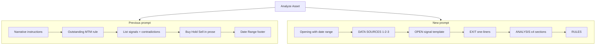

# Analyze Asset Prompt — Update (May 2026)

This document describes the **Analyze Asset** chatbot button prompt change in **MindWealth_UI**: what was replaced, what stayed the same in the pipeline, and what difference users should expect in AI output.

**Code location:** [`src/pages/chatbot_page.py`](../../src/pages/chatbot_page.py) — `analysis_prompt` f-string inside `if analyze_button and selected_asset:` (Deep Dive Analysis sidebar).

**Related docs:** [CHATBOT_UI_BUTTONS.md — Analyze Asset](../documentation/CHATBOT_UI_BUTTONS.md#1-analyze-asset), [byddy_deep_dive_missing_signals_fix.md](byddy_deep_dive_missing_signals_fix.md) (data-loading fixes; unchanged by this prompt update).

---

## Summary

| Aspect | Before | After |
|--------|--------|-------|
| **Structure** | Short narrative paragraph (~20 lines) | Sectioned template with DATA SOURCES, OUTPUT FORMAT, ANALYSIS, RULES |
| **Opening line** | `Please run a deep dive on {asset} covering all signals recorded over the past few weeks…` + trailing `Date Range:` line | `Run a deep dive on {asset} for the date range {start} to {end}.` (dates in first line only) |
| **Data sources** | Outstanding report + “Streamlit reports” (implicit) | Explicit ordered list: (1) outstanding, (2) entry/new signals for targets/stops, (3) exit reports |
| **Open-signal output** | “List all signals” (free-form) | Fixed per-signal block: Entry, Take Profit levels, Stop Loss levels, MTM, Status |
| **Exited signals** | Mentioned in contradictions only | Dedicated one-line-per-exit format |
| **Analysis section** | Mixed into narrative (contradictions, alignment, Buy/Hold/Sell) | Four numbered sections, written once; no per-signal repetition |
| **Targets / stops** | Not specified | Named column families; dollar values only; skip “No target” |
| **Holding-period status** | Not specified | Early / Approaching avg / Late / Beyond max with horizon hints |

**Pipeline unchanged:** `query_kind="deep_dive"`, fixed signal types `entry` + `exit`, sidebar date pickers (90-day default), `pending_analysis_*` session flow, and `SmartDataFetcher` `entry_or_exit` date mode (still triggered by “deep dive” in the prompt text).

---

## What changed in the prompt

### 1. Opening and date range

**Before:**

```text
Please run a deep dive on {ASSET} covering all signals recorded over the past few weeks.
Use the specified entry and / or exit-date range as the filter.
…
Date Range: {START_DATE} to {END_DATE}
```

**After:**

```text
Run a deep dive on {ASSET} for the date range {START_DATE} to {END_DATE}.
```

- Dates appear once in the first line (no separate `Date Range:` footer).
- Wording is explicit about the sidebar window; still matches backend regex for explicit date windows (`YYYY-MM-DD to YYYY-MM-DD`).

### 2. Data sources (new section)

The new prompt **orders** sources and assigns roles:

1. **Outstanding Signal** (`*_outstanding_signal.csv`) — MTM, holding period, today price, trading days; **do not recompute** (same rule as before, now step 1).
2. **New Signals / Entry reports** — **Targets** and **Stop Loss** columns with named level types (Pivot, Avg % Gain, Function Specific, Horizontal, F-Stack 1/2, EMA 200; Extrema, F-Track 1/2, etc.).
3. **Exit Signal reports** — closed positions only.

**Before:** Outstanding MTM was called out; targets/stops and exit-only usage were not spelled out. The model often produced narrative lists without structured TP/SL lines.

### 3. Output format — open signals (new)

Each open signal should appear in a **consistent template**:

- Collapse duplicates; note “confirmed by N criteria” when applicable.
- **Entry** line with date and price.
- **Take Profit** — all target levels as dollar values.
- **Stop Loss** — all stop levels as dollar values.
- **MTM** — percent and days held, with avg/max hold context.
- **Status** — Early / Approaching avg / Late (with % beyond avg hold and max horizon) / Beyond max (exit zone).

**Before:** “Retrieve and list all signals… showing function, timeframe, direction” with no field-level layout.

### 4. Output format — exited signals (new)

**Before:** Exits were implied via contradiction examples (e.g. short hit target while monthly long still open).

**After:** One line per exit:

```text
[FUNCTION] [Interval] [Direction] | Entry [Date] $X → Exit [Date] $X | Result: [%] | Held: [N] days
```

### 5. Analysis section (restructured)

**Before:** Contradictions, alignment, and Buy/Hold/Sell were embedded in prose without length limits.

**After:** Four concise sections, **written once** (not repeated per signal):

1. **Contradictions** — genuine conflicts only; one sentence each.
2. **Timeframe alignment** — one paragraph (daily / weekly / monthly).
3. **Stance** — BUY / HOLD / SELL with max 3-bullet rationale.
4. **Key risks & triggers** — max 5 bullets (late holds, stops to watch, levels that change stance).

### 6. Rules (expanded)

| Rule | Effect |
|------|--------|
| No fabricated signals | Same intent as before; tightened wording |
| No repeating signal data in analysis | Analysis references signals by name only — shorter summary block |
| Omit empty sections | Avoids long “N/A” filler when data is missing |
| Targets/stops: dollars only; skip “No target” | Cleaner tables; less noise from empty target cells |

---

## What did **not** change

These behaviors are **not** modified by the prompt update alone:

| Item | Notes |
|------|--------|
| **Button / UI** | Same `chatbot_analyze_asset_button`, asset dropdown, date inputs |
| **Signal types fetched** | Still fixed `entry` + `exit` only (no AI drift to breadth/portfolio) |
| **`query_kind=deep_dive`** | Same engine path, row cap, date fallback, completeness warnings |
| **Data merge order** | outstanding → entry.csv → all_signal → virtual_trading (see BYDDY/MSFT fix doc) |
| **Column loading** | Still AI-driven from prompt text; prompt now **names** target/stop columns explicitly |

---

## What difference this should make

### For users reading the chat

- **More scannable reports** — open and closed signals look the same every run (function header, bullets, then a short analysis block).
- **Actionable levels** — take-profit and stop-loss prices listed per signal instead of buried in prose.
- **Clearer risk framing** — holding-period status (Early / Late / Beyond max) and a capped “Key risks & triggers” section.
- **Shorter analysis** — stance and conflicts are summarized once; less duplication of the signal table in the narrative.

### For decision-making

- **Better pre-trade review** — compare TP/SL ladders across functions on one ticker before sizing or hedging.
- **Timeframe conflicts** — contradictions and alignment sections remain, but with explicit limits so the model focuses on real conflicts (e.g. monthly short vs daily longs).
- **Stance discipline** — BUY / HOLD / SELL with at most three bullets reduces vague recommendations.

### For data fidelity

- **MTM authority preserved** — outstanding export columns still must be cited as-is (no recomputation).
- **Fewer invented fields** — rules push the model to omit sections without data rather than inventing N/A paragraphs.
- **Entry report usage** — instructing use of entry/new-signal columns for targets/stops should improve alignment with **New Signals** / **Outstanding** pages when those columns exist in fetched JSON.

### Limitations (expectations)

- Output quality still depends on **what rows/columns** `SmartDataFetcher` loads; the prompt cannot add columns that were not selected or present in CSVs.
- If target/stop cells are empty in source data, the model should **skip** those levels (per rules), not fabricate prices.
- **No backend schema change** — this is a **prompt-only** update; loader and merge logic are unchanged.

---

## Before vs after (prompt shape)



---

## Verification

After deploy, confirm:

1. Click **Analyze Asset** with a ticker and date range — user message in chat should start with `Run a deep dive on {TICKER} for the date range …` and include the section headers (DATA SOURCES, OUTPUT FORMAT, etc.).
2. Assistant reply should follow the structured open/exit blocks where data exists.
3. `infer_date_filter_mode` still returns `entry_or_exit` for the new opening line (regex: `deep dive`).

```bash
python -m py_compile src/pages/chatbot_page.py
.venv/bin/python -m pytest tests/test_smart_data_fetcher_dates.py::TestInferDateFilterMode::test_deep_dive -q
```

---

## Files touched

| File | Change |
|------|--------|
| [`src/pages/chatbot_page.py`](../../src/pages/chatbot_page.py) | Replaced `analysis_prompt` f-string only |

Optional follow-up (not done in this change): update [CHATBOT_UI_BUTTONS.md](../documentation/CHATBOT_UI_BUTTONS.md) “Example prompt themes” to match the new OUTPUT FORMAT sections.
