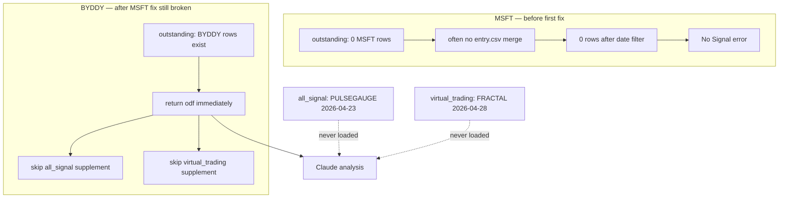
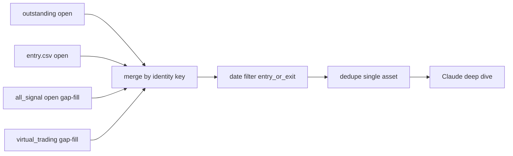

# Analyze Asset — BYDDY & MSFT Missing Signals (Issue & Resolution)

This document describes two related **Analyze Asset** deep-dive failures—**MSFT** (no data returned) and **BYDDY** (partial data, missing key signals)—why they had **different root causes**, why the **first MSFT-oriented fix did not fix BYDDY**, and how **MindWealth_UI** was hardened so single-asset deep dives load the full open/closed signal set.

For button behavior after the fix, see [CHATBOT_UI_BUTTONS.md — Analyze Asset](CHATBOT_UI_BUTTONS.md#1-analyze-asset). For report roles and MTM authority, see [REPORTS.md — Cross-report relationships](REPORTS.md#6-cross-report-relationships).

---

## Symptom

### BYDDY — partial data (wrong conclusion)

When users ran **Analyze Asset** on **BYDDY** over a date range that included April 2026 (e.g. `2026-04-01` to `2026-05-16`), the AI analysis:

- Listed only a **subset** of BYDDY signals (e.g. **TRENDPULSE** daily long `2026-04-14`, monthly **FRACTAL TRACK** short).
- **Omitted** open signals that were visible in Streamlit / trade-store reports, notably:
  - **PULSEGAUGE** long, entry **2026-04-23** — present in `trade_store/US/2026-05-15_all_signal.csv`, not in the outstanding export for that sync.
  - **FRACTAL TRACK** daily long, entry **2026-04-28** — present only in `trade_store/US/virtual_trading_long.csv` (CE-only virtual trading row).

The model correctly refused to invent signals, so the written stance was based on **incomplete** input data—not on bad reasoning.

### MSFT — zero data (hard error)

When users ran **Analyze Asset** on **MSFT** for a similar window (e.g. `2026-04-01` to `2026-05-16`), the chatbot often returned:

> **No Signal in the Specified date duration choosen, Please choose different date duration.**

That happened even though **`chatbot/data/entry.csv`** contained many open MSFT rows (FRACTAL TRACK, DELTADRIFT, TRENDPULSE, etc.). In the repo’s `2026-05-15` export, **MSFT does not appear** in `trade_store/US/2026-05-15_outstanding_signal.csv` at all—the loader’s primary source was empty for that ticker.

---

## MSFT asset analysis — issue, partial fix, and limits

### What was wrong (MSFT)

Three problems stacked:

| # | Problem | Effect on MSFT |
|---|---------|----------------|
| 1 | **Outstanding-only primary path** | `_load_entry_source_dataframe()` read `*_outstanding_signal.csv` first. For MSFT, asset filter → **0 rows**. Old code did not reliably fall through to `entry.csv` / all_signal before giving up. |
| 2 | **`primary` date filter** | Deep-dive prompts did not use `entry_or_exit` mode. Open positions whose **entry date** was **before** the UI window (e.g. Nov 2025 entries with analysis range starting Apr 2026) were dropped unless exit fell in range. |
| 3 | **Embedded `Date Range:` blocks retry** | Analyze Asset injects `Date Range: YYYY-MM-DD to YYYY-MM-DD` into the prompt. `chatbot_engine._user_explicitly_mentions_date_window()` treats that as explicit user intent, so when the first fetch returned **0 rows**, the engine returned the hard **No Signal** message instead of retrying **without** dates. |

So MSFT failed loudly (**no rows** → user-visible error), while BYDDY failed quietly (**some rows** → plausible but wrong analysis).

### What we fixed first (MSFT-oriented)

These changes addressed the **“ticker absent from outstanding”** path:

1. **Fallback to `entry.csv`** when outstanding has **no rows** for the requested asset(s).
2. **`infer_date_filter_mode()` → `entry_or_exit`** for deep-dive-style prompts so **still-open** positions overlapping the window are kept even when entry date is earlier.
3. **`_supplement_entry_from_all_signal()`** and **`_supplement_entry_from_virtual_trading()`** on that fallback path to gap-fill from the latest all_signal report and virtual trading files.

After that interim fix, MSFT deep dives could load signals **if** the code path reached `entry.csv` + supplements (outstanding count for MSFT = 0).

### Why that fix did **not** solve BYDDY automatically

MSFT and BYDDY hit **different branches** of the same loader. The first fix only improved the branch where outstanding returns **zero** rows for the ticker.

| | **MSFT** | **BYDDY** |
|---|----------|-----------|
| **Rows in outstanding for ticker?** | **No** (ticker missing from export) | **Yes** (e.g. weekly FRACTAL longs, or rows via `entry.csv` after partial merge) |
| **Code path before full fix** | Fallback → `entry.csv` + supplements | **Early `return odf`** as soon as outstanding (or merged set) was non-empty |
| **Missing signals lived in…** | `entry.csv` / all_signal (needed fallback) | **all_signal** and **virtual_trading** only—not in outstanding |
| **User-visible outcome** | “No Signal…” (0 rows) | Analysis ran but **incomplete** (subset of signals) |
| **Supplements ran?** | Yes, on fallback when outstanding empty | **No** — supplements were still gated behind “outstanding empty for asset” |


**In one sentence:** the MSFT fix solved **“no rows because outstanding doesn’t list this ticker.”** BYDDY needed **“merge everything even when outstanding already has some rows for this ticker.”** That requires **always** unioning outstanding + entry.csv + all_signal + virtual_trading—not returning early.

BYDDY also needed rows that the MSFT path never touched:

- **PULSEGAUGE 2026-04-23** — in all_signal, typically **not** in outstanding or `entry.csv`.
- **FRACTAL daily 2026-04-28** — only in **virtual_trading_long.csv**.

Even a working MSFT fallback to `entry.csv` would not add those identities unless **all_signal / virtual_trading supplements run on every load**, which the interim fix did not do.

---

## What the reports actually contained (BYDDY)

| Signal | Entry date | In outstanding (`*_outstanding_signal.csv`) | In all_signal (`*_all_signal.csv`) | In `entry.csv` | In `virtual_trading_long.csv` |
|--------|------------|-----------------------------------------------|-------------------------------------|----------------|--------------------------------|
| TRENDPULSE Long Daily | 2026-04-14 | Varies by export date | Yes | Yes (often duplicate rows) | No |
| PULSEGAUGE Long Weekly | 2026-04-23 | **No** (typical export gap) | **Yes** | No | No |
| FRACTAL TRACK Long Daily | 2026-04-28 | **No** | **No** | No | **Yes** (Open) |
| FRACTAL TRACK Long Weekly | 2025-10-26+ | Often yes when BYDDY in outstanding | Yes | Yes | No |

**Takeaway:** No single CSV is a complete superset. Per [REPORTS.md](REPORTS.md), **all_signal** is the historical superset; **outstanding** is authoritative for **MTM / Today / holding** on rows it includes; **virtual_trading** holds additional CE-only opens.

---

## What the reports actually contained (MSFT)

| Source | MSFT present? (typical `2026-05-15` sync) |
|--------|-------------------------------------------|
| `*_outstanding_signal.csv` | **No** — ticker not in export |
| `*_all_signal.csv` | **Yes** — full history |
| `chatbot/data/entry.csv` | **Yes** — many open rows (ingested from reports) |
| `virtual_trading_*.csv` | Per-ticker if CE exported |

MSFT was a **coverage** problem at the outstanding layer; BYDDY was a **merge completeness** problem when outstanding was non-empty but incomplete.

---

## Root cause

### 1. Outstanding-only / early return (MSFT + BYDDY)

**MSFT:** Loader treated outstanding as the primary entry source. Zero MSFT rows → empty handoff unless fallback to `entry.csv` ran.

**BYDDY:** Same loader **returned immediately** when outstanding returned **any** rows for the asset (see below)—a different failure mode on the **non-empty** branch.

### 2. Early return in entry loader (primary — BYDDY)

[`chatbot/smart_data_fetcher.py`](../chatbot/smart_data_fetcher.py) `_load_entry_source_dataframe()` used to **return immediately** when the outstanding report returned **any** rows for the requested asset(s):

```python
# Previous (broken) behavior
if not odf.empty:
    return odf  # all_signal / virtual_trading supplements never run
```

If BYDDY already had rows in `*_outstanding_signal.csv` (e.g. weekly FRACTAL longs), the fetcher stopped there. Rows that exist only in **all_signal** (PULSEGAUGE Apr 23) or **virtual_trading** (FRACTAL daily Apr 28) were **never merged**.

### 3. Supplements gated on “empty outstanding” (why MSFT fix stopped short)

The interim fix added `_supplement_entry_from_all_signal()` and `_supplement_entry_from_virtual_trading()`, but wired them only when outstanding had **zero** rows for the ticker—the same branch MSFT used. That unblocked MSFT; it did **not** change the BYDDY branch where outstanding was already non-empty.

### 4. Secondary gaps (all assets — MSFT “No Signal” + BYDDY omissions)

| Gap | Effect |
|-----|--------|
| AI `select_signal_types()` on Analyze Asset | Could omit `exit` or add `breadth` / `claude_report` |
| `MAX_ROWS_TO_INCLUDE = 100` | Busy tickers truncated after date filter |
| Embedded `Date Range:` in deep-dive prompt | Treated as explicit user dates → no undated retry → false “No Signal” |
| Exit fetch = `exit.csv` only | Closed trades only in all_signal missing |
| No fetch-time dedup | Multiple identical TRENDPULSE rows in UI tables |
| Weak identity key (no symbol in key) | Cross-ticker collision risk |
| `all_signal` path in convert vs runtime | Stale `entry.csv` if ingest picked wrong file |

---

## Data flow (before full fix)



---

## Resolution (full fix — MSFT and BYDDY)

The **final** change set keeps everything the MSFT path needed **and** removes the BYDDY early-return / supplement gating.

### Design principles

1. **Outstanding** remains canonical for **MTM / Today / holding** when the same signal identity exists there.
2. **all_signal** is the **completeness overlay** for missing open and closed rows.
3. **virtual_trading** is a **last-resort** gap-fill for **single-asset** queries only (synthetic row labeling in compound column).
4. **Deep dive contract:** fixed `entry` + `exit`, `entry_or_exit` date semantics, `query_kind=deep_dive`, completeness warning in UI.

### Unified entry loader

`_load_entry_source_dataframe()` now:

1. Merges **outstanding** open rows (tagged `outstanding`).
2. Merges **entry.csv** open rows (`entry_csv`).
3. **Always** calls `_supplement_entry_from_all_signal()`.
4. If `assets` is set, calls `_supplement_entry_from_virtual_trading()`.
5. Unions on identity key **`(symbol, function, entry_date, side, interval)`**.
6. On duplicate keys, keeps the row with best source priority: **outstanding > all_signal > entry.csv > virtual_trading**.

### Exit completeness

- `_load_exit_source_dataframe()` reads `exit.csv`, then `_supplement_exit_from_all_signal()` for closed rows only in all_signal.

### Deep-dive mode (`query_kind="deep_dive"`)

| Behavior | Implementation |
|----------|----------------|
| Signal types | `["entry", "exit"]` pinned in `src/pages/chatbot_page.py` (no AI selector) |
| Row cap | `MAX_ROWS_DEEP_DIVE` (default 500) in `chatbot/config.py` |
| Date fallback | Retry fetch with `from_date=None`, `to_date=None` if zero rows; `metadata["deep_dive_date_fallback_used"]` |
| Completeness | `compute_missing_open_entry_keys()` → `metadata["missing_signal_keys"]` + UI warning |
| Default window | Sidebar default **90 days** (was 15) for Analyze Asset |

### Other hardening

- Single-asset **dedupe** after date filter (`dedupe_single_asset_signals()`).
- Shared **`chatbot/signal_confirm.py`** — `is_confirmed_signal()` aligned with ingest.
- **`convert_signals_to_data_structure.py`** uses `resolve_all_signal_path()` (same as runtime).

---

## Data flow (after fix)



---

## Files changed

| File | Change |
|------|--------|
| [`chatbot/smart_data_fetcher.py`](../chatbot/smart_data_fetcher.py) | Unified entry/exit loaders, supplements, identity key, dedupe, `compute_missing_open_entry_keys()` |
| [`chatbot/signal_confirm.py`](../chatbot/signal_confirm.py) | Shared confirmation filter |
| [`chatbot/outstanding_paths.py`](../chatbot/outstanding_paths.py) | `resolve_all_signal_path()` (already present; used consistently) |
| [`chatbot/chatbot_engine.py`](../chatbot/chatbot_engine.py) | `query_kind`, row limit, date fallback, completeness metadata |
| [`chatbot/config.py`](../chatbot/config.py) | `MAX_ROWS_DEEP_DIVE` |
| [`src/pages/chatbot_page.py`](../src/pages/chatbot_page.py) | Fixed entry+exit, `query_kind="deep_dive"`, 90-day default, UI warnings |
| [`chatbot/convert_signals_to_data_structure.py`](../chatbot/convert_signals_to_data_structure.py) | all_signal path aligned with runtime |
| [`tests/test_smart_data_fetcher_dates.py`](../tests/test_smart_data_fetcher_dates.py) | Regression tests (supplement when outstanding non-empty, exit supplement, dedupe, identity key) |
| [`tests/test_deep_dive_completeness.py`](../tests/test_deep_dive_completeness.py) | BYDDY / MSFT / TSLA open-key completeness vs all_signal |
| [`docs/CHATBOT_UI_BUTTONS.md`](CHATBOT_UI_BUTTONS.md) | Analyze Asset section updated |

---

## Verification

### Automated tests

From repo root:

```bash
.venv/bin/python -m pytest tests/test_smart_data_fetcher_dates.py tests/test_deep_dive_completeness.py -q
```

Key cases:

- `test_supplements_run_when_outstanding_has_rows` — outstanding has AAPL row; all_signal adds PULSEGAUGE row → both loaded.
- `test_byddy_gets_pulsegauge_apr_23_from_all_signal` — integration on repo data.
- `test_byddy_gets_fractal_apr_28_from_virtual_trading` — integration on repo data.
- `test_open_all_signal_keys_present_in_entry_fetch` — parametrized BYDDY, MSFT, TSLA.

### Manual checklist (BYDDY)

1. **Analyze Asset** → BYDDY, date range covering Apr 2026.
2. Smart Query Details → entry table should include **PULSEGAUGE 2026-04-23** and **FRACTAL 2026-04-28** (virtual trading) when those rows exist in trade_store.
3. No `missing_signal_keys` warning (or investigate listed keys if export changed).
4. Analysis text should reference those functions/dates if they are material to the prompt.

### Manual checklist (MSFT)

1. **Analyze Asset** → MSFT, date range e.g. `2026-04-01` to `2026-05-16`.
2. Should **not** return “No Signal…” when `entry.csv` / all_signal have open MSFT rows (or after `deep_dive_date_fallback_used` info note if window was empty).
3. Entry table should list multiple functions from consolidated / all_signal data.

### Quick loader check (Python)

```python
from chatbot.smart_data_fetcher import SmartDataFetcher, SYMBOL_SIGNAL_COMPOUND_COL

fetcher = SmartDataFetcher()
r = fetcher.fetch_data(
    signal_types=["entry"],
    required_columns=None,
    assets=["BYDDY"],
    from_date="2026-04-01",
    to_date="2026-05-18",
    date_filter_mode="entry_or_exit",
)
df = r["entry"]
compounds = df[SYMBOL_SIGNAL_COMPOUND_COL].astype(str).tolist()
assert any("2026-04-23" in c for c in compounds), "PULSEGAUGE Apr 23 missing"
assert any("2026-04-28" in c for c in compounds), "FRACTAL Apr 28 missing"
```

MSFT (expect non-empty entry when outstanding omits ticker):

```python
r = fetcher.fetch_data(
    signal_types=["entry"],
    required_columns=None,
    assets=["MSFT"],
    from_date="2026-04-01",
    to_date="2026-05-18",
    date_filter_mode="entry_or_exit",
)
assert len(r["entry"]) > 0, "MSFT entry fetch should not be empty"
```

---


## Out of scope

- Changing MindWealth backend export logic (UI must tolerate incomplete outstanding).
- Making `virtual_trading` canonical for MTM (gap-fill only).
- Breadth / `portfolio_target_achieved` / `claude_report` in Analyze Asset deep dive.

---

## Related paths

- UI: `src/pages/chatbot_page.py` — `chatbot_analyze_asset_button`, `pending_analysis_*` session keys
- Runtime loader: `chatbot/smart_data_fetcher.py` — `_load_entry_source_dataframe`, `_supplement_entry_from_all_signal`
- Reports: `trade_store/US/2026-05-15_all_signal.csv`, `trade_store/US/virtual_trading_long.csv`, `chatbot/data/entry.csv`
- Similar write-up pattern: [breadth_analysis_button_fix.md](breadth_analysis_button_fix.md)
