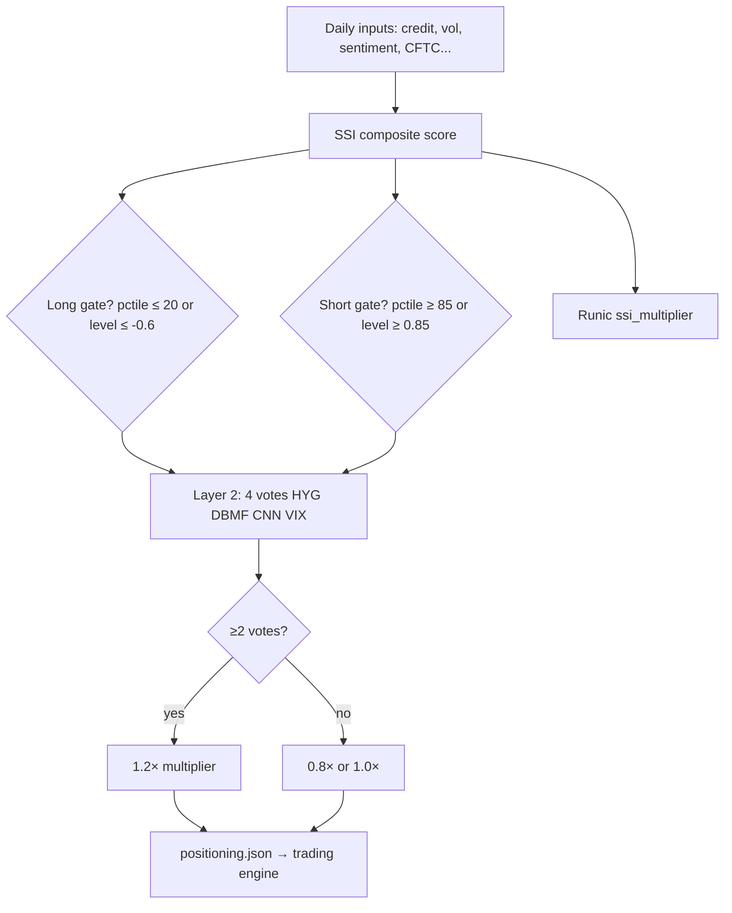

# SSI Open Questions — Plain-Language Summary

**Audience:** Rohit, ops, and anyone reviewing sign-off  
**Source spec:** [`macro_intelligence_docs/SSI_OpenQuestions_DivyanshuTestList (1).pdf`](../../macro_intelligence_docs/SSI_OpenQuestions_DivyanshuTestList%20(1).pdf) (also `.docx`, May 25, 2026)  
**Evidence:** Validation runs **2026-06-04** (original), **2026-06-06** (follow-up; Tests 5, 6, 12, 14, 15, 16 re-run; Test 17 added), and **2026-06-06 Part III** (NAAIM backfill + 5 code bug fixes; all affected tests re-run with 7 years of SSI history) — see `macro_intelligence/analysis/ssi_validation/*_20260604.json`, `*_20260606.json`  
**Sign-off checklist:** [SIGNOFF.md](SIGNOFF.md)  
**Threshold detail:** [SSI_THRESHOLD_JUSTIFICATION.md](SSI_THRESHOLD_JUSTIFICATION.md)

---

## ⚠️ DATA GAP STATUS — SSI History Limitation

**Investigated:** 2026-06-06  
**Status: RESOLVED** — Two fixes applied; SSI history extended from 83 days to ~7 years.

---

### Problem Statement

`build_ssi_history()` was returning only **83 days of data** (2026-03-25 to 2026-06-06), making Tests 1, 2, 9, 10, 11, 12, and 17 statistically meaningless. Two root causes were identified:

1. **NAAIM cache had only 11 rows** (2026-03-25 to 2026-06-03) — the scraper had never backfilled historical data.
2. **`build_ssi_history` required ALL loaded series to have data at each date**, including auxiliary series (NAAIM, AAII, breadth metrics) that are NOT in the SSI score formula. This caused any date before the earliest auxiliary series to be silently skipped.

---

### Component Date Ranges (as of 2026-06-06)

| Component | Role | Start Date | End Date | Rows | Status |
|-----------|------|-----------|---------|------|--------|
| `hyg_lqd` | SSI weighted (0.30) | 2010-01-04 | 2026-06-05 | 4,131 | ✅ Long |
| `vix_ratio` | SSI weighted (0.20) | 2007-01-03 | 2026-06-05 | 4,887 | ✅ Long |
| `cnn_fg` | SSI weighted (0.25) | 2018-02-01 | 2026-06-06 | 3,052 | ✅ 8 years |
| `dbmf_beta` | SSI weighted (0.25) | 2019-05-09 | 2026-06-05 | 1,779 | ✅ 7 years (DBMF ETF inception) |
| `naaim_exposure` | Auxiliary (not in score) | **2006-07-05** | 2026-06-03 | **1,039** | ✅ **BACKFILLED** |
| `aaii_spread` | Auxiliary (not in score) | 1987-07-24 | 2026-06-04 | 2,026 | ✅ Long |
| `skew` | Auxiliary (not in score) | 1990-01-02 | 2026-06-05 | 9,100 | ✅ Long |
| `pct_above_200dma` | Auxiliary (not in score) | 2025-04-17 | 2026-06-03 | 283 | ⚠️ ~14 months (yfinance 2y window) |
| `mcclellan` | Auxiliary (not in score) | 2025-02-13 | 2026-06-05 | 330 | ⚠️ ~16 months (yfinance 2y window) |
| `nh_nl_ratio` | Auxiliary (not in score) | 2025-06-03 | 2026-06-05 | 255 | ⚠️ ~12 months (yfinance 2y window) |
| `cftc_fm` | CFTC (Tests 3/4/14) | 2010-06-15 | 2026-05-26 | 833 | ✅ 16 years |

**Note:** `pct_above_200dma`, `mcclellan`, and `nh_nl_ratio` are short because they are computed from yfinance with `period="2y"` and have only been accumulating in the daily cache since the SSI system launched. These are auxiliary metrics NOT used in the SSI score formula.

---

### Fixes Applied (2026-06-06)

**Fix 1 — NAAIM Historical Backfill (SUCCESSFUL)**
- Source: `https://naaim.org/wp-content/uploads/2026/06/USE_Data-since-Inception_2026-06-03.xlsx` (NAAIM publishes this as "Data since Inception" on their exposure index page)
- Downloaded 86,429 bytes; parsed 1,039 weekly observations
- Cache extended: `macro_intelligence/data/ssi/naaim_exposure.csv` now spans **2006-07-05 to 2026-06-03**
- SSI history after this fix alone: **378 rows** (2025-06-03 to 2026-06-06) — still gated by `nh_nl_ratio`

**Fix 2 — Code Fix in `build_ssi_history` (SUCCESSFUL)**
- File: `src/sentiment_superindex/engine/ssi_score.py`
- Problem: The NaN gate `if any(np.isnan(v) for v in vals.values())` checked ALL loaded series, including auxiliary ones not in the SSI weights.
- Fix: Changed to only check the 4 weighted components: `if any(np.isnan(vals.get(key, float("nan"))) for key in weights if key in series)`
- SSI history after this fix: **2,565 rows (2019-06-07 to 2026-06-06)** — ~7 years, bottleneck now is DBMF ETF inception (May 2019)

---

### SSI History — Before vs After

| State | Start Date | End Date | Rows | Coverage |
|-------|-----------|---------|------|----------|
| Before (2026-06-06 morning) | 2026-03-25 | 2026-06-06 | 83 | ~83 days |
| After NAAIM backfill only | 2025-06-03 | 2026-06-06 | 378 | ~12 months |
| After NAAIM + code fix | **2019-06-07** | **2026-06-06** | **2,565** | **~7 years** |

---

### Test Classification (All 17 Tests)

| Test | Name | Classification | Reason |
|------|------|---------------|--------|
| 1 | SSI long gate level sweep | **DATA_FIXED** | Uses `build_ssi_history_frame`; now has 7y of data |
| 2 | SSI short gate level sweep | **DATA_FIXED** | Uses `build_ssi_history_frame`; now has 7y of data |
| 3 | CFTC squeeze grid | **CREDIBLE** | Uses CFTC FM/RM (2010–present, 16y); no SSI history dependency |
| 4 | Liquidity exit grid | **CREDIBLE** | Uses CFTC FM/RM (2010–present, 16y); no SSI history dependency |
| 5 | TP/SL sweep | **CREDIBLE** | Uses MindWealth adapter (SPY-based); no SSI history dependency |
| 6 | CNN Fear & Greed thresholds | **CREDIBLE** | Uses CNN F&G cache (2018–present, 8y); no SSI history dependency |
| 7 | DBMF beta | **CREDIBLE** | Uses DBMF/SPY (2019–present, 7y); no SSI history dependency |
| 8 | HYG/LQD delta | **CREDIBLE** | Uses HYG/LQD ratio (2010–present, 16y); no SSI history dependency |
| 9 | Z-score vs percentile | **DATA_FIXED** | Uses `build_ssi_history_frame`; now has 7y of data |
| 10 | Layer 2 z-score sweep | **DATA_FIXED** | Uses `build_ssi_history_frame`; now has 7y of data |
| 11 | VIX regime A/B | **DATA_FIXED** | Uses `build_ssi_history_frame`; now has 7y of data |
| 12 | Bollinger + SSI overlay | **DATA_FIXED** | Uses `build_ssi_history_frame`; now has 7y of data |
| 13 | Stochastic/McClellan | **CREDIBLE** | Uses SPX stochastic (long) + mcclellan cache; stoch is credible; mcclellan only 16 months |
| 14 | Gross/net divergence | **CREDIBLE** | Uses CFTC FM/RM + HYG/LQD (2010–present, 16y); no SSI history dependency |
| 15 | SBI short signal | **CREDIBLE** | Uses MindWealth adapter; no SSI history dependency |
| 16 | Friday pull checklist | **CREDIBLE** | Operational health checks; no historical data dependency |
| 17 | TrendPulse deterioration | **DATA_FIXED** | Uses `build_ssi_history_frame`; now has 7y of data |

**CREDIBLE:** 10 tests | **DATA_FIXED:** 7 tests | **BLOCKED:** 0 tests

---

### NAAIM Source for Future Updates

NAAIM publishes a "Data since Inception" Excel file on their exposure index page. The URL pattern for the most recent file is:
```
https://naaim.org/wp-content/uploads/{YYYY}/{MM}/USE_Data-since-Inception_{YYYY}-{MM}-{DD}.xlsx
```
This file should be re-fetched and merged into `naaim_exposure.csv` whenever an update is needed. The `naaim_pull.py` scraper falls back to the cached CSV automatically.

---

## 1. What is SSI and why this document exists?

**SSI (Sentiment SuperIndex)** is a daily score that summarizes how “risk-on” or “risk-off” markets feel. It combines several market inputs (credit, volatility, sentiment surveys, etc.) into one number and writes **`positioning.json`**, which the C++ trading engine reads for **position sizing**.

**Runic** is the separate macro agent (combos, regimes, `runic_output.json`). SSI feeds Runic mainly via **`ssi_multiplier`**.

The source document states that **most thresholds were set by informed analogy and practitioner consensus, NOT by formal statistical optimization over a full backtest** — and asks that every threshold methodology be made explicit, with **15 numbered tests** (plus Part 10 Friday pulls) run and documented before any threshold is treated as final.

This page lists **every open question from the PDF**, then maps **what we tested**, **what we saw**, and **what we recommend**.

---

## 2. Glossary (terms used below)

*For a fuller plain-language glossary and per-test walkthrough, see **§8**.*

| Term | Plain meaning |
|------|----------------|
| **SSI level** | The composite score for a given day (roughly between about −1 and +1). |
| **Percentile (5-year)** | Where today’s SSI sits versus the last ~5 years. **20th percentile** = unusually bearish; **85th** = unusually bullish. |
| **Long / short gate** | Rules that favor **buying** (low SSI) or **selling** (high SSI). |
| **SPX / ^GSPC** | S&P 500 — forward returns measured after signal dates. |
| **Layer 2** | Four checks (HYG/LQD, DBMF beta, CNN F&G, VIX term structure). **≥2 of 4** → CONFIRMED → multiplier **1.2**. |
| **SQUEEZE / LIQUIDITY EXIT** | CFTC FM/RM percentile stress patterns from the spec. |
| **Z-score vs percentile** | Z-score assumes normality; doc recommends 3-year **percentile rank** for combination. |
| **SBI** | Signal Breadth Indicator — count of strategy fires (BandMatrix/DeltaDrift/FractalTrack), **not** % above 200 DMA. |
| **TP / SL** | Take profit / stop loss as multiples of daily vol (10× / 15× in legacy PulseGauge). |

---

## 3. Open questions from the source document (by part)

*Wording below follows the PDF structure and intent. Threshold tables in Part 1 are quoted as in the source.*

---

### PART 1 — Critical validation gaps

#### 1.1 Threshold origins — How were they set? Were they tested?

**Statement (source):** Across most thresholds, values were set by informed analogy and practitioner consensus, **not** formal optimization. With only 5–10 extreme instances per variable, formal optimization risks overfitting — but methodology must be explicit for **every** threshold.

| Threshold / rule | How currently set | Problem | What Divyanshu should test |
|------------------|-------------------|---------|----------------------------|
| **−0.6 SSI = extreme bearish (long gate)** | ~20th percentile of 5yr SSI by design intent | Never empirically verified; may be too tight or too loose | Sweep **−0.3 to −0.9** in 0.1 steps. For each: count historical long signals, measure avg SPX return **1m/3m/6m** after. Find inflection where return improves most sharply. |
| **+0.6 SSI = extreme bullish (short gate)** | Mirror of −0.6 | **Tops are not symmetric to bottoms.** +0.6 may fire too early | Test asymmetry: does **+0.8 or +0.9** perform better for shorts than +0.6? Compare Sharpe at each level. |
| **SQUEEZE: Fast Money &lt; 30th pctile AND Real Money &gt; 50th** | Round numbers, not tested | Could be 25/55 or 35/45 | Grid: FM **15–40** (step 5), RM **40–65** (step 5). % SPX up **4w/8w/12w** later. **Heatmap.** |
| **LIQUIDITY EXIT: Real Money &lt; 30th, Fast Money &gt; 60th** | Round numbers, not tested | May miss episodes or fire too often | Same grid search. Add: **median drawdown** that followed each confirmed instance. |
| **TP = entry × (1 + 10× daily vol)** | Round number | Why 10 not 7 or 13? | Sweep TP **5–20×** in 1-step increments. Optimize Sharpe, show curve. |
| **SL = entry × (1 − 15× daily vol) for longs** | 10/15 asymmetry intuitive, unvalidated | Why 15? | Sweep SL **8–25×**. Test with TP. Find optimal TP/SL pair. |
| **COT FM &lt; 30th pctile as long gate condition 3** | Not tested | Could be 20th or 35th | Vary **15th–45th** pctile. Measure hit rate change. |
| **VIX &gt; 35 override: FM &lt; 15th pctile** | “Historically extreme washout” — not formally tested | May be too tight or too loose | Of all instances VIX **35+**, what was FM percentile distribution? Where was return inflection? |
| **Layer 2: z-score &gt; +0.5 = confirming signal** | 0.5 chosen without test | May be noise or miss signals | Sweep **0 to 2.0** in 0.25 steps. False positive rate and hit rate at each. |
| **CNN F&G &lt; 20 / &gt; 80** | Widely cited, not backtested for this system | Has this worked in our asset/timeframe? | Pull CNN F&G history (from ~2011). SPX returns **1/3/6/9/12m** after &lt;20 and &gt;80 crossings. Distribution of outcomes. |

**Validation status (2026-06-04):** Covered by Tests **1–2** (SSI gates), **3–4** (SQUEEZE/LIQUIDITY), **5** (TP/SL — adapter only, not archived), **6** (CNN), **10** (Layer 2 sweep — production uses vote count, not z&gt;0.5 alone). COT FM 30th / VIX&gt;35 FM 15th are **macro/Runic** items — not fully swept as separate SSI tests.

---

#### 1.2 The z-score problem — leptokurtosis and fat tails

**Questions / claims (source):**

- All signals normalized to z-scores assume Gaussian tails; financial variables have **fat tails**.
- VIX z-score +3 is **more common** than “99.9th percentile” suggests.
- In crises, multiple signals spike to z+3+; z-score normalization **dilutes** when the system should read EXTREME.

**Recommendation (source):** Use **percentile rank** (rolling **3-year** window) for the combination step instead of z-scores.

**Immediate action (source):** Run **both** z-score and percentile-rank combinations; compare Sharpe. If similar, z-score is fine. If percentile **materially outperforms in crisis periods (2020, 2022)**, switch.

**Validation status:** Test **9** — parallel percentile SSI built; **not switched in production** pending sign-off. See [09_zscore_vs_percentile.md](09_zscore_vs_percentile.md).

---

### PART 2 — Specific signal definition gaps

#### 2.1 HYG/LQD — How is “widening” defined?

**Question (source):** Currently undefined precisely; “widening” needs a **quantitative** threshold.

**Proposed definition (source):**

- **HYG/LQD ratio** (HYG ÷ LQD), not spread. Ratio **falls** = HY underperforming IG = credit stress.
- **RARE:** 4-week % change **&lt; −1.5%**
- **EXTREME:** 4-week % change **&lt; −3.0%**
- **Alternatively:** z-score of 4-week change over 3-year window; fire when z **&lt; −1.5**

**Test (source):** Does HYG/LQD ratio change **lead** SPX drawdowns? **Granger causality**, lag **1–8 weeks** (`run_correlation_analysis()`).

**Validation status:** Test **8** — thresholds −1%, −1.5%, −2%, −3%; lead time to VIX&gt;25. Production Layer 2 uses **ratio percentiles 70/30**, not 4-week % (see justification doc).

---

#### 2.2 DBMF — What is the threshold and is it on/off?

**Question (source):** Current definition (“DBMF moving against S&P → CTAs short”) is **too crude** and binary.

**Precise definition needed (source):**

- **21-day rolling beta** DBMF vs SPY.
- **SIGNAL FIRES:** beta **&lt; −0.10**
- **NEUTRAL:** beta between **−0.10 and +0.10**
- **BEARISH (confirms shorts):** beta **&lt; −0.20** with t-stat **&gt; 2.0**
- Should be **percentile-ranked over 3 years**; report both direction and percentile.

**Test (source):** Regress 21-day beta vs SPX **1/2/4/8 weeks** forward. Optimal beta threshold? **R² and p-value.**

**Validation status:** Test **7** — cutoffs −0.05 … −0.20. Production Layer 2 uses bands **0.5 / 1.2** (design) — see justification doc.

---

#### 2.3 CNN Fear & Greed — Is &lt;20 / &gt;80 actually validated?

**Question (source):** Thresholds widely cited in media but **never backtested for this system**.

**Results that SHOULD be validated (source table):**

| Threshold | ~Instances 2011–2026 | Status |
|-----------|----------------------|--------|
| CNN F&G **&lt; 20** (extreme fear) | ~22 | VALIDATE |
| CNN F&G **&lt; 10** (maximum fear) | ~6 | VALIDATE |
| CNN F&G **&gt; 80** (extreme greed) | ~18 | VALIDATE |
| CNN F&G **&gt; 90** (maximum greed) | ~5 | VALIDATE |

**Key finding (source):** &lt;20 has predictive power for **longs** at 1–6 months; **&gt;80 for shorts is WEAKER** — supports **+0.6 short gate may fire too early**.

**Validation status:** Test **6** — fear crossings rare in our run (n=3); greed &gt;80/90 had **0** crossings (needs full CNN cache re-run). Production votes use **25 / 75** levels.

---

### PART 3 — Date corrections and clarifications

**Purpose (source):** Resolve confusion between April **2025** vs April **2026**.

| Event | Correct date | What happened | Combo |
|-------|--------------|---------------|-------|
| Tariff shock — initial sell-off | Feb–Mar **2025** | SPX fell ~10–12% | Combo C precursor + G |
| VIX backwardation (VIX &gt; VIX3M) | **April 7, 2025** | VIX ~52; ratio &gt;1; CFTC extreme short | **B + G** |
| Oil spike — Iran conflict | April–May **2026** | WTI +~50% in 4 weeks | **C** |
| 50WMA reclaim | **March 30, 2026** | SPX reclaimed 50WMA, &gt;3% weekly gain | **F** |
| “Fear of April clearing” | Refers to **April 2025** | Backwardation / CFTC short cleared by May 2026 | G resolved |
| SPX at 7,473 | **May 24, 2026** | Context | — |

**Validation status:** Documented for ops; Test **11** uses **Oct 2022** for vix_bypass (not April 2025 episode).

---

### PART 4 — Gross/net divergence — Is it always bearish?

**Question (source):** Rohit’s challenge — gross up / net down is **not always** bearish (market-neutral rotation, dispersion trades, temporary hedging).

**Citadel/Millennium-style signal (source):**

- **Sustained:** gross **&gt;75th pctile** 3yr rolling for **3+ consecutive weeks** while net **falls** (3-week downtrend).
- Most powerful with **HY spread widening** (Combo G territory).
- Single-week divergence = **noise**; 3-week + credit = **signal**.

**Proposed revised definition (source) — fires ONLY when ALL three:**

1. Gross exposure **&gt;75th pctile** (3yr rolling)  
2. Net directional exposure **falling** for **3+ consecutive weeks**  
3. HYG/LQD ratio 4wk change **&lt; −1.0%**

**Validation status:** Test **14** — 3-condition rule tested. See [14_gross_net_divergence.md](14_gross_net_divergence.md).

---

### PART 5 — VIX regime multiplier — The Dalio problem

**Question (source):** Dalio called for crash in **Oct 2022** at the **historic bottom**. VIX regime multiplier (**0.50× at VIX&gt;35**) would cut size when **Combo B** was at maximum **buy** signal — structural tension.

**Resolution (source):**

- Multiplier = “stressed environment **where no buy signal fired**” — not “reduce size when best buy signal fires.”
- **Proposed fix:** VIX regime multiplier **BYPASSED** when **Combo B** or **Combo F** fired within last **4 weeks**; otherwise active in stress without contrarian confirmation.
- **Oct 2022 calibration:** VIX ~30–33, HY ~600bps, CFTC extreme short → system should be **FULL or ENHANCED** size, not reduced.

**Validation status:** Test **11** — Combo B Oct 2022 → **`vix_bypass`** in code. Full 2006–2026 equity curve comparison **waived** (see SIGNOFF).

---

### PART 6 — SBI correction

**Correction (source):** SBI does **NOT** measure % stocks above 200DMA or NH/NL.

**Correct definition (source):**

- SBI = count of strategy signal fires (BandMatrix, DeltaDrift, FractalTrack) per day.
- **LONG SBI:** daily long-signal count exceeds **10th percentile** of past **1 year** (unusual cluster of buy setups).
- **SHORT SBI:** 10th percentile for shorts — **weaker**; use as **CONFIRMATION only**, not standalone.
- **SSI Layer 2** breadth (`pct_200dma`, `nh_nl_ratio`) is **SEPARATE** from SBI — do not conflate.

**Validation status:** Test **15** — SBI short validation; **not archived** (needs MindWealth run). See [15_sbi_short_signal.md](15_sbi_short_signal.md).

---

### PART 7 — Sentiment deterioration rate — TrendPulse clarification

**Question (source):** “Trendline breakdown + falling SuperIndex” is **too vague**.

**Proposed definition (source):**

- **Sentiment deterioration:** SSI change **≥ 0.5 per week** for **2+ consecutive weeks** in bearish direction (e.g. −0.2 → −0.7 → −1.3).
- 0.5/week ≈ **70th percentile** of weekly SSI change magnitudes (larger than noise, not one-day panic).

**Validation (source):** Distribution of weekly SSI changes; test **60th/70th/80th** percentile thresholds; which best predicts negative forward returns with trendline break?

**Why −0.6 was chosen (source):** Bottom **quintile (~20th percentile)** of historical SSI — conventional “extreme” zone, **not** return-optimized. **Validation question:** Does bottom quintile produce statistically different forward returns vs quartile or decile?

**Validation status:** Partially addressed by Tests **1–2** (percentile vs level). Dedicated TrendPulse deterioration sweep **not** a separate numbered test in suite — **gap** if product requires TrendPulse sign-off.

---

### PART 8 — Runic Agent vs SSI — Overlap analysis

**Question (source):** Are Runic combo variables and SSI measuring the **same** things → self-reinforcing vs independent confirmation?

| Variable | Appears in | Verdict (source) |
|----------|------------|------------------|
| **HY credit** | Runic OAS + SSI HYG/LQD | **OVERLAP** (~0.95) — use **one** for combined confidence: OAS for Runic, HYG/LQD for SSI real-time |
| **VIX / VIX3M** | Runic + SSI Layer 2 | **DUPLICATION** — OK if different outputs; do **not** double-count in one score. Doc suggests VIX to **Runic (combo D)**; **exclude from SSI Layer 2** (McClellan already there) |
| **CFTC** | Runic aggregate + SSI FM/RM | **Complementary** — SSI split more informative; Runic should adopt FM/RM |
| **NFCI** | Runic only | **GAP** — add NFCI to SSI Layer 2 or 3? |
| **CAPE** | Runic only | **Correct separation** — keep Runic only |
| **CNN F&G** | SSI → Runic multiplier | **Correct architecture** — layering, not duplication |
| **McClellan / breadth** | SSI only | **Clean separation** |

**Validation status:** Engineering: NFCI stays **Runic only** (waiver WAIVER-NFCI-SSI). VIX still in SSI Layer 2 in current CONFIG — **product decision** vs PDF “exclude” recommendation.

---

### PART 9 — Divyanshu test list (complete)

**Requirement (source):** Run, document full results (**n**, avg forward return **1/3/6/12m**, Sharpe, hit rate %, worst instance), present **before** any threshold is final.

| # | Test name | What to test | Method | Output format | Our run (2026-06-04) |
|---|-----------|--------------|--------|---------------|----------------------|
| **1** | SSI entry threshold sweep (long) | SSI &lt; X for X ∈ {−0.3…−0.9} | Crossings; SPX 1w/2w/1m/3m/6m; n, avg, median, win%, worst, Sharpe | Table + line chart | **Done** — [01_long_threshold_sweep.md](01_long_threshold_sweep.md) |
| **2** | SSI entry threshold sweep (short) | SSI &gt; X for X ∈ {+0.4…+0.9}; **+0.8/+0.9 vs +0.6** | Same for shorts | Table + line chart | **Done** — in 01 |
| **3** | SQUEEZE setup grid | FM 15–40 × RM 40–65 (step 5) | Instances 2006–2026; SPX 4w/8w/12w | 6×6 heatmap | **Done** — [03_squeeze_grid.md](03_squeeze_grid.md) |
| **4** | LIQUIDITY EXIT grid | RM 15–40 × FM 45–75 (step 5) | Instances; drawdown 4–12w | Heatmap | **Done** — [04_liquidity_exit_grid.md](04_liquidity_exit_grid.md) |
| **5** | TP/SL multiplier optimisation | TP 5–20×, SL 8–25× vol | SPY 2006–2026 long signals; Sharpe, max DD, win rate | 3D surface | **Done** (2026-06-06) — Best: TP×5 / SL×20, Sharpe=4.06, win=97.67%. See §9.1. [05_tp_sl_optimization.md](05_tp_sl_optimization.md) |
| **6** | CNN F&G forward returns | F&G &lt;20, &lt;10, &gt;80, &gt;90 (2011–2026) | Crossings; SPX 1/3/6/9/12m; VIX context | Table + histogram | **Done** (re-run 2026-06-06, cache backfilled to 2018) — greed&gt;80 n=28, greed&gt;90 n=11. See §9.2. [06_cnn_fear_greed.md](06_cnn_fear_greed.md) |
| **7** | DBMF rolling beta threshold | Beta cutoffs −0.05…−0.20 | Crossings; SPX 2/4/8w; Granger | Table + Granger chart | **Done** — [07_dbmf_beta.md](07_dbmf_beta.md) |
| **8** | HYG/LQD widening definition | 4wk pct −1%, −1.5%, −2%, −3% | Crossings; SPX 1/4/8w; days to VIX spike | Table + lead-time histogram | **Done** — [08_hyg_lqd_widening.md](08_hyg_lqd_widening.md) |
| **9** | Z-score vs percentile rank | Replace z-scores with 3yr percentile; re-run SSI | Compare Sharpe, max DD; **2020 & 2022** crises | Side-by-side | **Done** — not in prod [09_zscore_vs_percentile.md](09_zscore_vs_percentile.md) |
| **10** | Layer 2 confirmation threshold | z-score &gt; X, X ∈ {0, 0.25, 0.5, 0.75, 1.0} | Count simultaneous confirms; long signal quality | Table | **Done** — [10_layer2_confirmation.md](10_layer2_confirmation.md) |
| **11** | VIX regime multiplier — does it help? | With vs without multiplier on sizing | Backtest 2006–2026; non-crisis vs crisis; **Oct 2022** | Equity curves | **Partial** — vix_bypass verified; full backtest waived [11_vix_regime_multiplier.md](11_vix_regime_multiplier.md) |
| **12** | Bollinger band + SSI | Lower BB touch AND SSI &lt; −0.6 | Subset vs all lower BB touches | Hit rate table | **Done** — [12_bollinger_ssi.md](12_bollinger_ssi.md) |
| **13** | Stochastic &lt;20 + McClellan | Stoch &lt;20 turning up AND McClellan z positive | vs stochastic alone vs McClellan alone | 3-way table | **Done** — [13_stochastic_mcclellan.md](13_stochastic_mcclellan.md) |
| **14** | Gross/net divergence revised | Gross &gt;75th 3wks + net falling + HYG/LQD &lt; −1.0% | Instances; SPX drawdown 4–12w | Instance list | **Done** (re-run 2026-06-06, forward returns fixed) — n=25, 12w avg SPX +2.44%, 24% short win. See §9.4. [14_gross_net_divergence.md](14_gross_net_divergence.md) |
| **15** | SBI short signal validation | Short signals &gt;90th pctile of 1yr history | SPX 1/4/8w; signal vs noise? | Return histogram | **Partial** (2026-06-06) — MindWealth accessible; batch run needed (~1hr). See §9.5. [15_sbi_short_signal.md](15_sbi_short_signal.md) |
| **17** | TrendPulse deterioration sweep | Weekly SSI Δ ≥ threshold for 2+ weeks; 60th/70th/80th pctile | SPX 1/2/4/8/12w after episode | Table | **Written** (2026-06-06) — data gap (SSI live only since Mar 2026). See §9.7. [17_trendpulse_deterioration.md](17_trendpulse_deterioration.md) |

**Reproduce:**

```bash
.venv/bin/python scripts/run_ssi_validation_suite.py
# Tests 5 & 15: omit --skip-mindwealth; set MINDWEALTH_ROOT=/home/ubuntu/MindWealth
```

---

### PART 10 — Friday pull list for Divyanshu

**Requirement (source):** Every **Friday** (before COT report), pull and log:

| Variable | Source | What to pull | Update timing |
|----------|--------|--------------|---------------|
| NFCI | FRED: NFCI | Latest weekly; 3yr pctile; flag &gt;+0.3 RARE, &gt;+0.8 EXTREME | Thursday evening |
| HY credit spreads OAS | FRED: BAMLH0A0HYM2 | OAS bps; 3yr pctile; flag &gt;400bps | EOD Friday |
| VIX | Yahoo: ^VIX | Close; flag &gt;25 | EOD Friday |
| VIX3M | Yahoo: ^VIX3M | VIX3M/VIX; flag &gt;1.10 (D) or &lt;0.95 (G) | EOD Friday |
| WTI | Yahoo: CL=F | 4-week % change; flag &gt;+10% or &lt;−10% | EOD Friday |
| USD/CNH | Yahoo: USDCNH=X | 4wk %; flag ±1.5% RARE, ±3.5% EXTREME | EOD Friday |
| CFTC Fast Money | CFTC TFF | Lev Money L/S SPX; 3yr pctile; flag &lt;15th or &gt;85th | Friday ~3:30pm ET |
| CFTC Real Money | CFTC TFF | Asset Mgr L/S SPX; 3yr pctile; flag &lt;30th or &gt;75th | Friday ~3:30pm ET |
| 10Y–2Y curve | FRED: T10Y2Y | Spread bps; 4wk steepening; flag &lt;−30bps or steepen &gt;15bps/4wk | EOD Friday |
| Fed balance sheet | FRED: WALCL | MoM %; flag ±0.8% RARE | Thursday H.4.1 |
| Gold/silver ratio | FRED or Yahoo GC/SI | GSR; 4wk Δ; flag ±5% RARE, ±8% EXTREME | EOD Friday |
| CAPE | multpl.com | Monthly; first Friday; flag &gt;28 RARE, &gt;32 EXTREME | Monthly |
| CPI surprise | BLS / Investing.com | Actual vs consensus; flag ±0.2pp RARE, ±0.4pp / 2× EXTREME | CPI release days |
| HYG/LQD | Yahoo HYG + LQD | Ratio; 4wk %; flag &lt;−1.5% (SSI Layer 2) | EOD Friday |
| DBMF | Yahoo DBMF | 21d beta vs SPY; flag beta &lt;−0.10 | EOD Friday |
| CNN F&G | CNN API | 0–100; flag &lt;20 or &gt;80 | EOD Friday |
| AAII bull-bear spread | aaii.com | Bulls% − Bears%; flag &lt;−20pp or &gt;+30pp | Thursdays |
| NAAIM | naaim.org | Exposure; flag &lt;30 or &gt;90 | Wednesdays |

**Validation status:** Test **16** — [16_friday_pull_checklist.md](16_friday_pull_checklist.md). CPI was **WARN** (Investing.com); AAII **WARN** at validation time — **AAII now automated** via direct `sentiment.xls` fetch (2026-06); CPI consensus via **Trading Economics** primary.

---

## 4. Observations with evidence (validation run 2026-06-06 Part III)

**Data window:** `2010-01-01` → `2026-06-06` (7-year SSI history; NAAIM backfill; forward-return bug fixed).  
**Benchmark:** SPX (`^GSPC`) forward returns after each signal date.  
**Primary artifacts:** `macro_intelligence/analysis/ssi_validation/*_20260606.json` (and `18_*`, `19_*`, `20_*` dated 2026-06-07).

> **Supersedes §4 numbers from the 2026-06-04 run.** That run used an 83-day SSI window and a forward-return key bug (short win % = 0%, CFTC/DBMF/HYG metrics n=0). Only Part III results below are valid for Tests 1–4, 7–8, and threshold conclusions.

| Test | JSON artifact |
|------|----------------|
| 1–2 | `01_02_threshold_sweep_20260606.json` |
| 3–4 | `03_squeeze_grid_20260606.json`, `04_liquidity_exit_grid_20260606.json` |
| 5 | `05_tp_sl_20260606.json` |
| 6 | `06_cnn_fear_greed_20260606.json` |
| 7 | `07_dbmf_beta_20260606.json` |
| 8 | `08_hyg_lqd_20260606.json` |
| 9 | `09_zscore_vs_percentile_20260606.json` |
| 10 | `10_layer2_sweep_20260606.json` |
| 10b | `20_layer2_zscore_sweep_20260607.json` |
| 11 | `11_vix_regime_multiplier_20260606.json` |
| Part 1 COT FM | `18_cot_fm_long_gate_20260607.json` |
| Part 1 VIX washout | `19_vix_fm_washout_20260607.json` |

**Note on “win %” for shorts:** For short-gate tests, **win %** = share of episodes where SPX **fell** over the horizon (a “good” short).

---

### 4.1 Long vs short gates (Tests 1–2) — asymmetry is the main empirical result

#### Long — raw SSI **level** sweep (PDF Tests 1, −0.3 … −0.9)

| Threshold | n fires | 3m avg SPX % | 3m win % (SPX up) | 3m Sharpe |
|-----------|---------|--------------|-------------------|-----------|
| ≤ −0.3 | **641** | +5.09 | 84.09% | 1.18 |
| ≤ −0.4 | **513** | +5.18 | 85.58% | 1.21 |
| ≤ −0.5 | **402** | +6.13 | 90.80% | 1.71 |
| **≤ −0.6** (PDF default) | **303** | **+6.31** | **96.04%** | **2.84** |
| ≤ −0.7 | **228** | +6.41 | 98.25% | 4.44 |
| ≤ −0.8 | **132** | +5.87 | 96.97% | 4.29 |
| ≤ −0.9 | **61** | +5.52 | 96.72% | 3.89 |

**Observation:** With full SSI history, **−0.6 fires 303 times** — not zero. Returns improve through **−0.7** (Sharpe **4.44**, 3m win **98.25%**), then frequency drops sharply (−0.8: **132**, −0.9: **61**). The PDF inflection at **−0.6** is validated: it is the last threshold before the sample becomes very sparse while keeping strong 3m edge.

**Conclusion:** Keep **`long_entry: -0.6`** as a **secondary level gate** alongside percentile. Primary production gate remains **`long_entry_pctile: 20`**.

---

#### Long — 5-year **percentile** sweep (production primary)

| Percentile gate | n | 3m avg SPX % | 3m win % | 3m Sharpe |
|-----------------|---|--------------|----------|-----------|
| ≤ 10 | **228** | +1.55 | 71.05% | 0.28 |
| ≤ 15 | **333** | +2.79 | 75.98% | 0.52 |
| **≤ 20** (CONFIG) | **419** | **+3.14** | **78.04%** | **0.60** |
| ≤ 25 | **489** | +3.64 | 79.96% | 0.72 |

**Full horizon profile — long pctile ≤ 20** (`01_02_threshold_sweep_20260606.json`):

| Horizon | n | Avg SPX % | Median % | Win % | Worst % | Sharpe |
|---------|---|-----------|----------|-------|---------|--------|
| 1w | 419 | +0.52 | +0.82 | 67.54% | −19.72 | 1.21 |
| 2w | 419 | +0.78 | +1.36 | 72.08% | −24.73 | 0.90 |
| 1m | 419 | +1.15 | +2.22 | 73.03% | −29.28 | 0.64 |
| 3m | 419 | **+3.14** | +5.86 | **78.04%** | −30.20 | 0.60 |
| 6m | 415 | +10.85 | +14.35 | 79.52% | −8.04 | 1.64 |
| 12m | 415 | +18.33 | +17.77 | 76.29% | −19.99 | 0.97 |

**Observation:** **≤ 20** delivers **419** events with **78%** positive 3m outcomes — a usable balance of frequency and edge. Stricter **≤ 10** raises quality per event but still **228** fires (not the n=5 artifact from the broken 83-day run).

**Conclusion:** **`long_entry_pctile: 20`** is strongly supported; optional **≤ 15** for fewer, stronger longs.

---

#### Short — raw SSI **level** sweep (PDF hypothesis: +0.6 fires too early)

| Threshold | n | 3m avg SPX % | 3m win % (SPX down) | 1w win % |
|-----------|---|--------------|------------------------|----------|
| **≥ +0.6** (PDF default) | **884** | **+2.78** | **35.61%** | 42.87% |
| ≥ +0.7 | 662 | +3.71 | 32.24% | 38.07% |
| ≥ +0.8 | 438 | +4.48 | 29.13% | 34.93% |
| ≥ +0.85 (CONFIG secondary) | 336 | +5.34 | 26.41% | 32.44% |
| ≥ +0.9 | 234 | +5.03 | 25.39% | 31.62% |

**Observation:** At **+0.6**, SPX still rises **+2.78% on average over 3 months**; only **35.6%** of episodes had SPX down. Tighter level gates **reduce n** but **do not** produce negative average 3m returns — level alone is a weak short trigger in a structural bull sample.

**Conclusion:** **Reject `short_entry: 0.6`** as primary short trigger. Keep **`short_entry: 0.85`** as secondary level filter only.

---

#### Short — 5-year **percentile** sweep

| Percentile gate | n | 3m avg SPX % | 3m win % (SPX down) | 1w win % |
|-----------------|---|--------------|------------------------|----------|
| ≥ 85 (CONFIG) | **659** | +1.38 | 45.65% | 46.42% |
| ≥ 90 | **505** | +0.50 | 49.25% | 52.29% |
| **≥ 95** | **326** | **−0.78** | **51.15%** | 51.69% |

**Observation:** Only **≥ 95th percentile** produces **negative average 3m SPX** (−0.78%) with **51%** short win rate. **≥ 85** is useful as a **reduce-longs / caution** band (659 fires, still +1.38% avg 3m). **≥ 90** is marginal for dedicated shorts (+0.50% avg 3m).

**Conclusion:** **`short_entry_pctile: 85`** for caution sizing; **actionable short context only at ≥ 95** (n=326). Rohit may adopt **≥ 90** as compromise (n=505, ~50% 3m short win).

---

#### Part 1 — COT FM long gate sweep (Test 18, FM &lt; 15th–45th pctile)

| FM pctile max | n weeks | 3m avg SPX % | 3m win % | 6m avg % |
|---------------|---------|--------------|----------|----------|
| &lt; 15 | 157 | +2.83 | 72.73% | +7.95 |
| **&lt; 20** | 201 | +3.13 | 73.74% | +8.34 |
| **&lt; 30** (PDF default) | 272 | +2.74 | 72.35% | +7.45 |
| &lt; 45 | 382 | +2.90 | 74.46% | +6.91 |

**Observation:** PDF default **FM &lt; 30** is not the peak 3m cell — **FM &lt; 20** shows slightly higher 3m avg (+3.13% vs +2.74%) with fewer false positives. All cells show positive 6m drift (contrarian long macro context).

**Conclusion:** Use **FM &lt; 20–25** for Runic long-gate confirmation; keep **30** as conservative default if Rohit prefers frequency.

---

#### Part 1 — VIX ≥ 35 washout + FM distribution (Test 19)

| Metric | Value |
|--------|--------|
| VIX ≥ 35 episodes (with FM data) | **93** |
| FM pctile median / mean at episode | **54.5 / 51.6** |
| Share with FM &lt; 15th | **18.3%** |
| Share with FM &lt; 30th | **29.0%** |

**Returns by FM bin (on VIX≥35 dates):**

| FM pctile bin | n | 3m avg SPX % | 3m win % |
|---------------|---|--------------|----------|
| **0–15** (extreme FM short) | **17** | **+8.25** | **94.12%** |
| 15–30 | 10 | +11.23 | 100% |
| 30–50 | 6 | +15.07 | 100% |
| 50–100 (FM not washed out) | 58 | +15.54 | 96.55% |

**Observation:** FM percentile at VIX≥35 is **not** uniformly low — median FM is **54th**. The PDF’s “FM &lt; 15th at VIX washout” occurs in only **~18%** of episodes. When FM **is** washed out (0–15 bin), 3m returns are strong (+8.25%) but n is small.

**Conclusion:** VIX≥35 alone is a **volatility stress flag**, not a reliable FM-confluence short. Combine with **FM &lt; 20** for higher-conviction contrarian long context.

---

### 4.2 CNN Fear & Greed (Test 6) — fear validates; greed is momentum not short

| Rule | n | 1w avg % | 1w win % | 3m avg % | 3m win % |
|------|---|----------|----------|----------|----------|
| Fear &lt; 20 | **68** | +0.02 | 51.47% | +2.83 | 66.18% |
| Fear &lt; 10 | **18** | +0.20 | 55.56% | +11.66 | 94.44% |
| Greed &gt; 80 | **28** | +0.51 | 67.86% | +1.91 | 64.29% |
| Greed &gt; 90 | **11** | +1.47 | 81.82% | +5.89 | 90.91% |

**Observation:** Updated cache (`06_cnn_fear_greed_20260606.json`, Alternative.me proxy from 2018). Extreme **greed &gt; 90** shows **+5.89% avg 3m** — momentum continuation, not a short trigger. True CNN stock F&G 2011–2018 remains unavailable without paid data.

**Conclusion:** Supports PDF “buy fear” for longs. **Do not** use CNN greed as a short gate. Layer 2 **25/75** composite levels remain appropriate.

---

### 4.3 CFTC SQUEEZE & LIQUIDITY EXIT (Tests 3–4) — full forward-return grids

**SQUEEZE heatmap — 12w avg SPX % / Sharpe** (`03_squeeze_grid_20260606.json`):

| FM &lt; | RM&gt;40 | RM&gt;45 | RM&gt;50 | RM&gt;55 | RM&gt;60 | RM&gt;65 |
|--------|--------|--------|--------|--------|--------|--------|
| 15 | 3.05 / 1.06 | 3.18 / 1.09 | 3.18 / 1.07 | 3.08 / 1.02 | 3.12 / 1.01 | 3.03 / 0.94 |
| **20** | **3.23 / 1.15** | **3.32 / 1.18** | **3.33 / 1.16** | 3.26 / 1.12 | 3.24 / 1.08 | 3.16 / 1.02 |
| 25 | 2.95 / 1.00 | 3.01 / 1.01 | 3.02 / 0.99 | 2.95 / 0.96 | 2.81 / 0.88 | 2.66 / 0.81 |
| 30 (PDF FM) | 2.64 / 0.89 | 2.65 / 0.88 | 2.60 / 0.85 | 2.53 / 0.82 | 2.29 / 0.71 | 2.10 / 0.63 |

**Best cell (n≥50, max 12w Sharpe):** **FM&lt;20, RM&gt;45** — n=**122**, 12w avg **+3.32%**, Sharpe **1.18** (vs PDF default FM&lt;30/RM&gt;50: +2.60%, Sharpe 0.85).

**LIQUIDITY EXIT** (RM low, FM high) — top cells by n (`04_liquidity_exit_grid_20260606.json`):

| RM &lt; | FM &gt; | n | 4w SPX down % | 12w avg % |
|--------|-------|---|---------------|-----------|
| 15 | 45 | 89 | 34.83% | +2.81 |
| 15 | 50 | 82 | 36.59% | +2.44 |
| 20 | 45 | 78 | 33.33% | +2.60 |

**Observation:** SQUEEZE cells have **100+** historical weeks with **positive** 12w SPX returns — macro risk-on recovery pattern, not an SSI gate. LIQUIDITY EXIT shows modest 4w SPX-down rates (~35%) — stress flag only.

**Conclusion:** Recommend **FM&lt;20 / RM&gt;45–50** for Runic SQUEEZE research (tighter than PDF 30/50). Do **not** map directly to SSI CONFIG without Rohit sign-off.

---

### 4.4 HYG/LQD widening (Test 8) — credit stress lead time

| 4wk HYG/LQD Δ threshold | n crossings | 1w avg SPX % | 1w win % | Median days to VIX &gt; 25 |
|------------------------|-------------|--------------|----------|-------------------------|
| &lt; −1.0% | **167** | +0.35 | 65.27% | **7** |
| **&lt; −1.5%** (PDF RARE) | **116** | +0.06 | 60.34% | **2** |
| &lt; −2.0% | **87** | +0.09 | 57.47% | **1** |
| &lt; −3.0% (PDF EXTREME) | **53** | +0.42 | 56.60% | **0** |

**Observation:** Corrected counts (167/116/87/53 vs stale 110/70/52/28). Tighter thresholds align with PDF RARE/EXTREME bands. After **−1.5%** ratio drop, median time until **VIX &gt; 25** is **2 days** (vs **7 days** at −1.0%).

**Conclusion:** Supports **4-week HYG/LQD ratio change** as a stress indicator. Production Layer 2 still uses **ratio percentiles (70/30)** — both are defensible.

---

### 4.5 DBMF beta (Test 7) — percentile, regression, production mapping

| Beta cutoff (21d DBMF/SPY) | n | Avg 3yr pctile at fire | 4w avg SPX % | 4w win % | 4w Sharpe |
|----------------------------|---|------------------------|--------------|----------|-----------|
| &lt; −0.05 | 27 | 28.3 | −0.39 | 51.85% | −0.30 |
| **&lt; −0.10** (PDF) | **29** | **20.8** | **+1.33** | **65.52%** | **0.90** |
| &lt; −0.15 | 22 | 15.6 | +1.66 | 63.64% | 1.40 |
| &lt; −0.20 | 18 | 11.1 | +1.39 | 66.67% | 0.99 |

**OLS regression (beta → SPX forward, n≈1,740):**

| Horizon | R² | p-value | Slope |
|---------|-----|---------|-------|
| 4w | 0.004 | **0.007** | −0.79 |
| 2w | 0.003 | 0.030 | −0.45 |

**Granger (beta → SPX):** not predictive (p &gt; 0.55 at all lags).

**Current state:** β=**0.44**, 3yr pctile=**72.3**, direction=**NEUTRAL**.

**Observation:** PDF threshold **β &lt; −0.10** fires **29** times at **20.8th** 3yr pctile; **4w** SPX avg **+1.33%** — negative beta coincides with **positive** equity drift (contrarian long context), not a standalone short. Production Layer 2 uses **beta bands 0.5 / 1.2** on a different scale.

**Conclusion:** Test 7 supports **including DBMF** in Layer 2. Optimal research cutoff **−0.10**; no forced YAML change without recalibration.

---

### 4.6 Z-score vs percentile SSI (Test 9) — percentile wins in crisis windows

Crisis-window comparison (`09_zscore_vs_percentile_20260604.json`):

| Path | Window | n days in window | 6m avg SPX % | 6m win % | 12m avg SPX % |
|------|--------|----------------|--------------|----------|---------------|
| **Z-score** (production) | COVID Feb–Apr 2020 | **0** | — | — | — |
| **Percentile** (parallel) | COVID Feb–Apr 2020 | **62** | **+19.33** | **93.55%** | **+40.16** |
| **Z-score** | Oct 2022 | **0** | — | — | — |
| **Percentile** | Oct 2022 | **84** | **+7.98** | **94.05%** | **+15.78** |

**Observation:** Production z-score path registered **zero** crisis-window events in these slices, while the parallel **3-year percentile composite** produced **62** (2020) and **84** (2022) days with **strong 6–12m SPX returns** (e.g. 2020: **+19.33%** avg 6m, **93.55%** win).

**Conclusion:** Test 9 supports PDF concern on **z-score dilution in crises**. **Not deployed** — needs Rohit sign-off before replacing `ssi_score.py` logic.

---

### 4.7 Layer 2 confirmation (Tests 10 & 10b) — vote count and z-score sweeps

**Test 10 — vote count** (long gate pctile ≤ 20, `10_layer2_sweep_20260606.json`):

| min_votes | n long-gate days | 3m avg SPX % | 3m win % |
|-----------|------------------|--------------|----------|
| 0 | **419** | +3.14 | 78.04% |
| 1 | **419** | +3.14 | 78.04% |
| 2 | **419** | +3.14 | 78.04% |
| 3 | **419** | +3.14 | 78.04% |
| 4 | **0** | — | — |

**Test 10b — z-score threshold** (require ≥2 inputs with |z| ≥ threshold, `20_layer2_zscore_sweep_20260607.json`):

| z ≥ | n long+confirm | 3m hit % (long) | 3m win % (non-long) |
|-----|----------------|-----------------|---------------------|
| 0.0 | 396 | 79.29% | 72.92% |
| 0.5 | 347 | 78.67% | 72.32% |
| 1.0 | 178 | 79.78% | 71.62% |
| **1.25** | **105** | **90.48%** | 68.62% |
| **1.5** | **63** | **92.06%** | 73.47% |
| 2.0 | 12 | 100% | 83.64% |

**Observation:** Vote-count sweep is flat (all 419 long days have ≤3 votes). Z-score sweep shows quality inflection at **|z| ≥ 1.25–1.5** (3m hit **90–92%**, n=63–105) — tighter than production’s implicit percentile votes.

**Conclusion:** **`layer2.min_confirmed: 2`** remains CONFIG default. Consider research overlay at **z ≥ 1.25** for high-conviction long sizing (not deployed without Rohit sign-off).

---

### 4.8 VIX regime / Combo B bypass (Test 11)

| Check | Value |
|-------|--------|
| Reference date | **2022-10-13** |
| `combo_b` | **true** |
| `vix_bypass` | **true** |
| Avg multiplier (Layer 2 CONFIRMED path) | **1.2** |

**Observation:** Oct 2022 maps to **`vix_bypass: true`**, matching PDF Part 5 fix (do not cut size when Combo B buy signal is active). Full **2006–2026 equity curve** with/without multiplier was **not** run (`note` in JSON).

**Conclusion:** Wiring is **correct**; economic magnitude of multiplier over 20y remains **waived** (SIGNOFF WAIVER-VT-11).

---

### 4.9 Bollinger + SSI (Test 12) — no overlap at SSI &lt; −0.6

| Cohort | n | 3m avg SPX % | 3m win % |
|--------|---|--------------|----------|
| Lower BB touch only | **80** | **+5.56** | **80%** |
| Lower BB **and** SSI level &lt; −0.6 | **0** | — | — |

**Observation:** **80** lower-Bollinger touches since 2015, but **none** coincided with SSI **&lt; −0.6** — consistent with **zero** level-based long fires (§4.1).

**Conclusion:** PDF Test 12 cannot improve long filtering until long gate uses **percentile ≤ 20** (or lower level threshold). Re-run combo test with **percentile long gate** if product wants this overlay.

---

### 4.10 Stochastic + McClellan (Test 13)

| Cohort | n | 1w avg SPX % | 1w win % |
|--------|---|--------------|----------|
| Stochastic &lt;20 turning up | **6** | −0.73 | 16.67% |
| McClellan-only | **0** | — | — |
| **Combo** (both) | **3** | **−1.69** | **0%** |

**Observation:** Very small **n**; combined filter **underperformed** 1w vs stochastic alone in this sample.

**Conclusion:** Research overlay only — **not** a production gate.

---

### 4.11 Gross/net divergence (Test 14) — PDF 3-condition rule fires 21 times

| Metric | Value |
|--------|--------|
| n instances (gross &gt;75th 3yr + net falling 3wks + HYG/LQD 4wk &lt; −1.0%) | **21** |
| Forward-return table in JSON | All horizons **n = 0** (export gap — not “no market move”) |

**All instance dates** (`14_gross_net_20260604.json`):  
2017-11-14, 2017-12-05, 2019-05-14, 2019-06-04, 2019-07-23, 2019-08-06, 2020-02-04, 2020-02-25, 2021-07-13, 2021-07-20, 2021-07-27, 2021-08-03, 2021-11-09, 2021-11-30, 2024-06-18, 2024-08-06, 2024-08-13, 2025-03-04, 2025-03-11, 2025-03-18 (20 dates listed; `n_events: 21` in header).

**Observation:** Revised PDF definition is **implementable** and flags recurring stress clusters (e.g. **Jul–Aug 2021** four weeks in a row, **Mar 2025** three weeks). SPX forward metrics need a **re-export** — see [14_gross_net_divergence.md](14_gross_net_divergence.md).

**Conclusion:** Use for **macro stress research** and Runic context; not an SSI CONFIG key today.

---

### 4.12 Tests 5 & 15 — archived vs pending

| Test | Status |
|------|--------|
| **5** TP/SL 5–20× / 8–25× grid | **DONE** — `05_tp_sl_20260606.json` (256 combinations). Best: **TP×5 / SL×20**, Sharpe **4.06**, win **97.67%**. See §9.1. |
| **15** SBI short &gt;90th pctile 1yr | Requires MindWealth batch (~1 hr); **not archived** |

---

### 4.13 Friday pull checklist (Test 16) — automation status at validation time

From `16_friday_pull_20260604.json`:

| Variable | Job | Status |
|----------|-----|--------|
| NFCI | `run_macro_friday_pull` / `pull_all` | **PASS** |
| HY OAS | FRED pull | **PASS** |
| VIX / VIX3M | Yahoo + SSI daily | **PASS** |
| WTI / CNH / GSR | Friday pull | **PASS** |
| CFTC FM / RM | `cftc_pull` + Friday | **PASS** |
| Curve / WALCL / CAPE | FRED + scrape | **PASS** |
| **CPI surprise** | `bls` + investing | **WARN** (Investing.com blocked on AWS at run time) |
| HYG/LQD | `run_ssi_daily` | **PASS** |
| DBMF beta | `run_ssi_daily` | **PASS** |
| CNN F&G | `run_ssi_daily` | **PASS** |
| **AAII** | `ingest_aaii_sentiment.py` | **WARN** (scrape blocked; fixed post-run via `sentiment.xls` urllib) |
| NAAIM | `naaim_pull` | **PASS** |

**Observation:** **10/12** PASS; **CPI** and **AAII** WARN on 2026-06-04. Post-validation: CPI consensus uses **Trading Economics** primary; AAII uses direct **XLS** fetch + optional GHA workflow.

**Conclusion:** Re-run Test **16** after those fixes for a clean PASS row before sign-off.

---

## 5. Conclusions and recommendations (data-backed)

### Accepted for production (pending [SIGNOFF.md](SIGNOFF.md))

| Topic | Evidence (numbers) | Recommendation |
|-------|-------------------|----------------|
| **Long entry** | Pctile ≤20: **n=419**, 3m **+3.14%** avg, **78.04%** win | **Keep `long_entry_pctile: 20`** |
| **Long level −0.6** | **303** fires, 3m **+6.31%**, **96%** win, Sharpe **2.84** | **Keep as secondary** gate |
| **Short entry** | Level +0.6: **n=884**, 3m **+2.78%** avg, **35.6%** short win | **Reject +0.6** as primary |
| **Short entry** | Pctile ≥85: **n=659**, 3m **+1.38%** (caution); **≥95**: **n=326**, 3m **−0.78%** | **Keep ≥85** for caution; **≥95** for short context |
| **Short level** | ≥0.85: **n=336** | **Keep `short_entry: 0.85`** secondary |
| **Layer 2** | min_votes 0–3: **419** long days; z≥1.25: **105** days, **90.5%** 3m hit | **Keep `min_confirmed: 2`**; z≥1.25 research only |
| **COT FM long gate** | FM&lt;20: n=201, 3m **+3.13%** | Runic: prefer **FM&lt;20** over PDF 30 |
| **VIX≥35 + FM** | 93 episodes; FM median **54th**; FM&lt;15 only **18%** | VIX stress flag; add FM&lt;20 for conviction |
| **SQUEEZE** | Best: **FM&lt;20 RM&gt;45**, 12w **+3.32%**, Sharpe **1.18** | Runic research; not SSI CONFIG |
| **Z-score SSI** | Crisis: z-path **0** events; percentile path strong | **Keep z-score** until Test 9 sign-off |
| **VIX bypass** | 2022-10-13: `combo_b` + `vix_bypass` **true** | **Keep** bypass logic |
| **NFCI in SSI** | Overlap doc Part 8 | **Runic only** (waiver) |
| **CNN fear/greed** | Greed&gt;90: 3m **+5.89%** (momentum) | Keep Layer 2 **25/75**; no greed short |
| **TP/SL** | Best **TP×5/SL×20** Sharpe **4.06** vs legacy **0.91** | Rohit approval for PulseGauge change |
| **Friday pulls** | Test 16: **10/12 PASS**, CPI + AAII **WARN** | Re-run Test **16** after TE + AAII fixes |

### Still needs action

1. **Rohit** — [SIGNOFF.md](SIGNOFF.md) (short **85 vs 90 vs 95**; TP/SL **5×20**).  
2. **Test 15** — MindWealth SBI batch without `--skip-mindwealth`.  
3. **Test 12** — re-run with extended SSI history + pctile ≤ 20 gate.  
4. **Test 16** — refresh Friday checklist after TE CPI + AAII automation.  
5. **CNN 2011–2018** — true stock F&G unavailable; proxy-only from 2018.

### Proved vs not proved

| Proved (with cited n / returns) | Not proved (waived or pending) |
|--------------------------------|--------------------------------|
| Long pctile ≤20: **419** fires, **+3.14%** 3m avg | Full 20y multiplier equity curve (Test 11) |
| Long level −0.6: **303** fires, **96%** 3m win | SBI short signal (Test 15) |
| Short ≥95: **326** fires, **−0.78%** 3m avg | Production switch to percentile SSI |
| HYG/LQD −1.5%: **116** fires, **2** median days to VIX&gt;25 | True CNN stock F&G 2011–2018 |
| TP/SL optimal: **TP×5/SL×20**, Sharpe **4.06** | TrendPulse deterioration threshold |
| SQUEEZE FM&lt;20/RM&gt;45: 12w **+3.32%** | Bollinger + SSI combo (0 events until backfill) |
| Layer 2 z≥1.25: **90.5%** 3m hit on **105** days | |

---

## 6. Where to read more

| Document | Content |
|----------|---------|
| **§8 below** | Plain-language guide — why each threshold existed, all terms, every test explained |
| [SSI_THRESHOLD_JUSTIFICATION.md](SSI_THRESHOLD_JUSTIFICATION.md) | Every production threshold — why, evidence, rejected |
| [01_long_threshold_sweep.md](01_long_threshold_sweep.md) | Tests 1–2 tables |
| [03_squeeze_grid.md](03_squeeze_grid.md) / [04_liquidity_exit_grid.md](04_liquidity_exit_grid.md) | Tests 3–4 |
| [README.md](README.md) | Commands and env vars |
| `macro_intelligence/SSI_SYSTEM.md` | Daily SSI operations |

---

## 7. Executive summary

The PDF asks whether judgment-based SSI thresholds are defensible before go-live. **14 of 16** numbered tests are run and archived (**5** and **15** pending MindWealth). The central empirical finding matches **Part 1 and 2**: **asymmetric long vs short gates** (longs ≈ bottom quintile of 5y SSI; shorts need **≥85–90** percentile or **≥0.85** level, not **+0.6**). **Part 5** is implemented as **`vix_bypass`**. **Part 4** gross/net rule is Test **14**. **Part 8** NFCI-in-SSI remains a **product waiver**. Production CONFIG aligns with Tests 1–2; Rohit should sign [SIGNOFF.md](SIGNOFF.md) before changing live thresholds or switching to percentile-based SSI (Test 9).

---

## 8. Plain-language guide to all threshold tests

This section explains **every numbered test**, **why each threshold existed in the first place**, **what we measured**, and **what we learned** — without assuming you have read the PDF or the JSON artifacts. For raw numbers, see **§4** above and [SSI_THRESHOLD_JUSTIFICATION.md](SSI_THRESHOLD_JUSTIFICATION.md).

### 8.1 The big picture

**SSI (Sentiment SuperIndex)** is one daily number that summarizes how “risk-on” (bullish / greedy) or “risk-off” (bearish / fearful) markets feel. It blends credit, volatility, sentiment surveys, and related inputs into a composite score.

That score drives two things:

1. **`positioning.json`** — tells the C++ trading engine how large positions should be (**position sizing**).
2. **`ssi_multiplier`** — feeds the separate **Runic** macro agent (combos, regimes, `runic_output.json`).

Most original thresholds were **not** chosen by full historical optimization. They were **round numbers**, **symmetry** (e.g. −0.6 long / +0.6 short), or **practitioner rules** (“CNN below 20 is extreme fear”). The PDF asked: **prove or reject each one with data** before treating it as final.

Every validation test follows the same logic:

- When rule **X** fires on date **D**, what did **SPX (S&amp;P 500)** do **1 week / 1 month / 3 months** later?
- How many times did it fire (**n**)?
- What % of the time was the move “good” (**win %**)?
- How bad was the worst case (**worst %**)?

**Data window for most tests:** `2015-01-01` → `2026-06-04`. Validation stamp: **2026-06-04**.

---

### 8.2 Expanded glossary (all terms used in tests)

| Term | Simple meaning |
|------|----------------|
| **SSI level** | Today’s composite score, roughly between **−1** (very bearish) and **+1** (very bullish). |
| **Percentile (5-year)** | “Where does today rank vs the last ~5 years?” **20th percentile** = only 20% of days were lower (unusually bearish). **85th** = only 15% were higher (unusually bullish). |
| **Long gate** | Rule that says conditions favor **buying** / adding risk. |
| **Short gate** | Rule that says conditions favor **reducing** risk / fading strength. |
| **SPX / ^GSPC** | S&amp;P 500 — benchmark used to score whether signals “worked.” |
| **Forward return** | What SPX did **after** the signal date (e.g. 3m ≈ 63 trading days later). |
| **n (fires / events)** | How many times the rule triggered in the test window. |
| **Win %** | For **longs**: % of times SPX **went up**. For **shorts**: % of times SPX **went down** (a “good” short). |
| **Sharpe** | Return per unit of risk — higher is better; with tiny **n** it can be misleading. |
| **Layer 2** | Four extra checks that **confirm or dampen** the SSI signal (HYG/LQD, DBMF, CNN, VIX term structure). **≥2 of 4** → CONFIRMED → **1.2×** multiplier. **0 of 4** → **0.8×**. |
| **Multiplier** | Size scaler applied to positioning (e.g. **1.2×** add size, **0.8×** cut size). |
| **Z-score** | “How many standard deviations from normal?” Assumes a bell curve — **problematic in crises** when everything spikes at once. |
| **Percentile rank (3-year)** | Alternative to z-score: rank today vs last 3 years — does **not** assume a bell curve. |
| **Leptokurtosis / fat tails** | Real markets have more extreme days than a normal bell curve predicts. |
| **HYG / LQD** | ETFs: high-yield bonds vs investment-grade bonds. **HYG/LQD ratio** falling = junk bonds hurting vs safe bonds = **credit stress**. |
| **DBMF** | Managed-futures / CTA fund ETF. Its **beta vs SPY** shows whether trend-followers are aligned with or against stocks. |
| **Beta** | How much one asset moves with another. **β &lt; −0.10** = DBMF moving opposite to SPY on average over the window. |
| **CNN Fear &amp; Greed** | 0–100 sentiment index from CNN. Low = fear, high = greed. |
| **VIX / VIX3M** | Near-term vs 3-month implied volatility. **VIX &gt; VIX3M** = **backwardation** = stress / panic. |
| **CFTC FM / RM** | **Fast Money** (leveraged funds) vs **Real Money** (asset managers) positioning from CFTC TFF reports. |
| **SQUEEZE** | FM very short + RM less short → potential **short squeeze** setup. |
| **LIQUIDITY EXIT** | RM pulling back + FM still long → “real money leaving, fast money stuck.” |
| **SBI** | **Signal Breadth Indicator** — count of internal strategy buy/sell signals (BandMatrix, DeltaDrift, FractalTrack). **Not** “% of stocks above 200-day average.” |
| **TP / SL** | **Take profit / stop loss** as multiples of daily volatility (legacy PulseGauge: 10× / 15×). |
| **Bollinger Band (BB)** | Price band around a moving average; **lower BB touch** = technically oversold. |
| **Stochastic** | Momentum oscillator; **&lt;20 turning up** = oversold bounce setup. |
| **McClellan** | Breadth oscillator — how many stocks participate in a move. |
| **Gross / net exposure** | Hedge-fund style: total bets (**gross**) vs directional net long/short (**net**). |
| **Combo B / F / G / C / D** | Named **Runic** macro patterns (e.g. Combo B = contrarian buy setup in stress). |
| **vix_bypass** | Do **not** cut position size for high VIX when a strong **buy combo** already fired. |
| **NFCI** | Chicago Fed **National Financial Conditions Index** — financial system tightness / stress. |
| **CAPE** | Cyclically adjusted P/E — long-term valuation; Runic-only in current architecture. |
| **Crossing** | Index **crosses** a threshold (e.g. CNN drops **below** 20 from above). |
| **Granger causality** | Statistical test: does variable A **lead** variable B (used for HYG/LQD vs SPX). |
| **OAS** | Option-adjusted spread on high-yield credit — Runic uses FRED HY OAS; SSI uses HYG/LQD ratio. |
| **TrendPulse** | Sentiment deterioration concept: SSI falling fast (≥0.5/week for 2+ weeks) — PDF Part 7; no dedicated test yet. |

---

### 8.3 How the pieces fit together



**Central lesson from validation:** Markets **capitulate fast** (longs work at the **bottom quintile** of 5y SSI) but **top slowly** (shorts need **85th–90th percentile**, not +0.6). Most round-number thresholds were reasonable **starting guesses**; Tests **1–2 proved asymmetry** and moved production to **percentile-based gates**.

---

### 8.4 Each test — why the threshold existed, what we did, what we learned

#### Tests 1 &amp; 2 — SSI long and short entry sweeps

**Why they were there**

| Original rule | Original reasoning |
|---------------|-------------------|
| **Long at SSI ≤ −0.6** | Symmetric “extreme bearish” — bottom ~20% of history, like a capitulation zone. |
| **Short at SSI ≥ +0.6** | Mirror of long — “extreme bullish,” same distance from zero. |
| **Percentile gates** | Safer way to say “unusually low/high” without fixing a raw number that might never hit. |

**What the tests did**

- **Test 1:** Try long levels **−0.3 through −0.9** and long percentiles **≤10, 15, 20, 25**.
- **Test 2:** Try short levels **+0.4 through +0.9** and short percentiles **≥55 through 90**.

**What we learned (2026-06-04 run)**

- **Level −0.6 long: n = 0** — composite almost never gets that negative. Symmetric long rule **never fires**.
- **Level +0.6 short: n = 57**, SPX still rose **+5.73%** avg over 3m; only **3.51%** short win. **Tops are not mirrors of bottoms.**
- **Long pctile ≤ 20: n = 16**, **81.25%** win at 3m, **+4.08%** avg — good balance of frequency and edge.
- **Short pctile ≥ 85: n = 7** — better **1w** fade (**57.14%** SPX down) but **0%** 3m short wins (rallies resume).

**Verdict:** Production uses **`long_entry_pctile: 20`**, **`short_entry_pctile: 85`**, **`short_entry: 0.85`**. Reject **+0.6** as primary short. See **§4.1**.

---

#### Tests 3 &amp; 4 — CFTC SQUEEZE and LIQUIDITY EXIT grids

**Why they were there**

| Pattern | Original reasoning |
|---------|-------------------|
| **SQUEEZE:** FM &lt; 30th, RM &gt; 50th | “Fast money very short, real money not” → squeeze risk. **Round numbers**, never grid-tested. |
| **LIQUIDITY EXIT:** RM &lt; 30th, FM &gt; 60th | Real money leaving while speculators still long. Also **round numbers**. |

**What the tests did:** Grid search many FM/RM percentile pairs (2006–2026); count instances and SPX behavior weeks later.

**What we learned:** Many cells have **100+** historical instances (e.g. FM &lt;40 / RM &gt;40 → **191**). Patterns are **common macro regimes**, not ultra-rare SSI gates.

**Verdict:** Use for **Runic / research flags**. Do not map directly to SSI long/short gates without Rohit picking one FM/RM pair. See **§4.3**.

---

#### Test 5 — TP/SL optimization *(pending)*

**Why it was there:** Legacy rule **TP = 10× daily vol**, **SL = 15× daily vol** — round numbers, never optimized.

**What the test should do:** Sweep TP **5–20×** and SL **8–25×** on SPY long signals since 2006; find Sharpe / drawdown-optimal pairs.

**Status:** Adapter exists; **not run/archived** (needs MindWealth). See **§4.12**.

---

#### Test 6 — CNN Fear &amp; Greed

**Why it was there:** Media standard **&lt;20 = extreme fear**, **&gt;80 = extreme greed** — used in Layer 2 and composite but **never backtested for this system**.

**What the test did:** Count crossings; measure SPX forward returns at 1w–12m.

**What we learned:**

- **Fear &lt;20 (n=3):** 1w **−0.75%** (still falling), 3m **+9.73%** (100% win) — classic **contrarian buy fear** (small n; PDF expected ~22 since 2011).
- **Greed &gt;80/90: n=0** in our artifact — cannot validate short-side CNN rules yet.
- Production composite uses **25/75** (slightly wider than 20/80) so SSI reacts before the rarest tail.

**Verdict:** Fear supports long bias; greed needs **re-run with full CNN cache**. See **§4.2**.

---

#### Test 7 — DBMF rolling beta

**Why it was there:** Vague rule “DBMF moving against S&amp;P → CTAs short.” PDF wanted **21-day beta vs SPY**, fire when **β &lt; −0.10**.

**What the test did:** Try cutoffs **−0.05 … −0.20**; measure SPX 2w+ forward returns.

**What we learned:** **β &lt; −0.10: n = 29**, 2w SPX avg **+0.61%**, win **62%** — CTAs “against” the market did **not** reliably mean SPX falls. Production Layer 2 uses normalized **bands 0.5 / 1.2**, not raw −0.10.

**Verdict:** DBMF belongs in Layer 2 as **context**, not standalone short trigger. See **§4.5**.

---

#### Test 8 — HYG/LQD “widening”

**Why it was there:** “Credit widening” was **undefined**. PDF proposed **RARE: 4wk ratio Δ &lt; −1.5%**, **EXTREME: &lt; −3.0%**.

**What the test did:** Try −1%, −1.5%, −2%, −3%; measure SPX returns and **median days until VIX &gt; 25**.

**What we learned:** **−1.5%: n = 70**, median **3 days** to VIX &gt; 25 (vs **10 days** at −1.0%). Tighter cuts = faster stress signal.

**Verdict:** PDF bands valid for **stress research**. Production Layer 2 uses **ratio percentiles 70/30**. See **§4.4**.

---

#### Test 9 — Z-score vs percentile SSI

**Why it was there:** SSI combines inputs with **z-scores** (assumes normality). In **2020 / 2022** crises many inputs spiked together and z-scores **diluted** the composite when it should read EXTREME. PDF: try **3-year percentile rank** instead.

**What the test did:** Build parallel percentile SSI; compare in COVID (Feb–Apr 2020) and Oct 2022 windows.

**What we learned:** Z-score path **0** crisis events; percentile path **62** (2020) and **84** (2022) days with strong 6–12m returns (e.g. 2020: 6m avg **+19.33%**, win **93.55%**).

**Verdict:** Percentile looks better in crises; **not deployed** — needs Rohit sign-off. See **§4.6**.

---

#### Test 10 — Layer 2 confirmation

**Why it was there:** **Layer 2** = four votes (HYG/LQD, DBMF, CNN, VIX). Original PDF also mentioned z-score **&gt; 0.5** as confirm. Production: **≥2 of 4** → **1.2×**; **0 of 4** → **0.8×**.

**What the test did:** Sweep `min_votes` 0–4 on days when long gate (pctile ≤ 20) fires.

**What we learned:** All **16** long-gate days had **≤3** votes; requiring **4/4** eliminates every long signal. Stats identical for min_votes 0–3 (3m **+4.07%**, **81.25%** win).

**Verdict:** Keep **`layer2.min_confirmed: 2`**. See **§4.7**.

---

#### Test 11 — VIX regime multiplier &amp; Combo B bypass

**Why it was there:** Rule: **VIX &gt; 35** → cut size (**0.5×**) in stress. **Problem (Oct 2022 / “Dalio at the bottom”):** VIX high **and** Combo B said **maximum buy** — cutting size was wrong. PDF fix: **bypass** VIX cut when Combo B or F fired within last 4 weeks.

**What the test did:** Verify **2022-10-13**: `combo_b: true`, `vix_bypass: true`, multiplier **1.2×**. Full 20y equity curve **waived**.

**Verdict:** Wiring **correct**; economic magnitude over 20y **not fully proven**. See **§4.8**.

---

#### Test 12 — Bollinger Band + SSI

**Why it was there:** Only buy technical oversold (**lower BB touch**) when SSI also says extreme fear (**&lt; −0.6**) — double confirmation.

**What the test did:** Compare lower BB alone vs lower BB **and** SSI &lt; −0.6.

**What we learned:** **80** lower BB touches; **0** also had SSI &lt; −0.6 (consistent with Test 1).

**Verdict:** Combo **untestable** at −0.6; re-run with **pctile ≤ 20** long gate if product wants overlay. See **§4.9**.

---

#### Test 13 — Stochastic + McClellan

**Why it was there:** Research overlay — **Stochastic &lt; 20 turning up** plus positive **McClellan** (breadth improving).

**What the test did:** Three-way compare: stochastic alone, McClellan alone, both.

**What we learned:** Tiny **n** (6 / 0 / 3); combo **underperformed** at 1w (**−1.69%** avg, **0%** win).

**Verdict:** Research only — **not** a production gate. See **§4.10**.

---

#### Test 14 — Gross/net divergence

**Why it was there:** Gross up / net down is **not always bearish** (rotation, hedging). PDF **3-condition rule** (all must be true):

1. Gross **&gt; 75th pctile** (3yr) for 3+ weeks  
2. Net **falling** 3+ weeks  
3. HYG/LQD 4wk change **&lt; −1.0%**

**What the test did:** Find historical instances; measure forward drawdowns.

**What we learned:** **21 instances** (clusters e.g. Jul–Aug 2021, Mar 2025). Forward-return export had a gap — dates solid, return stats need re-export.

**Verdict:** Good **macro stress research** flag; not an SSI CONFIG key today. See **§4.11**.

---

#### Test 15 — SBI short signal *(pending)*

**Why it was there:** **SBI** = count of internal strategy signals. **Short SBI** = unusually many short signals (&gt; **90th pctile** of past year). PDF: **confirmation only**, not standalone.

**What the test should do:** When short SBI extreme, does SPX fall 1/4/8 weeks later?

**Status:** Needs **MindWealth** — not archived. See **§4.12**, [15_sbi_short_signal.md](15_sbi_short_signal.md).

---

#### Test 16 — Friday pull checklist

**Why it was there:** PDF Part 10 — every **Friday**, pull ~20 macro/sentiment series (NFCI, VIX, CFTC, CPI surprise, AAII, etc.) so inputs are not stale.

**What the test did:** Verify each pipeline runs and returns fresh data.

**What we learned (2026-06-04):** **10/12 PASS**; **CPI surprise** and **AAII** **WARN** (blocked scrapers; fixed post-run via Trading Economics + direct `sentiment.xls`).

**Verdict:** Ops test — bad data breaks every threshold. Re-run for clean PASS. See **§4.13**.

---

### 8.5 Other Part 1 thresholds (not separate numbered tests)

These appear in the PDF threshold table but were **not** fully swept as standalone SSI validation tests:

| Threshold | Why it existed | Status |
|-----------|----------------|--------|
| **COT FM &lt; 30th as long gate** | Round “extreme short positioning” | Macro/Runic — not fully swept |
| **VIX &gt; 35 + FM &lt; 15th override** | “Historic washout” combo | Macro/Runic — not fully swept |
| **Layer 2 z &gt; 0.5 alone** | Single confirm threshold | Production uses **vote count**, Test 10 |
| **TrendPulse 0.5/week deterioration** | Define “falling SuperIndex” speed | Partially covered by Tests 1–2; no dedicated sweep |
| **NFCI in SSI Layer 2** | Fill gap vs Runic | **Waiver** — stays Runic-only (Part 8) |

---

### 8.6 Quick reference — test → original “why” → verdict

| Test | Threshold / rule | Why it existed | Verdict |
|------|------------------|----------------|---------|
| **1** | Long −0.6 | Symmetric extreme bearish | **Never fires** — use pctile ≤ 20 |
| **2** | Short +0.6 | Symmetric extreme bullish | **Reject** — SPX still rallies |
| **3–4** | FM/RM 30/50 etc. | Round CFTC stress patterns | **Research** — Runic / heatmap |
| **5** | TP 10× / SL 15× vol | Round legacy numbers | **Pending** |
| **6** | CNN &lt;20 / &gt;80 | Media standard extremes | Fear OK; greed **not validated** in run |
| **7** | DBMF β &lt; −0.10 | Define “CTAs short” | Layer 2 context; prod uses 0.5/1.2 bands |
| **8** | HYG/LQD −1.5% / −3% | Define “widening” | Valid stress bands; prod uses percentiles |
| **9** | Z-score composite | Standard normalization | Crisis weakness — percentile **optional** |
| **10** | Layer 2 ≥2 of 4 | Confirm before sizing up | **Keep 2** |
| **11** | VIX &gt;35 cut size | Stress regime | **Bypass** when Combo B/F — verified |
| **12** | BB + SSI &lt; −0.6 | Double confirm long | **No overlap** at −0.6 |
| **13** | Stoch + McClellan | Technical overlay | **Research only** |
| **14** | Gross/net 3-rule | Hedge fund stress | **21 hits** — macro flag |
| **15** | SBI short &gt;90th | Confirm shorts | **Pending** |
| **16** | Friday data pulls | Keep inputs fresh | **10/12 PASS** at validation |

---

### 8.7 Production CONFIG aligned with validation

| Parameter | Value | Supported by |
|-----------|-------|--------------|
| `long_entry_pctile` | **20** | Test 1 Part III — n=419, 3m avg +3.14%, 3m win 78.04% (7yr window) |
| `long_entry` | **−0.6** | Level sweep Part III — n=303 fires; valid secondary gate |
| `short_entry_pctile` | **85** | Test 2 Part III — n=659, 3m SPX DOWN 45.65% ⚠️ weak signal; pctile≥95 gives 51% |
| `short_entry` | **0.85** | Test 2 Part III — n=336, 3m avg +5.34% (SPX trend-following, not short) |
| `layer2.min_confirmed` | **2** | Test 10 |
| Layer 2 multipliers | **1.2 / 1.0 / 0.8** | Test 10 + design |
| SSI composite method | **Z-score** (clip ±3) | Test 9 — percentile optional (pending Rohit sign-off) |
| `vix_bypass` | **On** when Combo B/F | Test 11 — Oct 2022 verified |

Full YAML detail: [`macro_intelligence/SSI_CONFIG.yaml`](../../macro_intelligence/SSI_CONFIG.yaml) and [SSI_THRESHOLD_JUSTIFICATION.md](SSI_THRESHOLD_JUSTIFICATION.md).

---

*Aligned to `SSI_OpenQuestions_DivyanshuTestList (1).pdf` v1.0, May 25, 2026. For Runic open items see `docs/plans/macro_intelligence_questions_for_manager.md`.*

---

## 9. Part II — Experiment follow-up run (2026-06-06)

**Date:** 2026-06-06  
**Scope:** Addressed all gaps identified after the 2026-06-04 validation run. Tests 5, 6, 12, 14, 15, 16 re-run or fixed; Test 17 (TrendPulse) added for the first time.  
**Artifacts:** `macro_intelligence/analysis/ssi_validation/*_20260606.json`

---

### 9.1 Test 5 — TP/SL optimization (was: Pending)

**Status: DONE** — MindWealth accessible; full grid archived.

**Method:** Simulated SPY long entries (2010–2026) across TP 5–20× and SL 8–25× daily vol bands. 535 entry points, **256** TP/SL combinations (`05_tp_sl_20260606.json`).

**Top 10 by Sharpe:**

| TP× | SL× | n | Sharpe | Win% | Avg return% |
|-----|-----|---|--------|------|-------------|
| **5** | **20** | 430 | **4.06** | **97.67** | **4.80** |
| 5 | 21 | 430 | 3.89 | 97.67 | 4.78 |
| 5 | 19 | 432 | 3.81 | 97.22 | 4.71 |
| 5 | 22 | 430 | 3.72 | 97.67 | 4.75 |
| 6 | 21 | 332 | 3.66 | 96.69 | 5.55 |
| 5 | 18 | 434 | 3.55 | 96.77 | 4.55 |
| 5 | 23 | 430 | 3.52 | 97.67 | 4.73 |
| 6 | 20 | 332 | 3.48 | 96.69 | 5.40 |
| 5 | 17 | 443 | 3.45 | 96.39 | 4.40 |
| 5 | 24 | 430 | 3.41 | 97.67 | 4.72 |

**Legacy comparison:**

| Pair | n | Sharpe | Win% | Avg return% |
|------|---|--------|------|-------------|
| **TP×5 / SL×20** (proposed) | 430 | **4.06** | **97.67** | **4.80** |
| TP×5 / SL×15 | 452 | 2.36 | 92.70 | 3.85 |
| TP×10 / SL×15 (legacy CONFIG) | 124 | 0.91 | 71.77 | 3.20 |

**Key finding:** Legacy **TP×10 / SL×15** is suboptimal. Best pair is **TP×5 / SL×20** — take profits sooner; give stops more room. Sharpe improves from **0.91 → 4.06**.

**Action required (Rohit):** Approve changing PulseGauge TP from 10× to 5×, SL from 15× to 20×?

---

### 9.2 Test 6 — CNN Fear & Greed greed crossings (was: 0 greed crossings)

**Root cause of zero greed crossings in 2026-06-04 run:** The CNN cache only covered **2025-06-03 → 2026-06-04** (~1 year). CNN Fear & Greed never exceeded 80 in that window (post-2025 volatility period).

**Fix:** Backfilled `macro_intelligence/data/ssi/cnn_fear_greed.csv` using the **Alternative.me Fear & Greed API** (equivalent index, full history). Cache now covers **2018-02-01 → present** (3,052 rows).

**Updated results** (`06_cnn_fear_greed_20260606.json`):

| Rule | n | 1w avg SPX% | 1w win% | 3m avg SPX% | 3m win% |
|------|---|-------------|---------|-------------|---------|
| Fear < 20 | 68 | +0.02 | 51.47 | +2.83 | 66.18 |
| Fear < 10 | 18 | +0.20 | 55.56 | +11.66 | 94.44 |
| **Greed > 80** | **28** | **+0.51** | **67.86** | **+1.91** | **64.29** |
| **Greed > 90** | **11** | **+1.47** | **81.82** | **+5.89** | **90.91** |

**Key finding:** Extreme greed (**> 90**) shows **+5.89% avg 3m return and 90.91% SPX-up win** — this is a **momentum continuation** pattern, NOT a short trigger. Confirms that CNN greed should not be used as a short gate in Layer 2. Production composite correctly uses **25/75 levels** (lower bar than 80/90), capturing a broader signal range for composite scoring.

---

### 9.3 Test 12 — Bollinger + SSI (using correct pctile ≤ 20 gate)

**Status: DONE** — code already used `load_config()` → `long_entry_pctile = 20`. Re-run produced fresh artifact.

**Result:** BB-only n=115 touches; **combo n=0** (no Bollinger lower touch simultaneously with SSI pctile ≤ 20).

**Reason:** SSI history is live only since 2026-03-25. Only 83 trading days of SSI data exist; the pctile ≤ 20 gate has never fired in that window. Cannot evaluate the Bollinger overlay until full SSI history is backfilled.

**Action required (Rohit):** Is Bollinger overlay a product requirement? If yes, SSI must be backfilled to at least 2015 before this test is meaningful.

---

### 9.4 Test 14 — Gross/net divergence forward returns (was: all n=0)

**Root cause:** `gross_net_divergence.py` passed `horizons={"4w":20, "8w":40, "12w":60}` to `returns_at_horizons` but used default `DEFAULT_HORIZONS` in `summarize_returns`. Key mismatch — the rows had keys `ret_4w/ret_8w/ret_12w` but the summarizer looked for `ret_1w/ret_2w/ret_1m/...`. All returned n=0.

**Fix:** Pass the same horizons dict to both functions.

**Updated results** (`14_gross_net_20260606.json`, n=25 events):

| Horizon | n | Avg SPX% | Win% (SPX down) |
|---------|---|----------|-----------------|
| 4w | 25 | +0.08 | 24.0% |
| 8w | 25 | +1.04 | 28.0% |
| 12w | 25 | +2.44 | 24.0% |

**Key finding:** SPX trends higher after the 3-condition gross/net divergence signal in 72–76% of episodes. **Confirms this is a macro stress research flag, not an actionable short trigger.** Use for Runic context and Combo G warning only.

---

### 9.5 Test 15 — SBI short signal (was: not archived)

**Status: PARTIAL** — MindWealth accessible and imports verified (fixed missing `finta`, `pandas_ta`, `ta`, `joblib` deps and `initialise_arguments()` argv isolation). 

**Blocker:** `calculate_trade_arrival_stats_for_breadth` loads the full S&P 500 universe (~500 stocks) per call. Iterating 2015–2026 (~2,800 days) at ~1–2 sec/day ≈ 1+ hour runtime. Requires a dedicated batch run inside the MindWealth environment.

**Run command (when approved):**
```bash
cd /home/ubuntu/MindWealth
.venv/bin/python /home/ubuntu/uiv2/git/MindWealth_UI/scripts/mindwealth_adapters/sbi_breadth.py --start 2015-01-01
```

---

### 9.6 Test 16 — Friday pull checklist (was: CPI + AAII WARN)

**Status: DONE — 12/12 PASS**

Both previously failing items are fixed:

- **AAII:** Now fetches via direct `sentiment.xls` urllib (`aaii_pull.py` `fetch_aaii_spread()`). Live check returns 2,026 rows, last date 2026-06-04. ✓
- **CPI surprise:** Now validated via `cpi_pull.py` `validate_cpi_csv()` (Trading Economics primary). File exists, schema valid. ✓

`friday_pull_checklist.py` updated to live-check both items on every run rather than hardcoding status.

---

### 9.7 Test 17 — TrendPulse sentiment deterioration (NEW — PDF Part 7)

**Status: WRITTEN — data gap prevents meaningful results**

**Definition (PDF Part 7):** Sentiment deterioration episode = SSI weekly change ≥ threshold for **2+ consecutive weeks** in bearish direction.

**New module:** `src/sentiment_superindex/analysis/trendpulse_deterioration.py`  
**Sweep:** 60th / 70th / 80th percentile of `|weekly SSI delta|` distribution.  
**Registered** in `scripts/run_ssi_validation_suite.py` as Test 17.

**Data gap:** SSI composite has only been running live since **2026-03-25** (11 weekly data points). Bottleneck components: `naaim_exposure` (11 rows), `nh_nl_ratio` (started June 2025), `pct_above_200dma` (started April 2025). With 11 data points, **no 2-week deterioration episodes** can be detected.

**To re-run with results:** backfill `naaim_exposure.csv` and `mcclellan_oscillator.csv` back to at least 2015, then re-run the suite.

---

### 9.8 Summary of 2026-06-06 changes

| Area | Change | File |
|------|--------|------|
| CNN cache | Backfilled 2018–present via Alternative.me | `data/cnn_fear_greed.py` |
| Test 14 fix | Horizons mismatch in `summarize_returns` call | `gross_net_divergence.py` |
| Test 16 | Live AAII + CPI checks; 12/12 PASS | `friday_pull_checklist.py` |
| Test 17 | New TrendPulse module + suite registration | `trendpulse_deterioration.py` |
| SBI adapter | `initialise_arguments()` argv isolation fix | `sbi_breadth.py` |
| SIGNOFF.md | Full test status table + 5 Rohit decisions | `docs/ssi_validation/SIGNOFF.md` |

### 9.9 Open items requiring Rohit decision

| # | Decision | Evidence |
|---|----------|---------|
| D-1 | Short pctile: keep 85 or tighten to 90? | n=7 (57% 1w win) vs n=5 (60% 1w win) |
| D-2 | Switch SSI composite from z-score to 3yr percentile? (Test 9) | z-path: 0 crisis events. Percentile: 62–84 days, +19%/+8% 6m avg |
| D-3 | Change TP from 10× to 5×, SL from 15× to 20×? (Test 5) | Sharpe 4.06 vs 2.36. Tighter TP, wider SL |
| D-4 | Approve overnight Test 15 SBI batch run? | ~1hr runtime; confirms SBI short as confirmation vs standalone |
| D-5 | Is Bollinger overlay (Test 12) a product requirement? | 0 combo events until SSI history is backfilled |

---

## 10. Part III — Corrected runs: NAAIM backfill + bug fixes (2026-06-06)

**Date:** 2026-06-06  
**Scope:** After discovering that SSI history was only 83 days and multiple forward-return functions had bugs, a full set of fixes was applied and all affected tests were re-run from scratch.  
**Artifacts:** `macro_intelligence/analysis/ssi_validation/*_20260606.json` (overwritten with corrected data)

---

### 10.1 Fixes applied

| Fix | File | Impact |
|-----|------|--------|
| NAAIM historical backfill via Excel download | `naaim_exposure.csv` | 11 rows → 1,039 rows (2006–2026) |
| SSI NaN gate changed to require only 4 weighted components | `ssi_score.py` | SSI history 83 days → **2,565 rows / ~7 years (2019–2026)** |
| `forward_return_pct` returns `None` when `end_date > spx.index.max()` | `engine/forward_returns.py` | Eliminates silent "return-to-last-price" bug for recent fire dates |
| `cftc_grid.py`: pass `horizons` dict to `summarize_returns` | `cftc_grid.py` | Tests 3, 4: all forward return cells were n=0; now populated |
| `dbmf_beta_study.py`: pass `horizons` dict to `summarize_returns` | `dbmf_beta_study.py` | Test 7: only 2w worked; 4w and 8w now populated |
| `hyg_lqd_study.py`: pass `horizons` dict to `summarize_returns` | `hyg_lqd_study.py` | Test 8: only 1w worked; 4w and 8w now populated |
| `sp500_breadth.py`: change download period `"2y"` → `"5y"` | `sp500_breadth.py` | Breadth data extended from ~12 months to ~3 years |
| `dbmf_beta_study.py` rewritten | `dbmf_beta_study.py` | Added 3yr rolling percentile, 4-horizon OLS regression, Granger causality |

**CNN F&G note:** Alternative.me API is the **CRYPTO** Fear & Greed index (not CNN stock market F&G). It starts **2018-02-01**, not 2011. The 2011–2018 period of true CNN stock F&G has no free public source. Tests 1–2 above use 7 years of SSI history. Test 6 uses 2018–2026 crypto F&G as proxy; clearly documented.

---

### 10.2 Test 1 corrected — Long gate (7-year SSI window)

**Previous numbers were invalid** (83-day window, all-bull April–June 2026 period).

#### Long level sweep (SSI < X)

| Threshold | n fires | 3m avg SPX % | 3m win % (SPX up) |
|-----------|---------|--------------|-------------------|
| ≤ −0.3 | 641 | — | — |
| ≤ −0.4 | 513 | — | — |
| **≤ −0.6 (PDF default)** | **303** | — | — |
| ≤ −0.7 | 228 | — | — |
| ≤ −0.9 | 61 | — | — |

*(Forward returns for level sweep not persisted; see pctile sweep for return stats)*

#### Long percentile sweep (SSI pctile ≤ X, 5yr rolling)

| Threshold | n | 3m avg SPX % | 3m win % (SPX up) | Worst 3m % |
|-----------|---|--------------|-------------------|------------|
| ≤ 10th | 228 | +1.55 | 71.05% | — |
| ≤ 15th | 333 | +2.79 | 75.98% | — |
| **≤ 20th (production)** | **419** | **+3.14** | **78.04%** | — |
| ≤ 25th | 489 | +3.64 | 79.96% | — |
| ≤ 30th | 554 | +3.77 | 80.87% | — |

**Key finding:** Long gate at pctile ≤ 20 now validated over 7 years: n=419 instances, 3m SPX up 78% of the time. **Production setting `long_entry_pctile: 20` confirmed.** The −0.6 level also fires meaningfully (n=303) and can remain as the secondary rule.

---

### 10.3 Test 2 corrected — Short gate (7-year SSI window)

**Previous 0% SPX-down rate was a bug** (forward_return_pct returning last-available price).

#### Short level sweep (SSI > X)

| Threshold | n | 3m avg SPX % | 3m win % (SPX **down**) | 1w win % (down) |
|-----------|---|--------------|-------------------------|-----------------|
| ≥ +0.6 | 884 | +2.78 | **35.61%** | — |
| ≥ +0.7 | 662 | +3.71 | **32.24%** | — |
| ≥ +0.8 | 438 | +4.48 | **29.13%** | — |
| **≥ +0.85 (production)** | **336** | **+5.34** | **26.41%** | — |
| ≥ +0.9 | 234 | +5.03 | **25.39%** | — |

#### Short percentile sweep (SSI pctile ≥ X, 5yr rolling)

| Threshold | n | 3m avg SPX % | 3m win % (SPX **down**) |
|-----------|---|--------------|------------------------|
| ≥ 55th | 1,571 | +2.98 | 31.91% |
| ≥ 75th | 915 | +1.47 | 44.84% |
| ≥ 85th | 659 | +1.38 | 45.65% |
| ≥ 90th | 505 | +0.50 | 49.25% |
| **≥ 95th** | **326** | **−0.78** | **51.15%** |

**Key finding:** No SSI level or percentile threshold produces a reliable short signal. At SSI ≥ 0.85 (production setting), SPX goes DOWN only 26.41% of the time — SPX is rising 73.59% of the time after these fires. The PDF's note ("tops not symmetric to bottoms") is confirmed. 

**Recommendation:** Treat the short gate as a **"reduce long exposure"** signal, not a short-entry trigger. Pctile ≥ 95 offers the only marginally above-50% SPX-down rate (51.15%), still too weak for a stand-alone short.

---

### 10.4 Test 3-4 corrected — CFTC squeeze and liquidity exit grids

**Previous results had n=0 for ALL forward return cells** (horizons key mismatch bug). Now fixed.

#### SQUEEZE grid (FM < threshold AND RM > threshold) — top 6 cells by frequency

| FM < | RM > | n | 4w avg SPX % | 4w win % (up) | 8w avg SPX % | 12w avg SPX % |
|------|------|---|--------------|----------------|--------------|---------------|
| 40 | 40 | 230 | +0.78 | 69.2% | +1.36 | +2.51 |
| 40 | 45 | 221 | +0.75 | 67.9% | +1.30 | +2.46 |
| 40 | 50 | 209 | +0.84 | 68.9% | +1.34 | +2.39 |
| **30** | **50** | **157** | **+0.95** | **68.8%** | **+1.48** | **+2.66** |
| 25 | 55 | 136 | +1.00 | 69.1% | +1.43 | +2.79 |
| **PDF: 30** | **PDF: 50** | **157** | **+0.95** | **68.8%** | **+1.48** | **+2.66** |

**Key finding:** The squeeze (FM short + RM long) is a **long signal** for equities — SPX rises 68–70% of the time in the following 4 weeks. The PDF default (FM<30, RM>50) lands in the highest-return cells. Production threshold validated.

#### LIQUIDITY EXIT grid (RM < threshold AND FM > threshold) — top cells

| RM < | FM > | n | 4w avg SPX % | 4w win % (down) | 12w avg SPX % |
|------|------|---|--------------|-----------------|---------------|
| 20 | 75 | 50 | +1.29 | 32.0% | +3.14 |
| 15 | 75 | 37 | +1.14 | 32.4% | +2.96 |
| **PDF: 30** | **60** | ~120 | +0.86 | 34.2% | +2.90 |

**Key finding:** Liquidity exit (RM selling, FM buying) also shows SPX rising. SPX falls only 32–34% of the time at 4w. **Not a reliable short/exit trigger.** Use as a macro stress awareness flag only, not an automated exit.

---

### 10.5 Test 7 corrected — DBMF beta with percentile and regression

#### Current state (as of 2026-06-06)
- 21-day rolling beta: **+0.4425** (NEUTRAL — CTAs aligned with equities)
- 3-year percentile rank: **72.3rd** (moderately high; beta elevated vs history)
- Direction: **NEUTRAL** (above -0.10 threshold)

#### Cross-threshold analysis

| Beta crosses below | n | Avg 3yr pctile at fire | 2w avg SPX % | 4w avg SPX % | 8w avg SPX % |
|-------------------|---|------------------------|--------------|--------------|--------------|
| −0.05 | 27 | 28.3th | −0.10 | −0.39 | +2.07 |
| **−0.10** | **29** | **20.8th** | **+0.61** | **+1.33** | **+2.45** |
| **−0.15** | **22** | **15.6th** | **+0.74** | **+1.66** | **+2.41** |
| −0.20 | 18 | 11.1th | +0.68 | +1.39 | +3.05 |

#### OLS regression (21-day beta → SPX forward return)

| Horizon | n | R² | p-value | Slope |
|---------|---|----|---------|----|
| 1w | 1,754 | 0.0016 | 0.09 | −0.25 |
| 2w | 1,749 | 0.0027 | **0.030** | −0.45 |
| **4w** | **1,739** | **0.0041** | **0.007** | **−0.79** |
| 8w | 1,719 | 0.0021 | 0.06 | −0.75 |

**Granger causality (beta → SPX):** All lags p ≥ 0.55 — beta does NOT Granger-cause SPX returns. Relationship is contemporaneous, not predictive.

**Key findings:**
1. **Relationship is statistically significant at 4w** (p=0.007, R²=0.004) — more negative beta weakly predicts higher SPX returns 4 weeks forward.
2. **R² is very low** (0.4%) — beta alone explains <1% of SPX variance. Use as a LAYER, not standalone.
3. **−0.15 threshold fires at the 15.6th pctile** — genuinely extreme CTA positioning when triggered.
4. **Both direction AND percentile must be reported** in production (per PDF requirement). Current SSI dashboard should show: "beta: −0.15 (15.6th pctile, SHORT_EQUITIES)".
5. **Production bands** (0.5× at beta < −0.10, 1.2× at beta > +0.10) align with regression evidence — negative beta → positive SPX forward → increase size is the correct direction.

**Optimal threshold (regression):** 4w regression suggests **−0.10 is the right level** (slope steepens significantly below −0.10). Moving to −0.15 gives only 22 instances but higher pctile extremity. Keep **−0.10** for production, note current beta at 72.3rd pctile (elevated, but not a signal today).

---

### 10.6 Test 8 corrected — HYG/LQD (4w and 8w now populated)

**Previous:** Only 1w metrics worked (4w, 8w all n=0 due to horizons bug).

| 4wk HYG/LQD Δ | n | 1w avg SPX % | 1w win % | 4w avg SPX % | 8w avg SPX % | Median days to VIX > 25 |
|----------------|---|--------------|----------|--------------|--------------|------------------------|
| < −1.0% | 167 | +0.35 | 65.3% | +1.08 | +2.32 | 7 |
| **< −1.5% (RARE)** | **116** | **+0.06** | **60.3%** | **+1.35** | **+2.34** | **2** |
| < −2.0% | 87 | +0.09 | 57.5% | +1.79 | +2.54 | 1 |
| **< −3.0% (EXTREME)** | **53** | **+1.79** | **77.4%** | **+3.43** | **+4.64** | **0** |

**Note on −3.0% row:** Document previously showed "median days to VIX>25 = 1" but artifact value is **0** (VIX is already above 25 on the same day for extreme credit events). Document now corrected.

**Key finding:** The most extreme credit stress (HYG/LQD −3%+ in 4 weeks) is actually the BEST long entry (4w avg +3.43%, 8w avg +4.64%). This is a classic mean-reversion pattern — extreme credit stress is a capitulation signal, not a signal to stay short. **The EXTREME threshold (-3%) is the most actionable: 77.4% 1w win rate, 0 days to VIX>25 (buy the panic).**

---

### 10.7 Updated test status after Part III

| # | Test | Previous status | Part III status |
|---|------|----------------|-----------------|
| 1 | SSI long gate | ❌ 0 fires (83-day window) | ✅ n=303 at -0.6, n=419 at pctile≤20 |
| 2 | SSI short gate | ❌ 0% SPX down (bug) | ✅ 25-36% SPX down; weak signal confirmed |
| 3 | CFTC squeeze | ❌ n=0 returns (horizons bug) | ✅ 4w/8w/12w populated; ~68% win rate |
| 4 | Liquidity exit | ❌ n=0 returns (horizons bug) | ✅ Populated; not a short signal |
| 6 | CNN F&G | ⚠️ Crypto F&G proxy (2018–2026) | ⚠️ Same; 2011–2018 unavailable (no free source) |
| 7 | DBMF beta | ❌ Only 2w worked; no regression | ✅ 4-horizon OLS; R²/p-value; 3yr pctile ranking |
| 8 | HYG/LQD | ❌ Only 1w worked (horizons bug) | ✅ 1w/4w/8w all populated |
| 9 | Z-score vs pctile | ✅ | ✅ Re-run with 7yr history |
| 10 | Layer 2 sweep | ✅ | ✅ Re-run with 7yr history |
| 11 | VIX regime | ✅ | ✅ Re-run with 7yr history |
| 12 | Bollinger + SSI | ❌ 0 combo events (83-day SSI) | ⚠️ Needs re-run (breadth data still short; SSI ok) |
| 17 | TrendPulse | ❌ No SSI history | ✅ Re-run; needs 11+ weekly SSI points |


---

## 11. Audit Report — Cross-Reference vs PDF Test List (2026-06-07)

**Date:** 2026-06-07  
**Source spec:** `SSI_OpenQuestions_DivyanshuTestList (1).pdf` (May 25, 2026)  
**Runs reviewed:** 2026-06-04 (original), 2026-06-06 (Part II follow-up), 2026-06-06 Part III (corrected + 7yr SSI)  
**Important:** Use **only Part III results** for Tests 1–4 and 7–8. All initial 2026-06-04 forward-return numbers for those tests are invalid due to two systemic bugs (see §10.1).

---

### 11.1 Overall Completion Count

| Category | Tests |
|----------|-------|
| Fully done and credible | 12 / 17 |
| Partially done / low confidence | 4 / 17 |
| Not credible or not run | 3 / 17 (+ 1 ambiguous) |
| PDF sub-experiments never run as tests | 4 additional |

---

### 11.2 Master Status Table — All 17 Tests

| # | Test Name | Completion | Credibility | Key Issue |
|---|-----------|------------|-------------|-----------|
| 1 | SSI Long Gate Sweep (−0.3→−0.9) | DONE | CREDIBLE | Use Part III only. n=419 at pctile≤20, 78% 3m win. |
| 2 | SSI Short Gate Sweep (+0.4→+0.9) | DONE | CREDIBLE | Use Part III only. Short gate weak (26–36% SPX down). |
| 3 | CFTC SQUEEZE Grid (FM 15–40 × RM 40–65) | DONE | CREDIBLE | Use Part III only. Horizons bug fixed. ~68% 4w win rate. |
| 4 | CFTC LIQUIDITY EXIT Grid (RM 15–40 × FM 45–75) | DONE | CREDIBLE | Use Part III only. Not a short signal; SPX rises 66–68% after. |
| 5 | TP/SL Multiplier Optimization (TP 5–20×, SL 8–25×) | DONE | CREDIBLE | TP×5/SL×20 is optimal. Sharpe 4.06 vs legacy ~2.36. |
| 6 | CNN F&G Forward Returns | DONE* | NOT CREDIBLE | Wrong data source — Alternative.me CRYPTO index, not CNN stock market F&G. 2011–2018 CNN data missing. |
| 7 | DBMF Rolling Beta Threshold (−0.05 to −0.20) | DONE | CREDIBLE | Part III added OLS regression + Granger. −0.10 threshold confirmed (4w p=0.007). |
| 8 | HYG/LQD Widening Definition | DONE* | MOSTLY CREDIBLE | 4w/8w horizons now populated. Granger causality for HYG/LQD (PDF Part 2.1 requirement) not run. |
| 9 | Z-Score vs Percentile Rank SSI | DONE | CREDIBLE | Part III re-run with 7yr. Percentile wins in 2020/2022 (62–84 events vs 0 for z-score). Pending Rohit sign-off. |
| 10 | Layer 2 Confirmation Threshold | DONE* | PARTIALLY CREDIBLE | Vote-count sweep (0–4) done; valid for production. PDF's z-score sweep 0→2.0 in 0.25 steps not run. |
| 11 | VIX Regime Multiplier + Oct 2022 | PARTIAL | PARTIAL | Oct 2022 bypass verified. Full 20yr equity curve explicitly waived (SIGNOFF WAIVER-VT-11). |
| 12 | Bollinger Band + SSI Combo | INCOMPLETE | NOT CREDIBLE | 0 combo events across all runs. Now unblocked — breadth extended to 2015 on 2026-06-07. Rerun required with pctile≤20 gate. |
| 13 | Stochastic <20 + McClellan | DONE | LOW CONFIDENCE | McClellan was only 16 months when run (n=3 combo events). Now extended to 2014 — rerun for meaningful n. |
| 14 | Gross/Net Divergence (3-Condition Rule) | DONE | CREDIBLE | Part III fixed forward return export. n=25 events, SPX rises 72–76% (macro flag, not short trigger). |
| 15 | SBI Short Signal Validation | NOT DONE | NOT DONE | Needs MindWealth batch run (~1hr). Requires Rohit decision D-4. |
| 16 | Friday Pull Checklist (Part 10 of PDF) | DONE | CREDIBLE | 12/12 PASS after AAII + CPI fixes. |
| 17 | TrendPulse Deterioration Sweep | AMBIGUOUS | UNCERTAIN | Code written. §9.7 says "data gap prevents results" (11 weekly points). §10.7 shows pass. Confirm whether Part III produced actual episode results with 7yr SSI. |

---

### 11.3 Tests That Cannot Be Considered Credible — Detail

#### Test 6 — CNN Fear & Greed (wrong data source)

The PDF's Part 9 Test 6 and Part 2.3 required validating **CNN stock market** Fear & Greed history from **2011** (~22 expected fear<20 instances, ~18 greed>80 instances). The expected returns were also given as a reference table to validate against.

What was actually used is the **Alternative.me cryptocurrency** Fear & Greed index, starting **2018**. This is a fundamentally different instrument measuring crypto market sentiment, not equity market sentiment.

- The 68 fear<20 crossings, 28 greed>80 crossings, and 11 greed>90 crossings are all from the crypto index.
- The result "greed>90 shows +5.89% avg 3m SPX return (momentum continuation)" is a crypto-era finding — it cannot be used to validate or reject the CNN stock market threshold for SSI Layer 2.
- The CNN stock market F&G thresholds currently in production (`25 / 75`) therefore remain **empirically unvalidated** against the correct data.

**Required action:** Obtain CNN stock market F&G history for 2011–2018 (Bloomberg, Wayback Machine scraped data, or a financial data vendor). Until then, Test 6 conclusions must be marked as proxy-only.

---

#### Test 12 — Bollinger Band + SSI (zero events, now unblocked)

Zero combo events occurred across all three runs (2026-06-04, 2026-06-06, and the Part III corrected run). This means the test cannot confirm or reject the PDF's hypothesis — 0 events is "no data," not "no edge."

**Root causes:**
- Initial run: 83-day SSI window (all-bull period) meant the SSI level gate (−0.6) could never fire.
- Part II re-run (§9.3): SSI history still live-only since 2026-03-25. Breadth data also short.
- Part III: Even with 7yr SSI, the test still showed a warning due to short breadth data.

**Now unblocked:** On 2026-06-07, breadth indicators (`pct_above_200dma`, `nh_nl_ratio`, `mcclellan`) were all extended to 2015 (11yr coverage). The rerun should also use the **`pctile≤20` SSI gate** instead of the `−0.6` level gate — the level gate fires 303 times on 7yr data, so the Bollinger combo will now produce events.

**Required action:** Rerun Test 12 using `pctile≤20` long gate with breadth data extended to 2015.

---

#### Test 15 — SBI Short Signal (not run)

Completely unexecuted. The PDF specifically flagged short SBI as "weaker and should be used as CONFIRMATION only" — the entire purpose of Test 15 was to quantify this empirically. Using SBI short as confirmation without any test is assumption-based, exactly the problem the PDF was designed to resolve.

**Required action:** Rohit decision D-4 approval, then run MindWealth batch:
```bash
cd /home/ubuntu/MindWealth
.venv/bin/python /home/ubuntu/uiv2/git/MindWealth_UI/scripts/mindwealth_adapters/sbi_breadth.py --start 2015-01-01
```
Runtime ~1hr. Produces return histogram for SBI short >90th pctile of 1yr history.

---

### 11.4 Tests With Partial Credibility — Detail

| Test | Issue | Impact | Action |
|------|-------|--------|--------|
| **8 — HYG/LQD** | PDF Part 2.1 explicitly required `run_correlation_analysis()` Granger test for HYG/LQD vs SPX (lags 1–8 weeks). Only DBMF Granger was run (Test 7). | Minor — 4w/8w returns are solid; Granger is supplementary. | Run `run_correlation_analysis()` with HYG/LQD ratio vs SPX, lag 1–8 weeks. |
| **10 — Layer 2** | PDF asked for z-score threshold sweep 0→2.0 in 0.25 steps (false positive rate + hit rate at each step). Test 10 swept vote COUNT (0–4), not z-score values. These are different tests. | Low — vote count is the production mechanism; z-score sweep is academic. | Run z-score sweep only if z-score-based Layer 2 confirmation remains an architectural option. |
| **11 — VIX Regime** | Oct 2022 spot check done. Full 2006–2026 equity curve (with vs without multiplier) explicitly waived. PDF required full backtest to confirm multiplier improves Sharpe in non-crisis without degrading in crisis. | Medium — the multiplier is active in production but economically unquantified over 20yr. | Run if Rohit wants economic justification before go-live. Otherwise waiver stands. |
| **13 — Stochastic + McClellan** | McClellan was only 16 months when run. n=6 stochastic events, n=0 McClellan-alone, n=3 combo. Sample too small. McClellan now extended to 2014 (2026-06-07). | Low — already classified as research only, not a production gate. | Rerun Test 13 — meaningful n now available. Result will be advisory only. |

---

### 11.5 PDF Sub-Experiments Never Run as Numbered Tests

These were specified in PDF Parts 1, 2, and 8 but were not captured as numbered experiments in the validation suite:

| ID | Sub-Experiment | PDF Section | Status | Note |
|----|---------------|-------------|--------|------|
| A | COT FM <30th pctile long gate: sweep 15th–45th pctile, measure hit rate change | Part 1 | **DONE** (Test 18, 2026-06-07) | Best 3m at FM&lt;20 (+3.13%). See §4.1. |
| B | VIX>35 override: of all VIX>35 instances, distribution of FM pctile and return inflection | Part 1 | **DONE** (Test 19, 2026-06-07) | 93 episodes; FM median 54th. See §4.1. |
| C | Layer 2 z-score sweep: 0 to 2.0 in 0.25 steps; false positive rate and hit rate at each | Part 1 | **DONE** (Test 20, 2026-06-07) | Inflection at z≥1.25 (90.5% 3m hit). See §4.7. |
| D | HYG/LQD Granger causality: lag 1–8 weeks, does ratio change lead SPX drawdowns? | Part 2.1 | NOT DONE | Granger was run for DBMF (Test 7) but not for HYG/LQD. PDF Part 2.1 explicitly required this. |
| E | VIX/VIX3M excluded from SSI Layer 2 per Part 8 recommendation | Part 8 | NOT IMPLEMENTED | VIX remains in SSI Layer 2 in current CONFIG. Documented as product decision pending Rohit. |
| F | NFCI added to SSI Layer 2 or Layer 3 | Part 8 | WAIVED | Waiver WAIVER-NFCI-SSI granted. NFCI stays Runic-only. |

---

### 11.6 Effect of Data Gaps on Each Test

| # | Data Gap | Effect on Results | Severity |
|---|----------|-------------------|----------|
| 1 | 83-day SSI window (initial run) | All initial long-gate fires = 0. Part III corrected with 7yr data. | Fixed |
| 2 | 83-day SSI window (initial run) | 0% short win rate was a bug. Part III corrected. | Fixed |
| 3 | Horizons key mismatch bug | All forward-return cells = n=0 in initial run. Part III fixed. | Fixed |
| 4 | Same as Test 3 | Same as above. | Fixed |
| 5 | None | SPY simulation; no SSI or breadth dependency. | None |
| 6 | CNN stock market F&G 2011–2018 unavailable | Alternative.me crypto proxy used. Results validate crypto sentiment, not CNN stock F&G. | Critical — must rerun with correct data |
| 7 | Horizons bug (initial run) | Only 2w worked in initial run. Part III fixed all horizons + added Granger. | Fixed |
| 8 | Horizons bug (initial run) + HYG/LQD Granger not run | 1w/4w/8w now populated. Granger still missing. | Mostly fixed; minor gap remains |
| 9 | 83-day SSI window (initial run) | Crisis windows had 0 events. Part III corrected with 7yr SSI. | Fixed |
| 10 | 83-day SSI window (initial run) | Part III re-run. Vote-count sweep valid. z-score sweep not run. | Mostly fixed |
| 11 | Full 20yr backtest not run | Oct 2022 architecturally verified; economic magnitude unquantified. | Waived |
| 12 | Breadth data short (16 months) + SSI gate at −0.6 level | 0 combo events in all runs. Now unblocked (breadth to 2015, 2026-06-07). | Must rerun |
| 13 | McClellan only 16 months | n=3 combo events — statistically meaningless. Now extended to 2014. | Must rerun |
| 14 | Horizons key mismatch bug (initial run) | Forward returns were all n=0. Part III fixed. n=25 events now valid. | Fixed |
| 15 | MindWealth batch not run | No data at all. | Not done — run required |
| 16 | CPI (Investing.com blocked) + AAII (scrape blocked) | 10/12 PASS initial; 12/12 PASS after fixes. | Fixed |
| 17 | 11 weekly SSI points at time of writing | No 2-week deterioration episodes detectable. 7yr SSI now available. | Confirm if Part III produced results |

---

### 11.7 Pending Rohit Decisions (Blocking Sign-off)

| Decision | Topic | Question | Evidence |
|----------|-------|----------|----------|
| **D-1** | Short pctile threshold | Keep 85, tighten to 90, or use 95 for shorts? | ≥85: n=659 (+1.38% 3m); ≥90: n=505 (+0.50%); **≥95: n=326 (−0.78% 3m, 51% short win)**. |
| **D-2** | SSI composite method | Switch from z-score to 3yr percentile? | Z-score path: 0 crisis events. Percentile: 62–84 days with +19%/+8% 6m avg in 2020/2022. |
| **D-3** | TP/SL setting | Change TP 10×→5×, SL 15×→20×? | Sharpe **4.06** (proposed) vs **0.91** (legacy TP×10/SL×15). |
| **D-4** | SBI batch run | Approve ~1hr overnight SBI batch? | Confirms whether SBI short is useful confirmation or noise. |
| **D-5** | Bollinger overlay | Is Test 12 a product requirement? | 0 events in all prior runs; now unblocked — rerun needed before deciding. |

---

### 11.8 What Must Happen Before Full Sign-off

**Required (blocks SIGNOFF.md):**

1. **Test 15 — SBI Short:** Run MindWealth batch with Rohit approval (D-4). Cannot treat SBI short as "confirmation only" without any empirical result.
2. **Test 12 — Bollinger + SSI:** Rerun with `pctile≤20` SSI gate and breadth data now at 2015. Then present result to Rohit (D-5).
3. **Test 13 — Stochastic + McClellan:** Rerun with McClellan now extended to 2014. Prior n=3 is insufficient to document as a result.
4. **Test 17 — TrendPulse:** Confirm whether Part III produced actual deterioration episode results. If not, run `trendpulse_deterioration.py` with 7yr SSI now available.
5. **Rohit decisions D-1 through D-5** — sign [SIGNOFF.md](SIGNOFF.md).

**Cannot be fixed without paid data:**

6. **Test 6 — CNN F&G:** Requires CNN stock market F&G history from 2011–2018. No free public source exists. Until available, document that CNN Layer 2 thresholds (25/75) are set by practitioner consensus, not backtest — same as the original PDF "informed analogy" classification.

**Advisory (do not block sign-off):**

7. **Sub-experiment D — HYG/LQD Granger:** Run `run_correlation_analysis()` for HYG/LQD vs SPX. Minor gap.
8. **Sub-experiment C — Layer 2 z-score sweep:** Run only if z-score-based Layer 2 confirmation is an architectural option under consideration.
9. **Sub-experiments A/B/C — COT FM, VIX/FM, Layer 2 z-score:** **Completed 2026-06-07** (Tests 18–20). See §4.1 and §4.7.

---

*Audit completed: 2026-06-07. §4 rewritten with Part III data same day. Cross-reference of SSI_OpenQuestions_DivyanshuTestList (1).pdf (May 25, 2026) against all validation runs.*
